# OWASP ZAP Assessment of OWASP Juice Shop

## Overview

This report documents my practical use of **OWASP ZAP** against **OWASP Juice Shop** in an authorised training environment.

The exercise did not begin as a straightforward vulnerability scan. Before I could crawl and actively test the application, I had to resolve several problems involving connectivity, proxy configuration, localhost traffic and ZAP scope. I have kept those troubleshooting steps in this report because they explain how I reached the final working setup and what I learned from the process.

I am still learning web application security, so I have deliberately separated:

- what ZAP formally reported,
- what I manually observed, and
- what I currently understand those observations to mean.

I have not presented a manual observation as a scanner-confirmed vulnerability where ZAP did not generate an alert.

---

## Lab Environment

| Component | Configuration |
|---|---|
| Operating system | Kali Linux virtual machine |
| Virtualisation | Oracle VirtualBox |
| Security tool | OWASP ZAP 2.17.0 |
| Browser | Mozilla Firefox |
| Target | OWASP Juice Shop |
| Target address | `http://127.0.0.1:3000` |
| ZAP proxy | `localhost:8080` |
| Purpose | Authorised cybersecurity training and vulnerability-scanning practice |

---

## Objectives

The objectives of this exercise were to:

- configure Firefox so that ZAP could observe Juice Shop traffic;
- understand how localhost and loopback traffic behave;
- define the authorised Juice Shop target in a ZAP context and scope;
- use the AJAX Spider to discover application resources and endpoints;
- review what the spider discovered before moving to active testing;
- run an Active Scan against the authorised local target;
- inspect interesting HTTP responses and record evidence; and
- understand the difference between discovery, active testing, manual observations and formal ZAP alerts.

---

## 1. Understanding the Local Lab

Juice Shop was running inside the **same Kali VM** as Firefox and ZAP.

This became an important networking concept for me. `127.0.0.1` is the IPv4 loopback address. It points back to the same machine rather than to another computer on the internet.

In this lab:

- Juice Shop listened on port `3000`.
- ZAP listened as a proxy on port `8080`.

The basic path was therefore:

```text
Firefox  →  ZAP (127.0.0.1:8080)  →  Juice Shop (127.0.0.1:3000)
```

The Juice Shop traffic itself did **not** need to leave Kali or travel across the internet. Kali could still have internet access at the same time for unrelated external traffic.

This is different from testing an internet-hosted target, where the path would be closer to:

```text
Firefox → ZAP → Kali networking → VirtualBox NAT → Internet → Remote target
```

This helped me understand that **localhost is not another way of accessing the internet**. It simply means that the destination is a service running on the same machine.

---

## 2. Background: Why I Used a Local Juice Shop

Before this exercise I had difficulty reaching the internet-hosted training targets.

The wider troubleshooting session involved:

- router connectivity;
- testing the default gateway;
- checking external IP connectivity;
- DNS resolution;
- DHCP;
- NetworkManager;
- VirtualBox Bridged networking; and
- changing the Kali VM to NAT.

Once NAT and DNS were working, internet connectivity was restored. I documented that investigation separately in my **Kali Linux Network & DNS Troubleshooting** report.

To continue the ZAP assignment without depending on the unreliable hosted Juice Shop instance, I ran OWASP Juice Shop locally in Kali.

This gave me a controlled authorised target and also introduced me to the practical meaning of localhost.

---

## 3. Configuring Firefox to Use ZAP

The first important distinction was between the **target port** and the **proxy port**.

Juice Shop was the target:

```text
127.0.0.1:3000
```

ZAP was not running on port 3000. Its proxy listener was:

```text
localhost:8080
```

Firefox therefore needed to send browser traffic to ZAP on port `8080`.

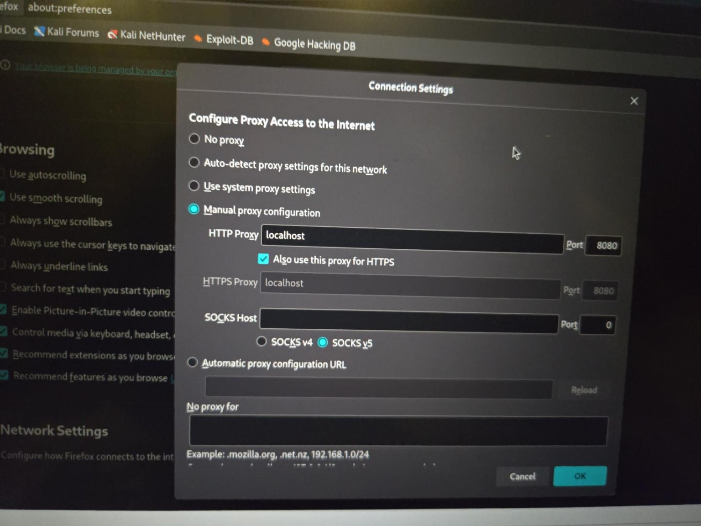

*Figure 1. Firefox proxy configuration used during the lab. ZAP listened locally on port 8080.*

This configuration allows ZAP to sit between Firefox and the web application, recording the requests Firefox sends and the responses returned by the application.

---

## 4. The Localhost Proxy Problem

Although Juice Shop loaded in Firefox, I initially had difficulty getting the local Juice Shop traffic to appear properly in ZAP.

Firefox treats localhost specially and can bypass a configured proxy for loopback traffic. This was confusing because the application could be visible in Firefox while ZAP was not necessarily seeing the same requests.

In Firefox I opened:

```text
about:config
```

I then changed:

```text
network.proxy.allow_hijacking_localhost
```

from `false` to `true`.

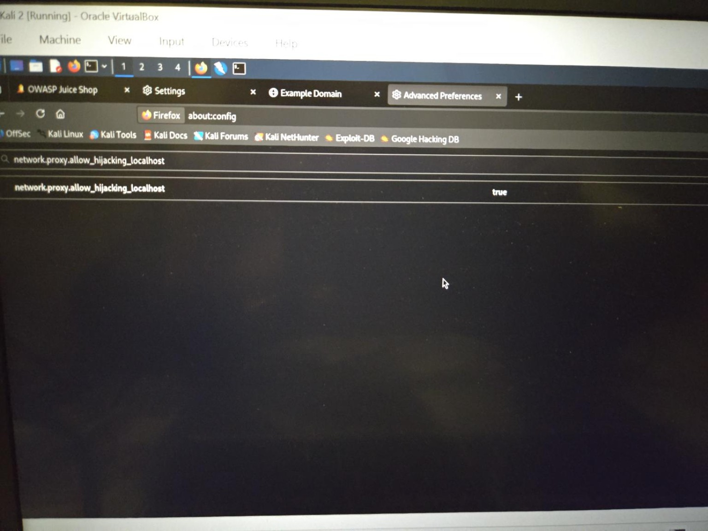

*Figure 2. Firefox advanced configuration used to allow localhost traffic to pass through the proxy.*

In practical terms, this allowed Firefox to send localhost traffic through the configured ZAP proxy instead of bypassing it.

After this change, the Juice Shop site began populating ZAP's **Sites** tree.

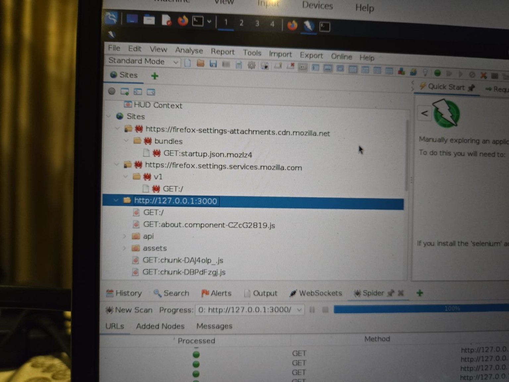

*Figure 3. Juice Shop appearing in the ZAP Sites tree after localhost proxying was working.*

This was my confirmation that the proxy path was now working for the local application.

---

## 5. Manual Exploration and the ZAP HUD

I manually browsed parts of Juice Shop with the **ZAP HUD** active.

I opened pages including product information, reviews and the About page. As I browsed, ZAP's History and WebSocket activity increased.

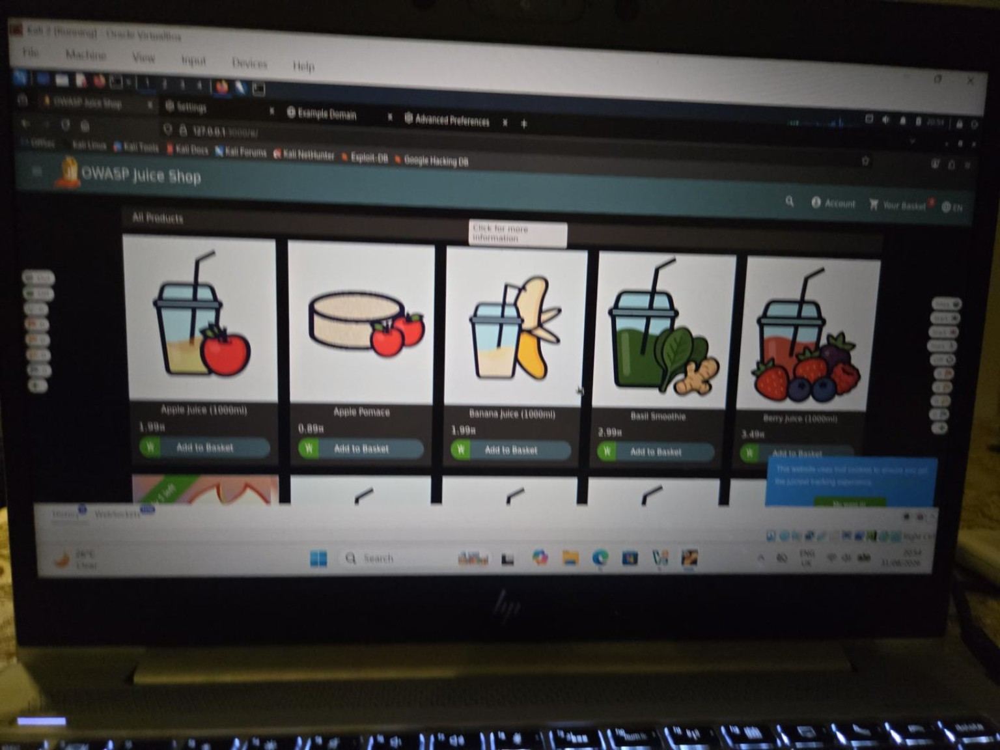

*Figure 4. Local Juice Shop running with ZAP HUD controls visible during manual exploration.*

This stage helped me understand that manual browsing and automated crawling complement each other.

Manual browsing generates realistic user traffic, while an automated spider can discover far more routes and resources than I would realistically click through myself.

---

## 6. Context and Scope

When I first tried to run the AJAX Spider, ZAP reported:

> `127.0.0.1:3000 is not in scope.`

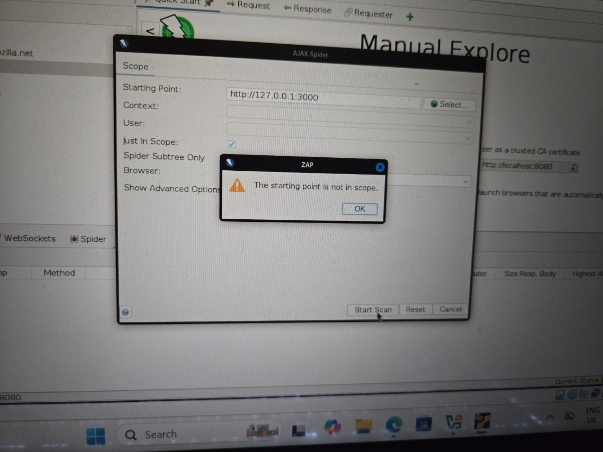

*Figure 5. AJAX Spider warning that the starting point was not in scope.*

This became a practical lesson in the difference between **seeing a site** and **authorising ZAP to test it**.

I created a context for the local Juice Shop target and included:

```text
http://127.0.0.1:3000.*
```

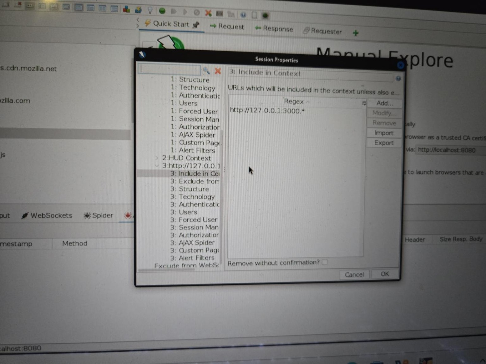

*Figure 6. ZAP context configuration showing the local Juice Shop target included.*

Once the context was in scope, ZAP offered actions including:

- AJAX Spider
- Spider
- Active Scan

The scope boundary was also important later. External resources encountered during crawling were marked as **out of context** rather than being treated as authorised targets.

This helped me understand that scope is both an ethical and technical control.

---

## 7. AJAX Spider Configuration

I then launched the AJAX Spider against the Juice Shop context using **Firefox Headless**.

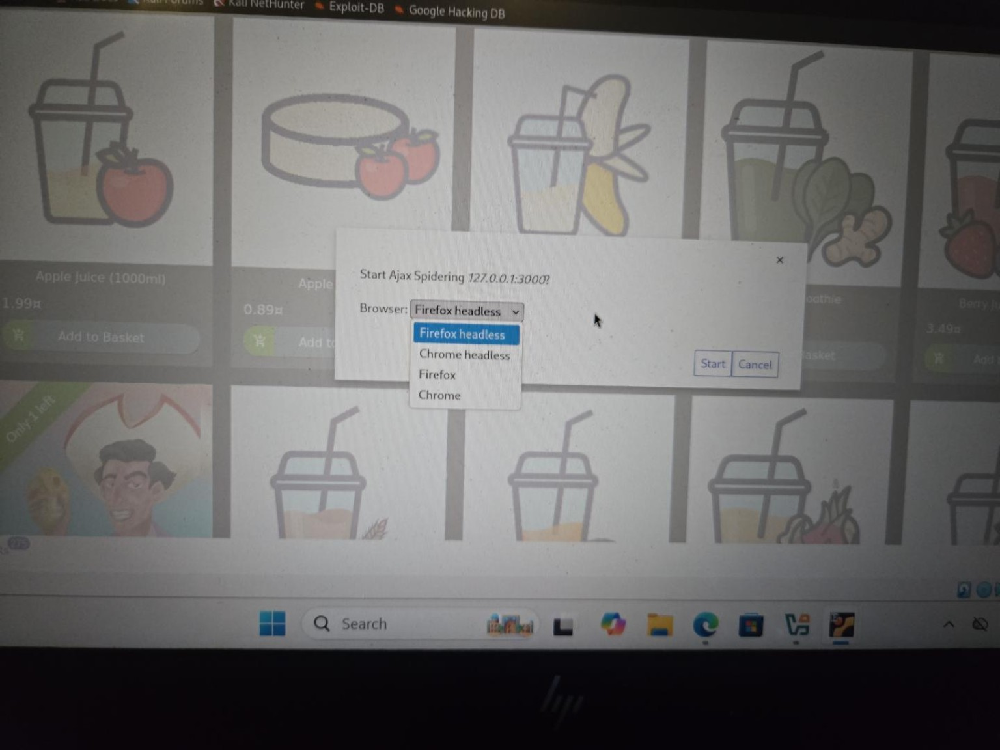

*Figure 7. AJAX Spider configuration for the Juice Shop context.*

The AJAX Spider is useful for modern JavaScript-heavy applications because it can interact with the application and discover routes and resources that may not be obvious from a simple static page.

The distinction I learned was:

```text
AJAX Spider = discovery / attack-surface mapping
Active Scan = active vulnerability testing
```

---

## 8. AJAX Spider Results

The AJAX Spider completed with:

**639 crawled URLs**

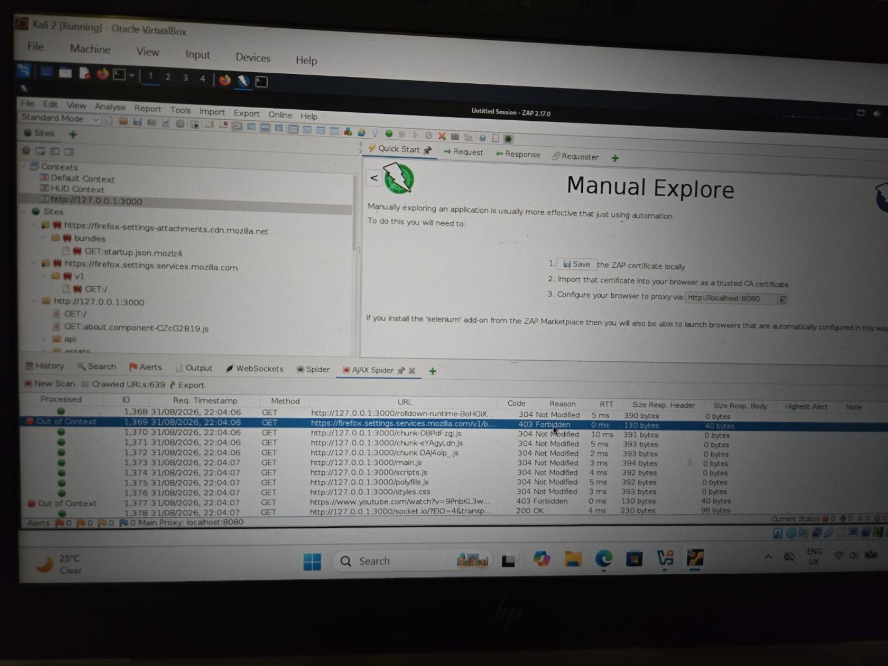

*Figure 8. Completed AJAX Spider showing 639 crawled URLs and a mixture of response codes.*

During the crawl I saw several HTTP response codes, including:

- `200 OK`
- `304 Not Modified`
- `403 Forbidden`
- `101 Switching Protocols`

I learned not to treat a status code by itself as a vulnerability.

For example:

- `200` means the request was successfully answered.
- `304` commonly relates to caching and means the resource has not changed.
- `403` means access was refused.
- `101` can relate to switching protocols, including WebSocket communication.

Some external resources, including browser or third-party resources, produced a ZAP response stating:

```text
(403 Forbidden) Out of AJAX Spider scope
```

This was not evidence of a vulnerability in those external sites. It was evidence that ZAP was enforcing the scope I had configured.

---

## 9. Application Resources Discovered

The Sites tree expanded considerably after crawling.

I could see API-related paths associated with areas such as:

- Challenges
- Feedbacks
- Products
- Quantities
- Assets
- REST resources

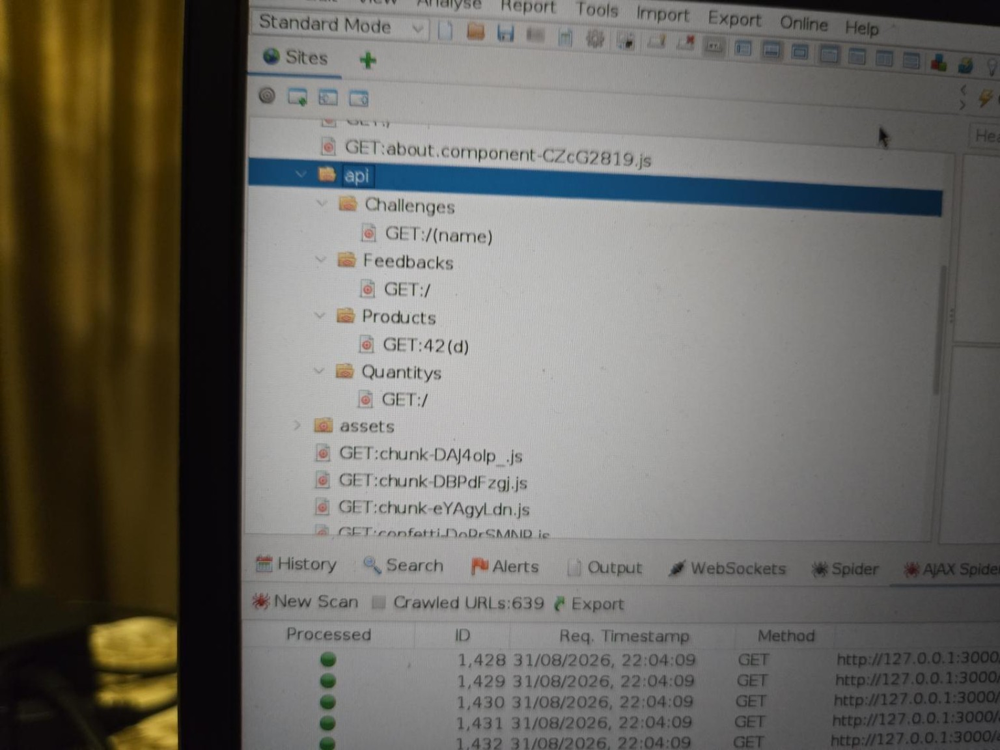

*Figure 9. Examples of API resources discovered under the local Juice Shop target.*

This was a much clearer demonstration of **attack-surface discovery** than manual browsing alone.

For example, I inspected a product API response and received a `200 OK` response containing JSON product data. I learned that an accessible API response is not automatically a vulnerability; it first tells me that the endpoint exists and how the application communicates with it.

---

## 10. `/ftp` Resources

One particularly interesting area discovered by the spider was:

```text
/ftp
```

This was an HTTP web path called `/ftp`; it should not be confused with connecting to a separate FTP network service.

ZAP showed resources including:

- `acquisitions.md`
- `announcement_encrypted.md`
- `coupons_2013.md.bak`
- `eastere.gg`
- `encrypt.pyc`
- `incident-support.kdbx`
- `legal.md`
- `package-lock.json.bak`
- `package.json.bak`
- `quarantine`
- `suspicious_errors.yml`

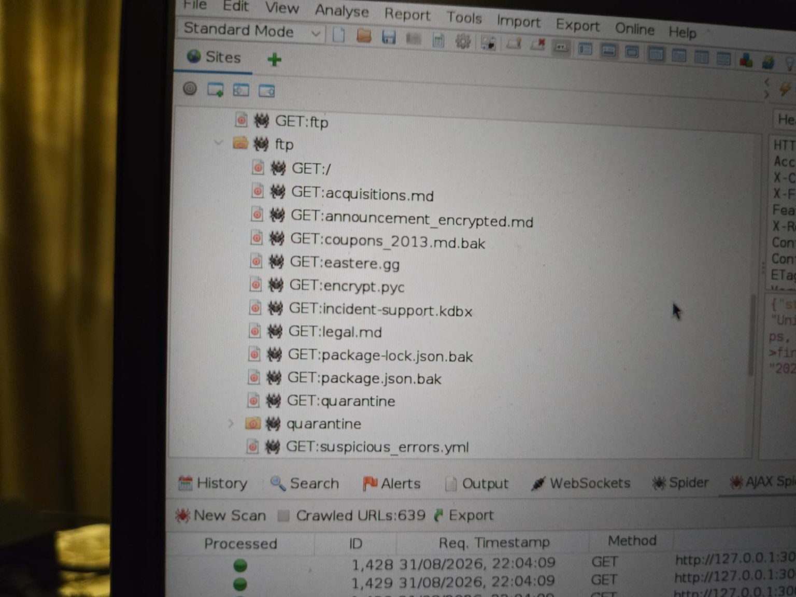

*Figure 10. Resources discovered under the Juice Shop `/ftp` path.*

I did **not** assume that every file was a confirmed vulnerability simply because it existed.

However, filenames involving backup files, a KeePass database (`.kdbx`), compiled Python (`.pyc`) and configuration-related material were worth investigating because exposed resources can sometimes reveal useful technical or sensitive information.

When I opened `incident-support.kdbx`, ZAP displayed binary data because a KDBX file is not ordinary human-readable text.

I also inspected `announcement_encrypted.md`, which returned a long encrypted-looking or encoded body.

By contrast, `package-lock.json.bak` returned:

```text
403 Forbidden
```

with a message indicating that only `.md` and `.pdf` files were allowed.

At this stage I recorded these as **discovered resources and behaviours**, rather than claiming that I had exploited them.

---

## 11. Active Scan

After completing discovery, I moved to **Active Scan**.

The distinction I learned was:

> The AJAX Spider asks **"What is here?"**, while Active Scan asks **"What happens when I actively test what I found?"**

Active scanning sends test requests and therefore should only be performed against systems I am authorised to test.

I started the scan against the Juice Shop context using ZAP's **Default Policy**, with recursion enabled.

The scan completed at 100% with:

- **84 requests**
- **0 new formal ZAP alerts**

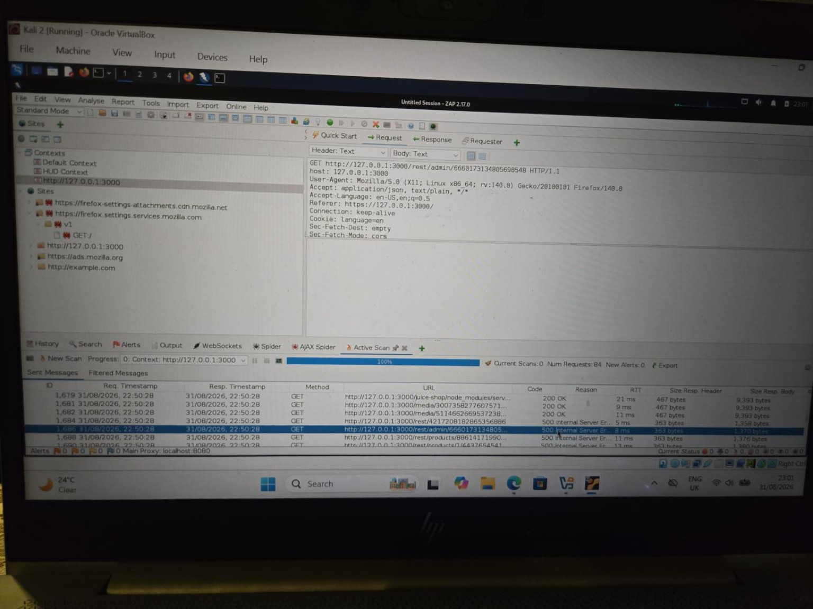

*Figure 11. Completed Active Scan against the Juice Shop context.*

The number of Active Scan requests did not need to match the 639 crawled URLs one-for-one. I therefore did not interpret 84 requests as proof that every discovered route and application state had been exhaustively tested.

---

## 12. Active Scan Observations

During the Active Scan I saw responses including:

- `200 OK`
- `401 Unauthorized`
- `403 Forbidden`
- `500 Internal Server Error`

Again, I did not treat the status codes alone as vulnerabilities.

Several requests returned `500 Internal Server Error`, so I opened the responses to see what the application had actually returned.

One request involving:

```text
/rest/admin/...
```

returned a JSON error response containing internal application paths and a sequence of code locations.

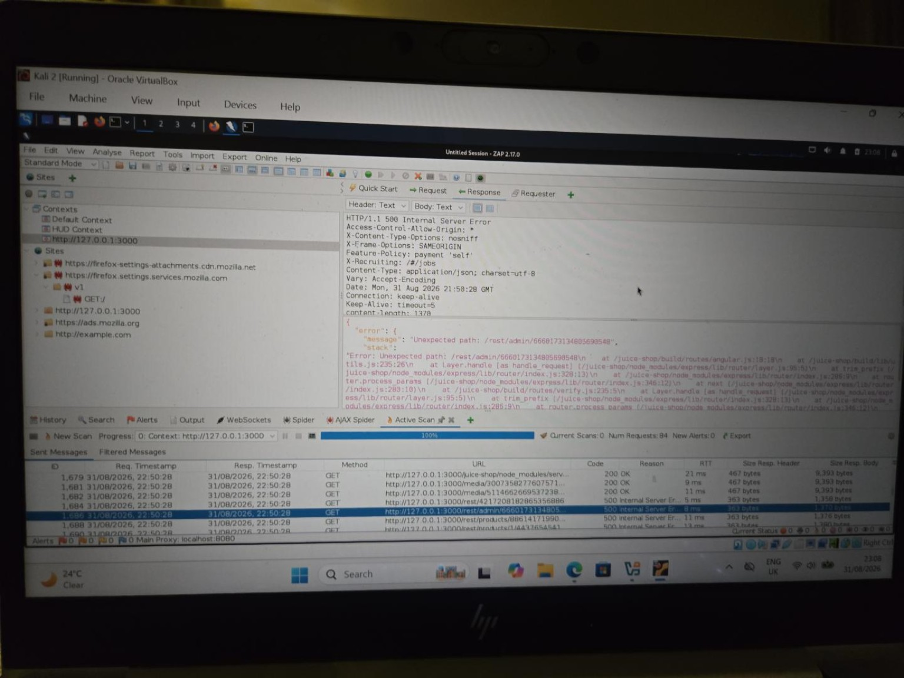

*Figure 12. A 500 response from a `/rest/admin/` request exposing internal error and code-path information.*

I learned that this sequence of information is called a **stack trace**.

My beginner-level understanding is that a stack trace is essentially the trail an application provides showing where an error occurred in its code.

The response exposed internal paths including application and framework locations rather than returning only a generic error message.

I then inspected another request involving:

```text
/rest/products/...
```

and observed the same general behaviour.

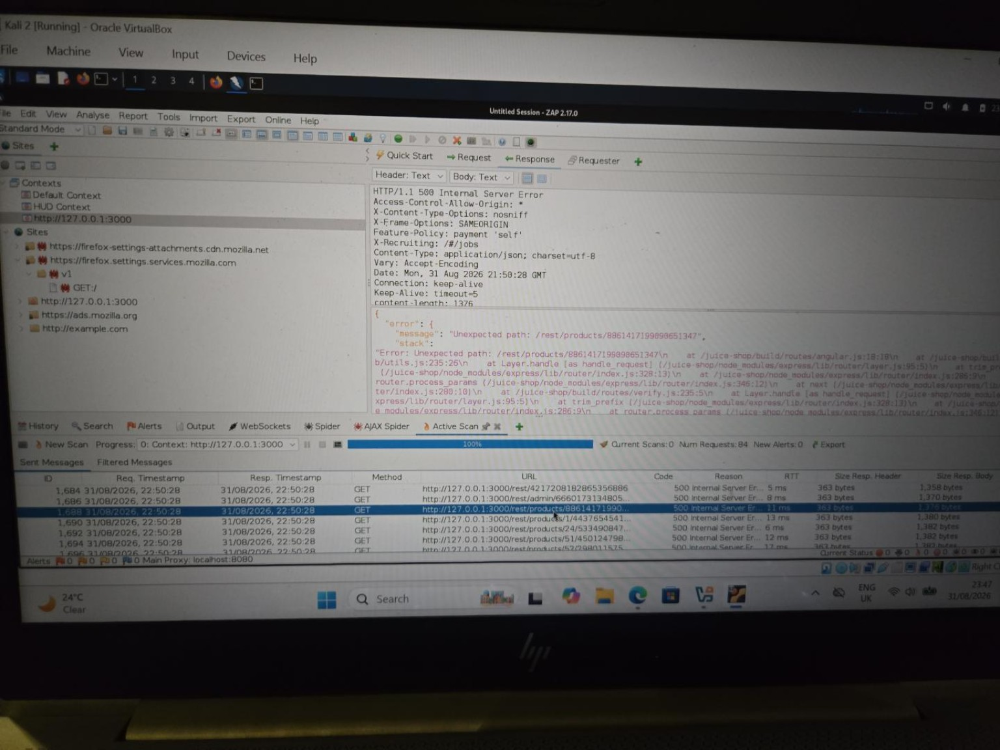

*Figure 13. A second 500 response under `/rest/products/` showing similar internal error information.*

Seeing the behaviour in more than one endpoint family made it more interesting, although it still required careful interpretation.

---

## 13. Interpreting the 500 Responses

I would **not** describe the `500` status itself as the vulnerability.

What interested me was that the response returned considerably more technical detail than an ordinary user would need.

The responses exposed information about internal application paths and code/framework locations.

From my current understanding, this **may represent information disclosure**, because unnecessary technical error information could give an attacker additional knowledge about how an application is built.

However, ZAP did **not** create a formal alert for this behaviour during my scan.

I have therefore recorded it as a **manual observation requiring further validation**, rather than presenting it as a scanner-confirmed vulnerability.

A stronger professional assessment would require clearer validation and evidence of security impact.

---

## 14. Why Zero ZAP Alerts Did Not End the Assessment

The completed Active Scan displayed:

```text
New Alerts: 0
```

and the Alerts pane remained empty.

I initially expected Juice Shop to produce vulnerability alerts similar to those I had previously seen while working with the Acunetix Test ASP.NET training site.

This exercise taught me that:

> **0 alerts does not mean 0 vulnerabilities.**

It means that **this particular scan did not produce a formal alert from ZAP's automated scanning rules**.

A scanner can:

- discover resources;
- send active test requests;
- produce unusual server behaviour; and
- expose responses worth manually investigating

without automatically classifying every observation as a vulnerability.

This was an important lesson in not treating the vulnerability scanner as the final authority.

The process is:

```text
Configure environment
        ↓
Proxy traffic
        ↓
Define context and scope
        ↓
Discover attack surface
        ↓
Actively test
        ↓
Review responses and alerts
        ↓
Validate important observations
        ↓
Record evidence
        ↓
Report only what the evidence supports
```

---

## 15. Findings and Evidence Summary

| Observation | Location | Evidence | Status | My interpretation |
|---|---|---|---|---|
| Large application attack surface | Local Juice Shop | AJAX Spider crawled 639 URLs | Observed | Automated crawling discovered considerably more resources than manual browsing alone |
| Interesting exposed resources | `/ftp` | Backup, KDBX, PYC, Markdown and related files visible | Observed | Potentially useful information requiring further investigation; not automatically vulnerabilities |
| Out-of-scope protection | External resources | `403 Out of AJAX Spider scope` | Observed | Scope prevented unrelated external resources from being treated as authorised targets |
| Verbose server error | `/rest/admin/...` | `500` response containing internal paths and stack-trace information | Manual observation; no ZAP alert | May disclose unnecessary technical information |
| Repeated verbose server error | `/rest/products/...` | Similar `500` response containing internal paths and stack-trace information | Manual observation; no ZAP alert | Behaviour was not limited to one endpoint family |
| Formal automated alerts | ZAP Alerts pane | `New Alerts: 0` | No formal alerts | Does not demonstrate that the application is vulnerability-free |

---

## 16. Terms I Learned

### Localhost / `127.0.0.1`

The same computer I am currently using. Traffic to the loopback address does not need to travel onto the internet.

### Port

A numbered communication point used by a service. In this lab Juice Shop used port `3000` and ZAP used port `8080`.

### Proxy

A program placed between a client and server. ZAP received Firefox's requests, could record or modify them, and forwarded them to Juice Shop.

### Context

ZAP's grouping and configuration for a particular application being tested.

### Scope

The boundary defining what I intentionally authorised ZAP to test.

### Endpoint

A particular application or API location that can receive a request, such as a path under `/rest` or `/api`.

### AJAX Spider

A crawler used to discover routes and resources in dynamic web applications.

### Active Scan

ZAP actively sends test requests looking for vulnerable behaviour. This is different from simply observing normal browser traffic.

### Stack Trace

Technical error information showing the sequence or location of application code involved when an error occurred.

### HTTP 500

The server encountered an internal error. The code itself does not automatically prove that a vulnerability exists.

---

## 17. What I Learned

This exercise helped me connect several concepts that I had previously encountered separately.

I learned that:

- a web application can be running locally even while the computer is also connected to the internet;
- `127.0.0.1` points back to the same machine and is not a remote internet address;
- the ZAP proxy port and the target application's port are different things;
- Firefox can bypass localhost proxying, so a locally loaded page may not automatically be visible to ZAP;
- seeing a site in ZAP is not the same as placing it inside an authorised testing scope;
- the AJAX Spider is primarily for discovery;
- Active Scan is for active vulnerability testing;
- HTTP status codes are evidence that must be interpreted in context rather than treated as vulnerability labels;
- a `500` response is not automatically a vulnerability;
- a scanner can finish with zero formal alerts while still producing responses worth manually investigating;
- automated vulnerability scanners do not replace manual inspection and interpretation; and
- a report should clearly distinguish between scanner-generated alerts, manual observations and confirmed vulnerabilities.

---

## 18. Limitations

This was a training assessment of a **locally running OWASP Juice Shop instance**, not a comprehensive penetration test.

The results describe this local application build and the configuration used during the session. They should not be presented as findings against a live production deployment.

The Active Scan generated 84 requests and zero formal ZAP alerts. I therefore do not assume that:

- every one of the 639 crawled URLs was exhaustively tested;
- every authenticated application state was tested; or
- every possible vulnerability was covered.

The locally hosted application also represents the version and environment being run in this VM. Testing a local copy of an application does not automatically demonstrate that a separate live deployment has identical behaviour.

---

## 19. Conclusion

The most important outcome of this exercise was not a list of automated alerts.

I learned how the different parts of a ZAP assessment fit together:

**establish connectivity → proxy the browser → define the authorised context and scope → discover the attack surface → actively test it → inspect responses → interpret the evidence → report only what the evidence supports.**

The troubleshooting was therefore part of the learning process rather than wasted time.

By the end of the exercise I could explain:

- why Juice Shop on `127.0.0.1` did not require its traffic to travel across the internet;
- why Firefox needed a localhost proxy setting;
- why Juice Shop port `3000` and ZAP proxy port `8080` served different purposes;
- why external resources were kept out of scope;
- what the AJAX Spider contributed;
- what an Active Scan did differently;
- what a stack trace was; and
- why a completed Active Scan with zero formal alerts did not automatically mean that nothing interesting had happened.

---

## Evidence Handling

The screenshots in this repository are original evidence from my authorised lab session.

The visible target address `127.0.0.1` is the standard IPv4 loopback address and `localhost:8080` is the local ZAP proxy. These do not expose a public internet address.

The technical results shown in the screenshots have not been recreated or altered.

---

## Full Report

A formatted Microsoft Word version containing the same detailed assessment and evidence is included in this directory:

**`OWASP_ZAP_Assessment_of_OWASP_Juice_Shop.docx`**

---

## Authorisation

All testing documented in this repository was performed against deliberately vulnerable training applications or systems I was authorised to test.
