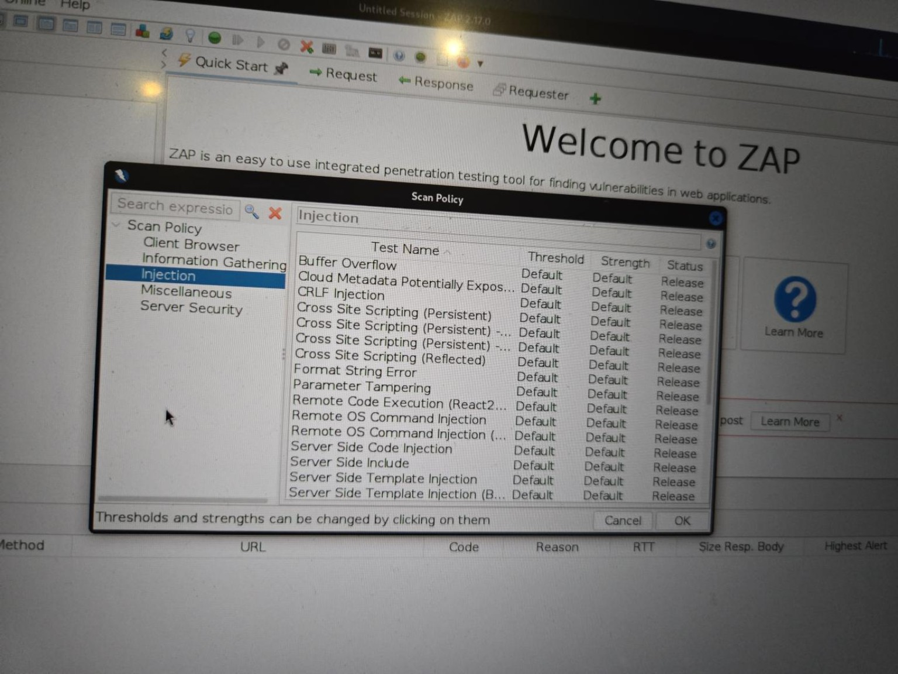
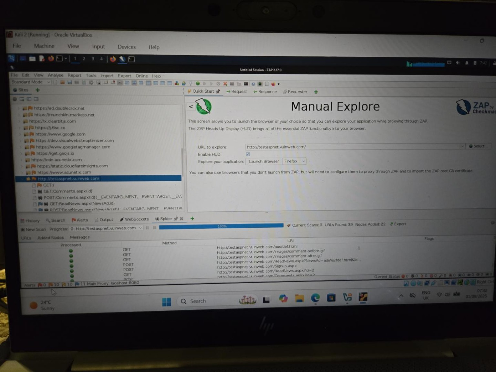
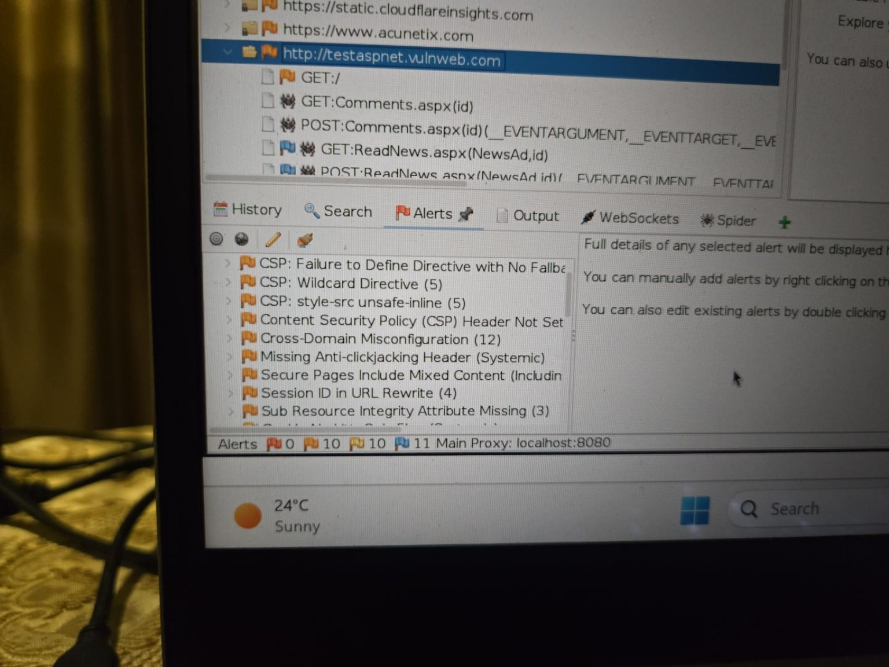
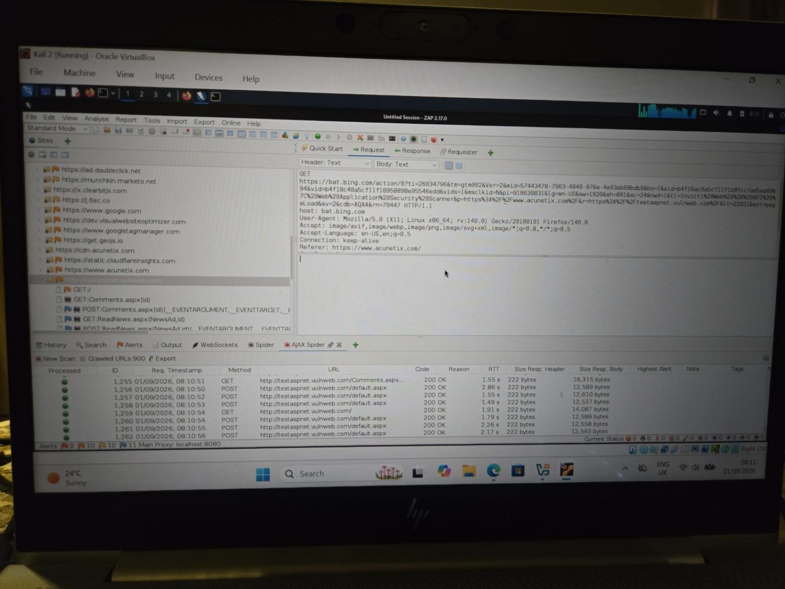
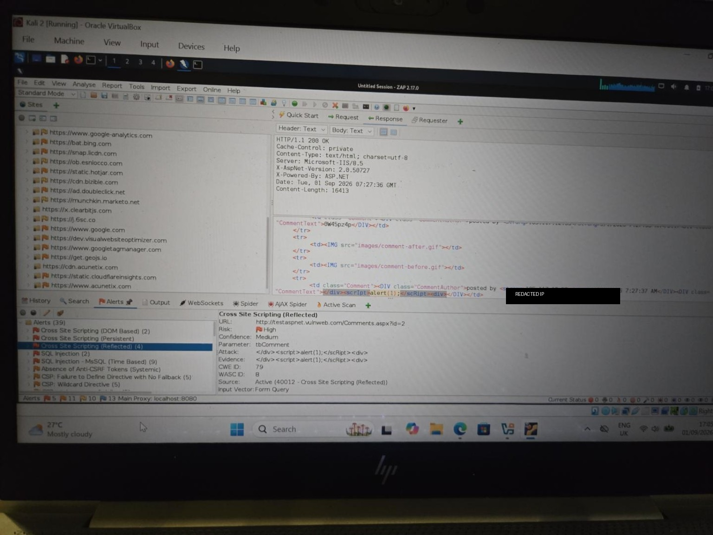
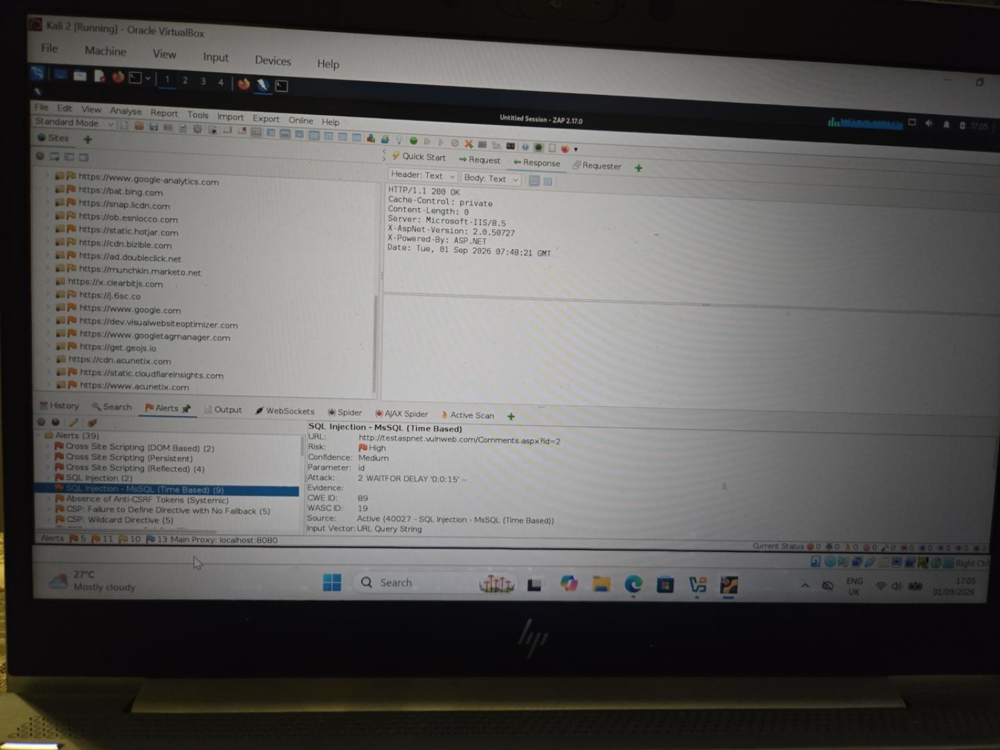
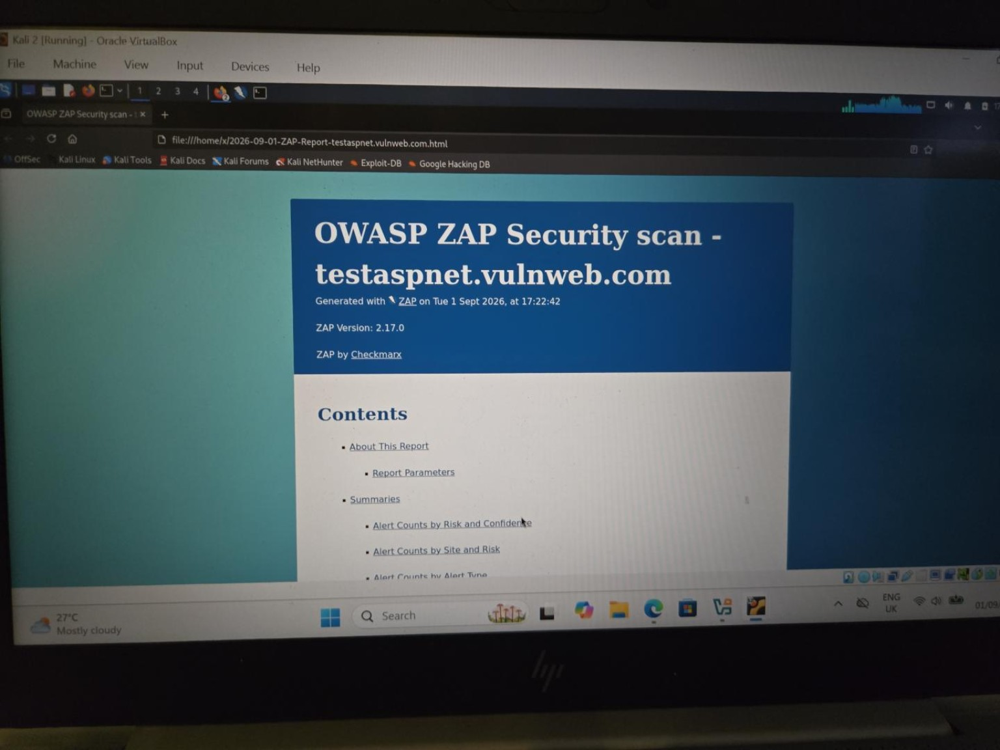
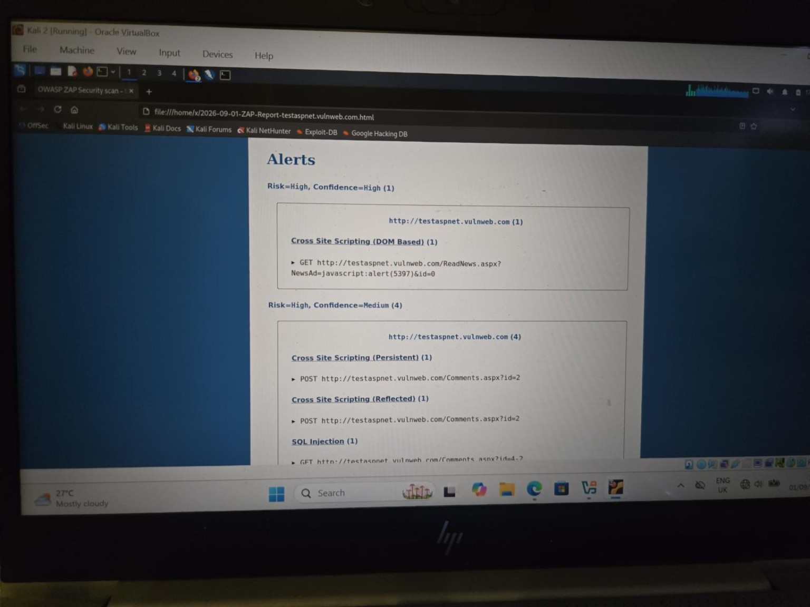
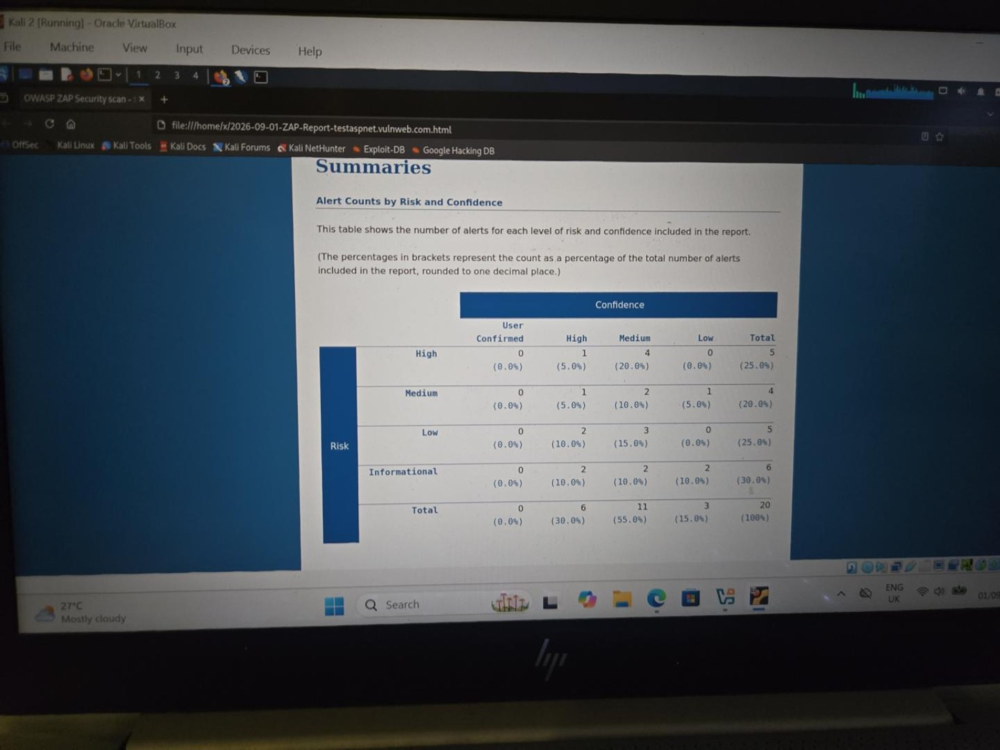

# OWASP ZAP Assessment of Acunetix Test ASP.NET

| **Date** | 1 September 2026 |
|---|---|
| **Environment** | Kali Linux virtual machine in Oracle VirtualBox |
| **Security Tool** | OWASP ZAP 2.17.0 |
| **Browser** | Mozilla Firefox |
| **Target** | Acunetix Test ASP.NET |
| **Target Address** | `http://testaspnet.vulnweb.com` |
| **ZAP Proxy** | `localhost:8080` |

**Purpose: authorised cybersecurity training and web vulnerability-scanning practice.**

## 1. Overview

This report documents my practical use of OWASP ZAP against the Acunetix Test ASP.NET site. I am still learning web application security, so I have written this as a record of what I actually did, what went wrong, how I troubleshot it, and what I understood from the results.

The exercise did **not** begin with a successful scan. My first Active Scan reached 100% after only five requests and produced no new alerts. Because the target is deliberately vulnerable, that result did not make sense to me. I checked the scan policy, looked through the ZAP logs and reviewed the installed add-ons. I found that the **Injection** section of the Active Scan policy was empty and that the installation was not loading the scanner rules properly.

After several attempts to repair the add-ons, I removed ZAP and installed it again. I then updated the add-ons and checked the Scan Policy before continuing. This time the Injection category contained the expected rules.

The successful Active Scan behaved very differently: it sent **6,805 requests**, reached **100%**, and produced **125 new alert instances**. I later generated a report scoped only to `http://testaspnet.vulnweb.com`. That final report contained **20 alert types: 5 High, 4 Medium, 5 Low and 6 Informational**.

One of the main lessons for me was that a tool saying **100% complete** does not automatically mean the tool worked correctly.

---

## 2. Objectives

My objectives were to:

- use ZAP as a proxy between Firefox and the authorised target;
- use the regular Spider and AJAX Spider to discover pages and parameters;
- review passive alerts before active testing;
- run an Active Scan and understand the results;
- troubleshoot the scanner when the first scan did not behave normally;
- repeat the scan after repairing ZAP;
- examine some of the findings in more detail; and
- export a target-specific report without mixing third-party browser traffic into the final result.

---

## 3. Scope and Lab Environment

Testing was limited to:

`http://testaspnet.vulnweb.com`

The site is an intentionally vulnerable web application made available for security-testing practice.

My basic setup was:

`Firefox → ZAP proxy (localhost:8080) → testaspnet.vulnweb.com`

ZAP also recorded requests to third-party domains that the browser or website loaded. I did not treat those domains as authorised targets. This became important later when I generated the final report.

---

## 4. Initial Spider

I started with the regular Spider to discover pages and links on the target.

The first Spider completed at 100% and reported:

- **63 URLs found**
- **22 nodes added**

*Figure 1. My first regular Spider completed with 63 URLs found and 22 nodes added.*

### What I learned

The Spider is a discovery tool. It helps ZAP build a map of the application, but finding a URL does not mean that a vulnerability has been found.

---

## 5. The First Active Scan Did Not Make Sense

I then ran an Active Scan.

It reached **100% after only five requests** and showed **0 new alerts**.

*Figure 2. The first Active Scan reported 100% completion after only five requests.*

At first glance, the scan looked finished. The request count was what made me suspicious. Five requests seemed far too small compared with the number of pages the Spider had already discovered, especially on a deliberately vulnerable training site.

Instead of writing down “no vulnerabilities found,” I stopped and checked whether ZAP itself was working correctly.

### What I learned

A completed progress bar is not enough evidence that a scan was valid. The result has to make technical sense.

---

## 6. Checking the Scan Policy

I opened the Active Scan policy and looked at the available categories.

The **Injection** category was empty.

*Figure 3. The Injection category contained no scanner rules.*

This explained why the scan was doing almost nothing. If the rules for testing injection problems were not loaded, the scanner had very little to execute.

This was the first clear sign that the problem was with my ZAP installation rather than with the target.

---

## 7. Checking the Logs and Add-ons

I then checked ZAP's log output. The logs showed add-on loading problems and scanner plugins being skipped.

*Figure 4. I used the ZAP log to investigate why the scanner rules were not loading.*

I also checked **Manage Add-ons**. During the troubleshooting I found that the **Common Library** component and other scanner components were not behaving consistently.

*Figure 5. Manage Add-ons during the troubleshooting stage.*

I tried updating the add-ons and also investigated the Common Library files from the terminal. The manual repair became increasingly messy, so I decided that a clean reinstall would be the simpler way to get back to a known working state.

### What I learned

The security tool itself is part of the lab environment. If the tool is incomplete or misconfigured, its results cannot automatically be trusted.

---

## 8. Removing and Reinstalling ZAP

I removed the existing ZAP installation. I checked this by trying to run `zaproxy` from the terminal and confirming that the command was no longer available.

*Figure 6. The `zaproxy` command was no longer available after the uninstall.*

I then reinstalled ZAP and allowed the add-ons to update.

After the reinstall, I went back to the Scan Policy before running another vulnerability scan.

This time the **Injection** category contained rules for XSS, command injection, parameter tampering and other active tests.

*Figure 7. The Injection category was populated after the clean reinstall.*

That was the confirmation I needed before continuing.

---

## 9. Re-establishing the Browser and Proxy

I returned to **Manual Explore**, entered the target URL and launched Firefox through ZAP.

*Figure 8. Manual Explore after the reinstall, with the authorised target loaded through ZAP.*

ZAP continued to use `localhost:8080` as its proxy. The target itself remained `http://testaspnet.vulnweb.com`.

The Sites tree also contained several external domains loaded during browsing. I kept those separate from the target rather than treating everything ZAP could see as part of the assessment.

---

## 10. Repeating the Regular Spider

Because the earlier Spider belonged to the broken ZAP session, I repeated the discovery stage after the reinstall.

The second regular Spider completed with:

- **39 URLs found**
- **22 nodes added**

*Figure 9. The regular Spider after the reinstall completed with 39 URLs found and 22 nodes added.*

The URL count was not identical to the first run, but both scans produced 22 nodes in the target tree. I treated the second run as the discovery stage for the repaired assessment.

---

## 11. Passive Alerts Before Active Testing

Before running another Active Scan, I reviewed the **Alerts** tab.

ZAP had already identified several issues simply by analysing normal requests and responses.

*Figure 10. Passive alerts visible after discovery.*

One example was **Content Security Policy (CSP) Header Not Set**, which ZAP rated **Medium risk / High confidence**.

*Figure 11. CSP Header Not Set. A transient session identifier has been redacted from this public image.*

At this stage I understood that passive scanning and active scanning are different. ZAP can identify some missing headers or information-disclosure issues without sending attack payloads.

---

## 12. AJAX Spider

I then ran the **AJAX Spider** from the target in the Sites tree.

The AJAX Spider continued crawling for a long time and kept discovering repeated application states. I manually stopped it when it reached **900 crawled URLs**.

*Figure 12. I manually stopped the AJAX Spider at 900 crawled URLs.*

I am not presenting 900 as a completed or exhaustive crawl. It is the point at which I stopped the scan after getting substantial additional discovery.

### What I learned

The regular Spider and AJAX Spider are both discovery tools, but they work differently. The AJAX Spider behaves more like a browser and can find dynamic content that a basic link crawler may not see.

---

## 13. The Successful Active Scan

I then ran the Active Scan again.

This time the behaviour was immediately different. At **13%**, ZAP had already sent **810 requests**.

*Figure 13. The repaired Active Scan had already sent 810 requests at 13% progress.*

The scan eventually completed at **100%** with:

- **6,805 requests**
- **125 new alert instances**
- **0 current scans**

*Figure 14. The successful Active Scan completed after 6,805 requests and produced 125 new alert instances.*

This was very different from the first scan, which had finished after only five requests.

### Important distinction

I do **not** interpret “125 new alerts” as 125 different vulnerabilities.

The 125 figure represents alert **instances** generated during scanning. The same type of problem can appear on several pages, requests or parameters.

The final target-specific report contained **20 alert types**.

---

## 14. High-Risk Findings I Examined

I did not manually exploit every alert or attempt to extract data from the target. I reviewed the evidence ZAP provided and tried to understand what each finding meant.

### 14.1 DOM-Based Cross-Site Scripting

ZAP reported **DOM-based XSS** as:

- **Risk:** High
- **Confidence:** High
- **Page:** `ReadNews.aspx`
- **Parameter:** `NewsAd`

*Figure 15. DOM-based XSS identified by ZAP.*

At my current level, I understood this to mean that data controlled through the URL could reach a dangerous JavaScript context in the browser.

---

### 14.2 Persistent Cross-Site Scripting

ZAP also reported **Persistent XSS** on the comments functionality.

*Figure 16. Persistent XSS reported on the comments page.*

I understood persistent or stored XSS as input that can be saved by the application and later returned to another browser.

---

### 14.3 Reflected Cross-Site Scripting

ZAP reported **Reflected XSS** on the same comments area.

*Figure 17. Reflected XSS evidence. A public IP visible in the response was redacted before publishing this image.*

Here I could see the injected script string being returned in the response. I understood this as different from stored XSS because the input is reflected back rather than necessarily being saved for later.

---

### 14.4 SQL Injection

ZAP reported **SQL Injection** on the `id` parameter of `Comments.aspx`.

*Figure 18. SQL Injection reported on the `id` parameter.*

This was one of the clearest examples for me of why parameters matter during web testing. A value that looks like a simple page identifier may be passed to a database query behind the application.

I did **not** try to dump the database or extend the test beyond the scanner evidence.

---

### 14.5 Microsoft SQL Server Time-Based SQL Injection

ZAP also reported **MSSQL time-based SQL injection**.

*Figure 19. ZAP's time-based SQL injection finding.*

The scanner used a database delay and observed a delayed response. I understood the timing difference as evidence that the input may have reached Microsoft SQL Server as executable SQL.

Again, I did not use this to extract information from the database.

---

## 15. Other Alert Types

The final target-scoped report contained the following categories.

### Medium risk

- Absence of Anti-CSRF Tokens
- Content Security Policy (CSP) Header Not Set
- HTTP Only Site
- Missing Anti-clickjacking Header

### Low risk

- Cookie without SameSite Attribute
- Server information disclosed through `X-Powered-By`
- Server version information disclosed through the `Server` header
- `X-AspNet-Version` Response Header
- `X-Content-Type-Options` Header Missing

### Informational

- Authentication Request Identified
- Charset Mismatch
- GET for POST
- Session Management Response Identified
- User Agent Fuzzer
- User Controllable HTML Element Attribute (Potential XSS)

I did not treat the Informational items as vulnerabilities simply because they appeared in the report. Some are observations that help ZAP understand how the application handles authentication, sessions and input.

---

## 16. What I Understood About Fixes

I am **not** presenting this as a professional remediation plan. These are the basic fixes I understood from ZAP's descriptions and from reviewing the findings during the exercise:

- SQL injection should be prevented by keeping user input separate from SQL commands, for example by using parameterised queries.
- XSS requires safer handling of untrusted input when it is returned to HTML or JavaScript.
- Security headers such as CSP, anti-clickjacking protections and `X-Content-Type-Options` add browser-side protections.
- A real application should use HTTPS rather than HTTP-only access.
- Unnecessary server/version headers can reveal technology information that does not need to be public.

At this stage, the important part for me was understanding **why** ZAP was raising each category rather than trying to write a production remediation guide.

---

## 17. Generating a Target-Specific Report

The ZAP session contained traffic for the target as well as third-party domains loaded by the browser.

I generated an HTML report and scoped it specifically to:

`http://testaspnet.vulnweb.com`

*Figure 20. The target-specific ZAP HTML report generated successfully.*

The report showed the High-risk findings under the correct target.

*Figure 21. High-risk findings in the exported target-specific report.*

The final **Alert Counts by Risk and Confidence** table showed:

| Risk | Alert types |
|---|---:|
| High | 5 |
| Medium | 4 |
| Low | 5 |
| Informational | 6 |
| **Total** | **20** |

The confidence totals were:

| Confidence | Alert types |
|---|---:|
| High | 6 |
| Medium | 11 |
| Low | 3 |
| User Confirmed | 0 |

*Figure 22. Final target-scoped risk and confidence summary.*

This helped me understand why the **39 alerts visible in the wider ZAP session** and the **125 new alert instances from the Active Scan** should not be reported as 39 or 125 unique vulnerabilities.

---

## 18. Comparing the Broken and Working Scans

| Measure | First scan | Repaired scan |
|---|---:|---:|
| Progress | 100% | 100% |
| Requests | 5 | 6,805 |
| New alert instances | 0 | 125 |
| Injection category | Empty | Populated |
| My interpretation | Scan was not trustworthy | Scanner was clearly doing substantial testing |

For me, this comparison is one of the most useful parts of the exercise.

Both scans said **100%**, but they did not mean the same thing.

---

## 19. Terms I Learned During This Exercise

**Proxy:** A program placed between the browser and the destination. Firefox sent traffic through ZAP on `localhost:8080`.

**Spider:** A crawler that follows discoverable links and paths.

**AJAX Spider:** A browser-driven crawler that can discover dynamic content and application states.

**Passive Scan:** ZAP analyses traffic it has already seen without sending an attack payload for that rule.

**Active Scan:** ZAP deliberately sends modified requests and test payloads.

**Alert type:** A category such as SQL Injection or CSP Header Not Set.

**Alert instance:** One occurrence of an alert on a particular page, request or parameter. Several instances can belong to the same alert type.

**Risk:** ZAP's estimate of how serious a finding could be if valid.

**Confidence:** ZAP's estimate of how strongly the evidence supports the finding.

**Scope:** The boundary of what I am authorised and intending to test.

---

## 20. What I Learned

This exercise taught me more than simply how to press **Active Scan**.

I learned that:

- a scanner can be broken or incomplete while still displaying a normal-looking completion percentage;
- request counts can help me sanity-check whether a scan result makes sense;
- the regular Spider, AJAX Spider, passive scanner and Active Scan have different jobs;
- finding a page or parameter is not the same as proving a vulnerability;
- browser traffic can include third-party domains that are outside the intended target;
- scanner-generated evidence should not be exaggerated into manual exploitation I did not perform;
- 125 alert instances do not mean 125 different vulnerabilities;
- risk and confidence are different measurements; and
- troubleshooting the testing tool can be part of the learning process rather than wasted time.

The biggest lesson for me was to **question a result that does not make sense**. If I had accepted the first five-request scan at face value, I would have reported a completely misleading result.

---

## 21. Limitations

This was a student assessment of an intentionally vulnerable training website, not a full professional penetration test.

I used ZAP's automated and semi-automated features and reviewed selected findings, but I did not:

- manually validate every alert instance;
- attempt to extract database contents;
- attempt account compromise or privilege escalation;
- test every possible authenticated state or business-logic path; or
- claim that the AJAX Spider exhaustively crawled the application.

I manually stopped the AJAX Spider at 900 crawled URLs.

The full exported HTML report contains verbose request and response data. I retained that report locally as evidence but did **not** include it in this public GitHub folder.

---

## 22. Evidence and Privacy Note

The images in this repository are original photographs/screenshots from my authorised lab session. I did not recreate ZAP output for the write-up.

Before preparing the public version, I reviewed the screenshots for information that did not need to be published. I redacted:

- a transient ASP.NET session identifier; and
- a public IP address that appeared inside one response.

I have not included the raw exported HTML report in the public repository because it contains substantially more request/response data than is necessary for a student portfolio.

---

## Conclusion

This assessment started with a scan that appeared to work but did not.

By checking the Scan Policy, reviewing logs and add-ons, reinstalling ZAP, repeating discovery and then running the Active Scan again, I was able to see the difference between a misleading “100% complete” scan and a scanner that was actually exercising the target.

The repaired assessment produced a target-scoped report containing **20 alert types**, including XSS and SQL injection findings. More importantly, I came away understanding the workflow better:

**discover → observe → actively test → inspect evidence → check scope → report only what the evidence supports**

---

## Lab Note

This project documents **authorised security testing against Acunetix Test ASP.NET (`testaspnet.vulnweb.com`), an intentionally vulnerable training site provided for web security testing**. It is a student learning record and should not be read as a professional penetration-test report.
