# OWASP ZAP Assessment of Acunetix Test ASP.NET

| **Date** | 1 September 2026 |
|---|---|
| **Environment** | Kali Linux virtual machine in Oracle VirtualBox |
| **Security Tool** | OWASP ZAP 2.17.0 |
| **Browser** | Mozilla Firefox |
| **Target** | Acunetix Test ASP.NET |
| **Target Address** | `http://testaspnet.vulnweb.com` |
| **ZAP Proxy** | `localhost:8080` |

**Purpose: authorised cybersecurity training and web vulnerability-scanning practice.**

## 1. Overview

This project records my practical use of OWASP ZAP against the Acunetix Test ASP.NET training site. I am still learning web application security, so I have written this in the same way I actually experienced the exercise: what I tried, what went wrong, what I checked next, what finally worked, and what I understood from the results.

I have deliberately **kept the unsuccessful steps** rather than rewriting the exercise as if I knew the solution from the beginning. The biggest problem was that my first Active Scan appeared to complete normally but sent only **five requests** and produced **zero new alerts**. Because the target is deliberately vulnerable, that result did not make sense to me. I eventually discovered that the **Injection** section of the scan policy was empty and that my ZAP add-ons were not loading consistently.

I tried to repair the add-ons first. When that became increasingly confusing, I removed ZAP and reinstalled it. After the reinstall and add-on updates, the Injection rules were visible again. The repeated Active Scan then behaved completely differently: it sent **6,805 requests**, reached **100%**, and produced **125 new alert instances**.

I later generated a report scoped only to `http://testaspnet.vulnweb.com`. The final report contained **20 alert types: 5 High, 4 Medium, 5 Low and 6 Informational**.

The main lesson for me was that a security tool saying **100% complete** does not automatically mean that the tool actually performed the testing I expected.

---

## 2. Objectives

My objectives were to:

- use ZAP as a proxy between Firefox and the authorised target;
- use the regular Spider and AJAX Spider to discover pages and parameters;
- review passive alerts before active testing;
- run an Active Scan and understand what the results meant;
- investigate the scanner when the first Active Scan did not behave normally;
- repair or reinstall ZAP and verify the scanner rules before trying again;
- review some of the High, Medium, Low and Informational findings at my current level of understanding; and
- export a report for the authorised target without accidentally including unrelated third-party browser traffic.

---

## 3. Scope and Lab Environment

Testing was limited to:

`http://testaspnet.vulnweb.com`

The site is an intentionally vulnerable web application made available for security-testing practice.

My setup was approximately:

`Firefox → ZAP proxy (localhost:8080) → Kali networking → Internet → testaspnet.vulnweb.com`

This helped reinforce something I had learned during my earlier ZAP work: **the proxy address and the target address are not the same thing**. `localhost:8080` was where Firefox sent traffic to ZAP. ZAP then forwarded the request to the remote training site.

ZAP also recorded traffic to advertising, analytics and other third-party domains loaded during browsing. I did not treat those domains as authorised targets. This became important later when I generated the final report.

---

## 4. Starting with Discovery: Regular Spider

I began with discovery rather than going straight into an Active Scan.

My first regular Spider completed at 100% and reported:

- **63 URLs found**
- **22 nodes added**

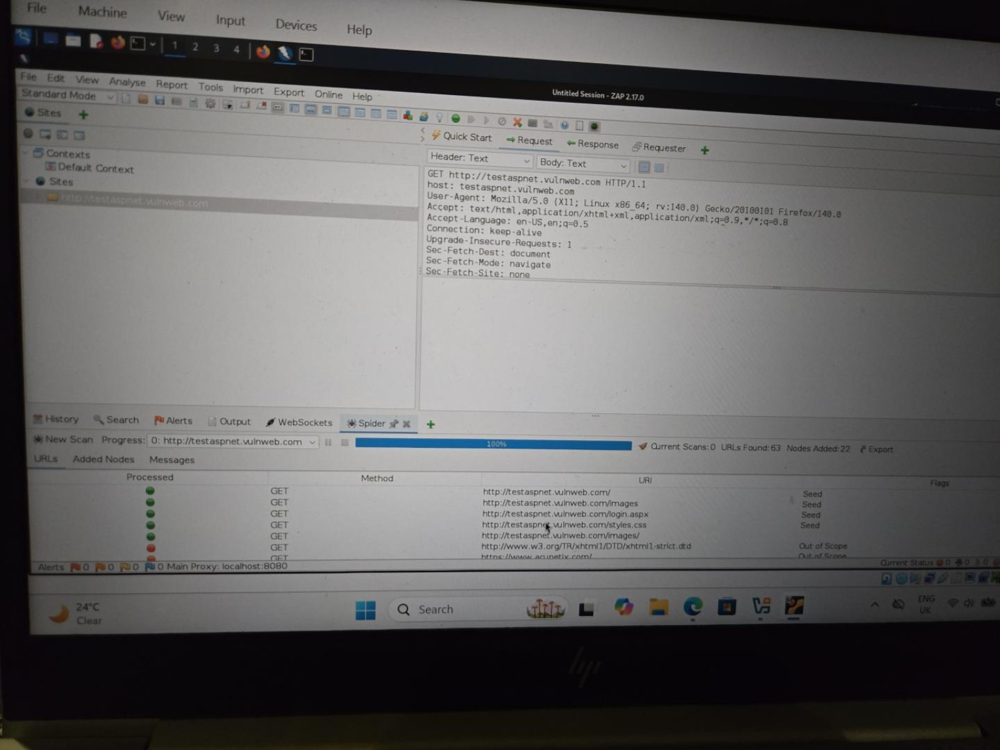

*Figure 1. My first regular Spider completed with 63 URLs found and 22 nodes added.*

### What I understood

The Spider is mainly a discovery tool. It helps ZAP build a map of pages, links and parameters that it can see. Finding a URL does **not** mean that a vulnerability has been found.

---

## 5. The First Active Scan Did Not Make Sense

I then ran an Active Scan.

It reached **100% after only five requests** and showed **0 new alerts**.

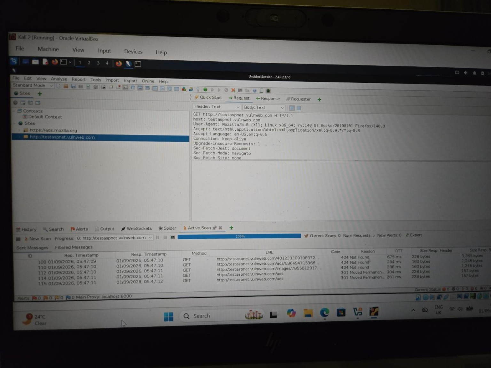

*Figure 2. The first Active Scan reported 100% completion after only five requests.*

At first glance it looked as though the scan had simply finished. The request count was what made me suspicious. Five requests seemed far too small compared with the application that the Spider had already discovered, especially because the site is deliberately vulnerable.

Instead of recording “no vulnerabilities found,” I started checking ZAP itself.

### What I learned

A progress bar is not enough to tell me that a security scan was meaningful. The result also has to make technical sense.

---

## 6. Checking the Scan Policy

I opened the Active Scan policy and selected **Injection**.

The category was completely empty.

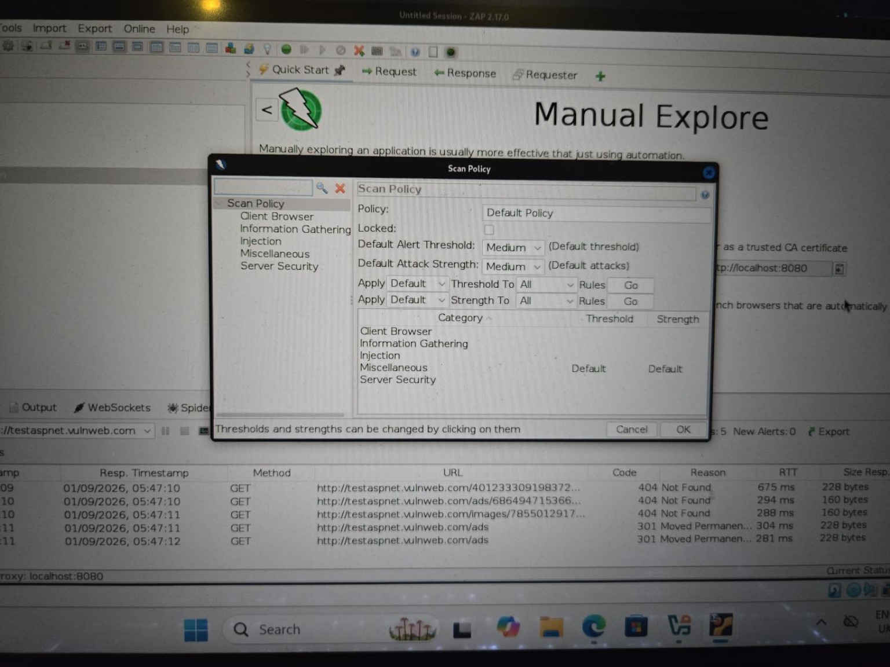

*Figure 3. The Injection category contained no scanner rules.*

This was the first clear clue. I expected injection testing to contain rules for things such as SQL injection and cross-site scripting. If those rules were missing, it explained why the Active Scan had almost nothing to do.

At this point I stopped treating the five-request result as useful evidence about the target.

---

## 7. Troubleshooting the ZAP Installation

### 7.1 Checking the log

I checked ZAP's log from the terminal instead of relying only on the graphical interface. The log showed add-on loading problems and showed scanner plugins being skipped.

```bash
grep -Ei 'error|exception|ascan|scan rule|scanner' ~/.ZAP/zap.log | tail -n 50
```

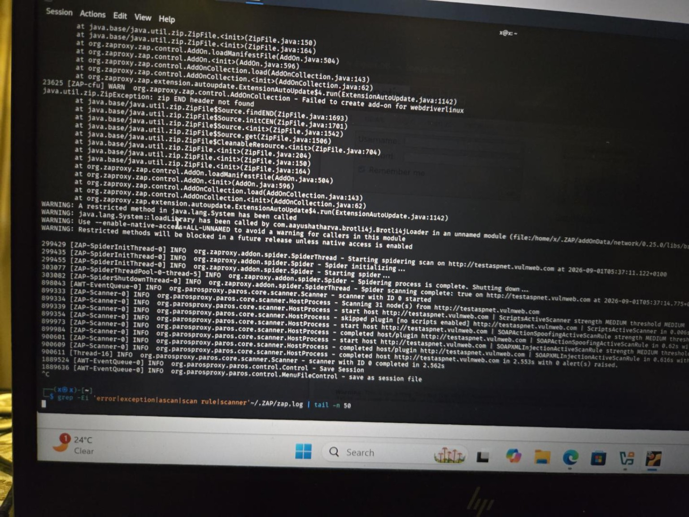

*Figure 4. I checked `zap.log` after the five-request scan and found scanner/add-on errors.*

This supported my suspicion that the problem was my installation rather than the target suddenly having nothing for ZAP to test.

### 7.2 Checking Manage Add-ons

I then opened **Manage Add-ons**. The Common Library entry was still showing version **1.39.0**, and I was having difficulty getting the graphical updater to behave normally.

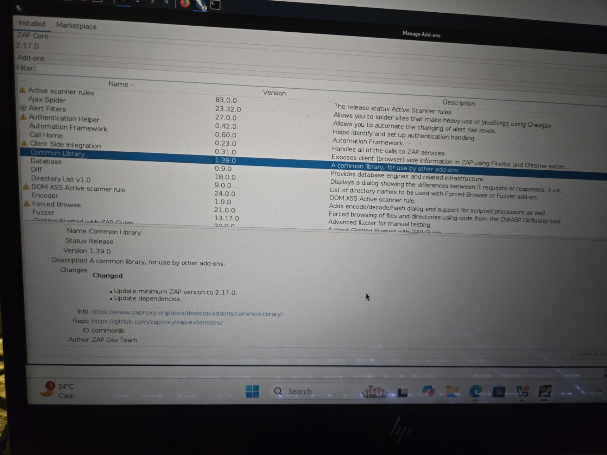

*Figure 5. Manage Add-ons during troubleshooting, including Common Library 1.39.0.*

I also used the command-line updater:

```bash
zaproxy -cmd -addonupdate
```

The command completed its add-on update check, but the underlying problem was still not resolved.

### 7.3 Trying a manual Common Library repair

I tried a manual download while troubleshooting. My first GitHub release URL returned **404 Not Found**.

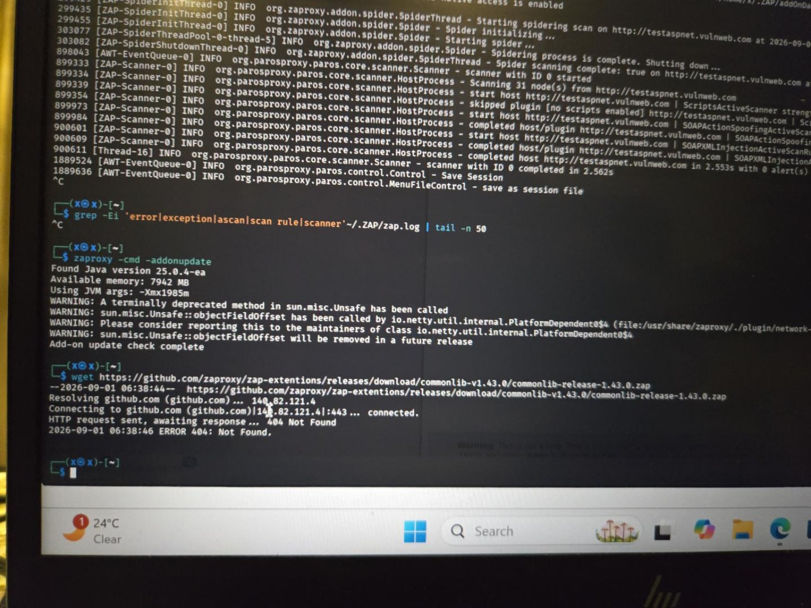

*Figure 6. The command-line add-on check completed, but my first manual Common Library download attempt returned 404.*

I then checked where Common Library files actually existed. This showed me something I had not understood before: ZAP could have add-ons in more than one location.

```bash
ls ~/.ZAP/plugin/commonlib*.zap
ls /usr/share/zaproxy/plugin/commonlib*.zap
```

I found a newer Common Library file in my user ZAP plugin directory while the system ZAP plugin directory still contained **1.39.0**.

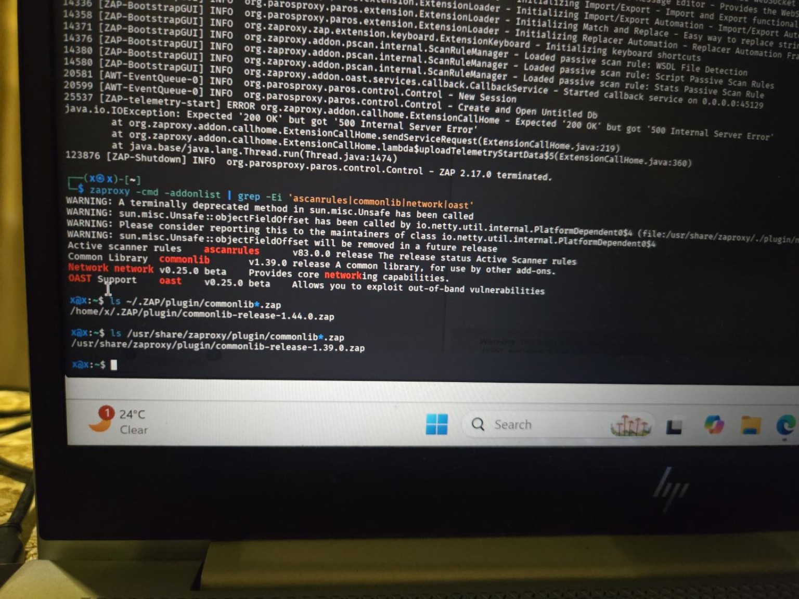

*Figure 7. I found Common Library files in two locations: a newer user copy and the older system copy.*

I tried disabling the older system copy and checked the add-on list again. Instead of giving me a clean fix, Common Library disappeared from the filtered add-on list altogether.

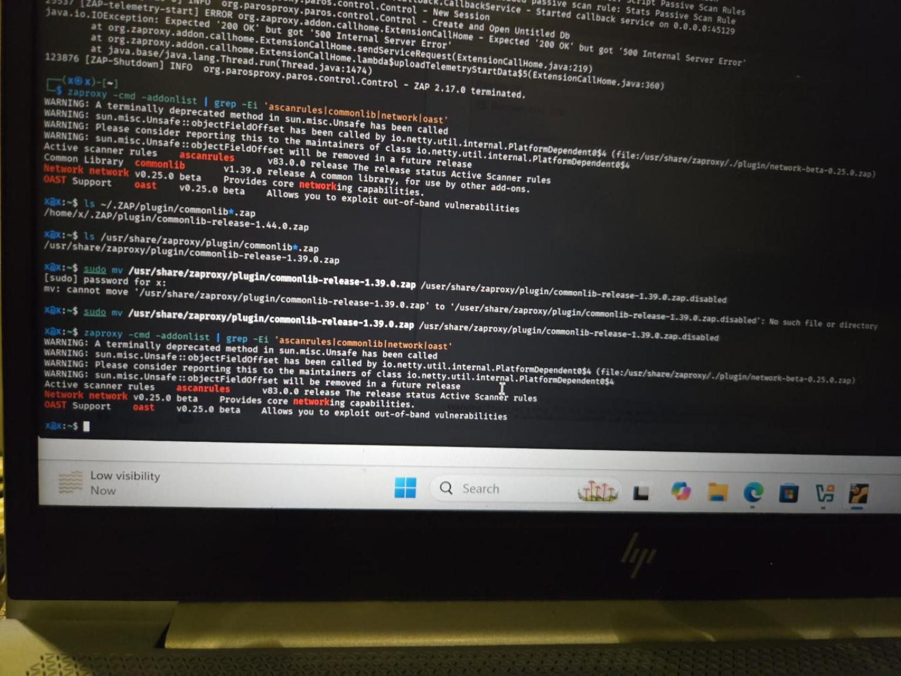

*Figure 8. After trying to disable the older system copy, my filtered add-on list no longer showed Common Library.*

That was the point where continuing to patch the installation felt less useful than starting again.

### What I learned from this troubleshooting

I did not begin this exercise knowing where ZAP stored its add-ons or how the system and user plugin locations interacted. The troubleshooting showed me that a tool can have several moving parts underneath the GUI. It also taught me that there is a point where repeatedly patching a setup can create more uncertainty than a clean reinstall.

---

## 8. Removing and Reinstalling ZAP

Because I did not need to preserve the failed scan session, I decided to uninstall ZAP and reinstall it cleanly.

After uninstalling, I ran `zaproxy` and received **command not found**. That was useful because it confirmed that the old installation had actually been removed.

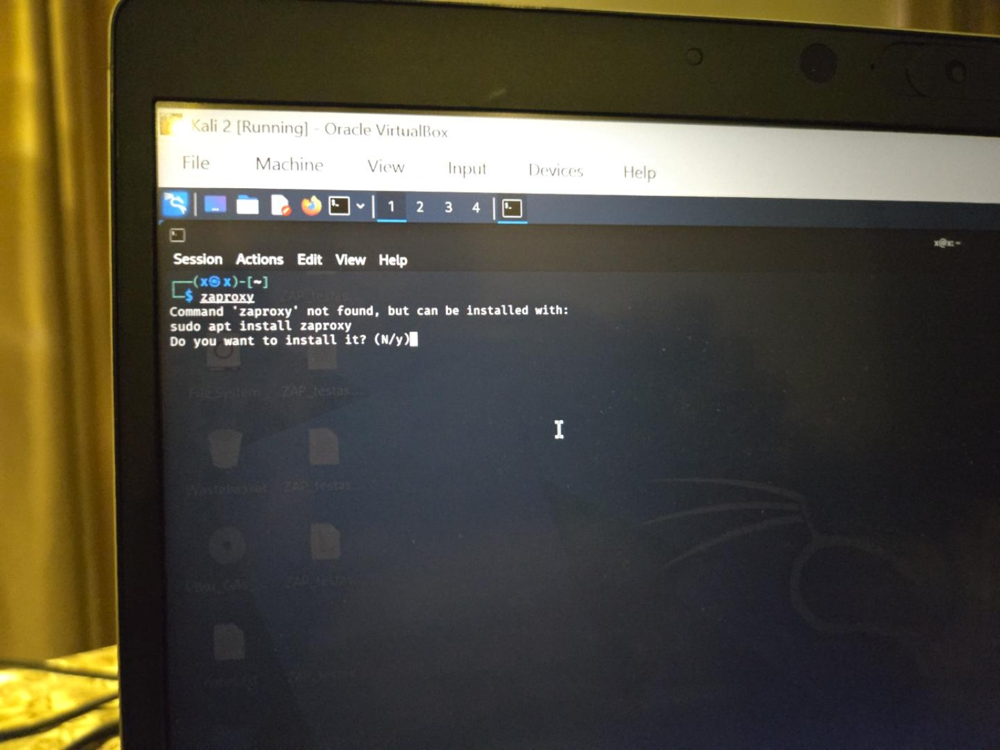

*Figure 9. `zaproxy` was no longer available after the uninstall.*

I reinstalled ZAP and allowed the add-ons to update. Before trusting another Active Scan, I went straight back to the Scan Policy.

This time the **Injection** category was populated with active scanner rules.


*Figure 10. The Injection category was populated after the clean reinstall.*

This was the verification I wanted before trying another full scan.

### What I learned

A security scanner is part of the testing environment. I need to check that the scanner itself is ready before I rely on its output.

---

## 9. Re-establishing Firefox and the ZAP Proxy

After the reinstall, I returned to **Manual Explore**, entered the target and launched Firefox through ZAP.

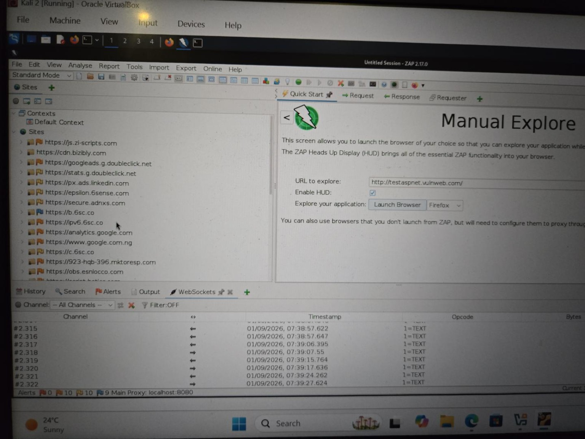

*Figure 11. Manual Explore after the reinstall, with the target entered and the ZAP proxy still on `localhost:8080`.*

I also checked that the target itself loaded through the browser session controlled by ZAP.

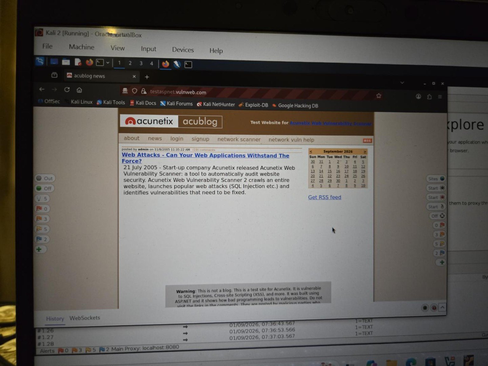

*Figure 12. The Acunetix Test ASP.NET site loaded through the ZAP browser/HUD after the reinstall.*

I had also wondered whether the ZAP certificate needed to be the first thing I fixed after reinstalling. For this particular target, the site I was testing was **HTTP**, not HTTPS, so certificate interception was not the issue that had caused the broken scan.

---

## 10. Repeating the Regular Spider

Because the original discovery belonged to the broken ZAP session, I repeated the regular Spider after the reinstall.

The second run completed at 100% with:

- **39 URLs found**
- **22 nodes added**


*Figure 13. The regular Spider after the reinstall completed with 39 URLs found and 22 nodes added.*

The URL count was different from the first crawl, but both runs produced 22 nodes. I treated this second crawl as the discovery stage for the repaired assessment.

---

## 11. Looking at Passive Alerts Before Active Testing

Before launching another Active Scan, I looked through the **Alerts** tab.

ZAP had already identified a range of issues simply by analysing normal responses.


*Figure 14. Passive alerts visible after discovery.*

One example was **Content Security Policy (CSP) Header Not Set**, which ZAP rated **Medium risk / High confidence**.

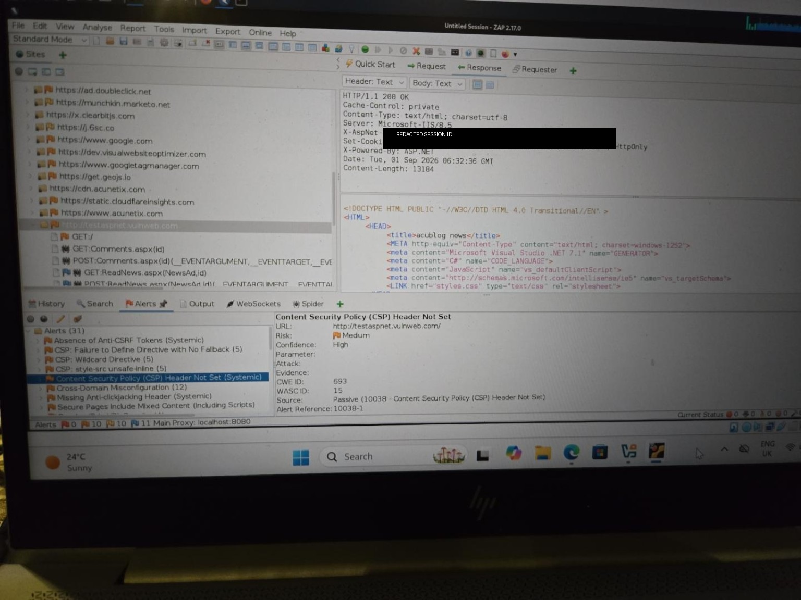

*Figure 15. CSP Header Not Set on the authorised target. A transient session identifier has been redacted from this public image.*

This helped me understand the difference between **passive** and **active** testing. Some issues can be noticed from ordinary responses without ZAP sending an attack payload.

---

## 12. AJAX Spider

I then ran the **AJAX Spider** from the target in the Sites tree.

The crawl continued to grow for a long time. I manually stopped it when it reached **900 crawled URLs** rather than waiting indefinitely while it continued discovering repeated application states.


*Figure 16. I manually stopped the AJAX Spider at 900 crawled URLs.*

I am not presenting 900 as a completed or exhaustive crawl. It is simply the point at which I stopped it after substantial additional discovery.

### What I learned

The regular Spider and AJAX Spider are both discovery tools, but the AJAX Spider behaves more like a browser and can reach dynamic content that a basic crawler may miss.

---

## 13. The Active Scan After Repair

I ran the Active Scan again.

This time it immediately behaved differently. At only **13%**, ZAP had already sent **810 requests**.

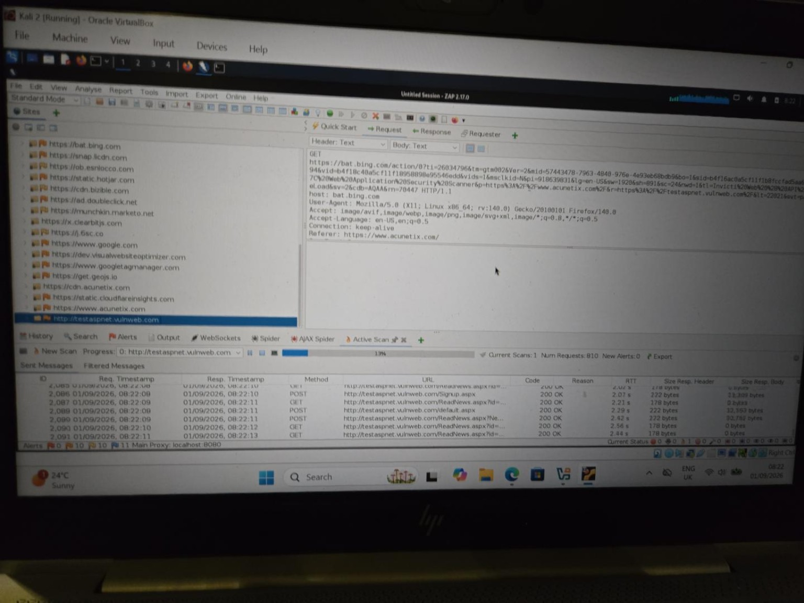

*Figure 17. The repaired Active Scan had already sent 810 requests at 13% progress.*

The scan eventually completed at **100%** with:

- **6,805 requests**
- **125 new alert instances**
- **0 current scans**

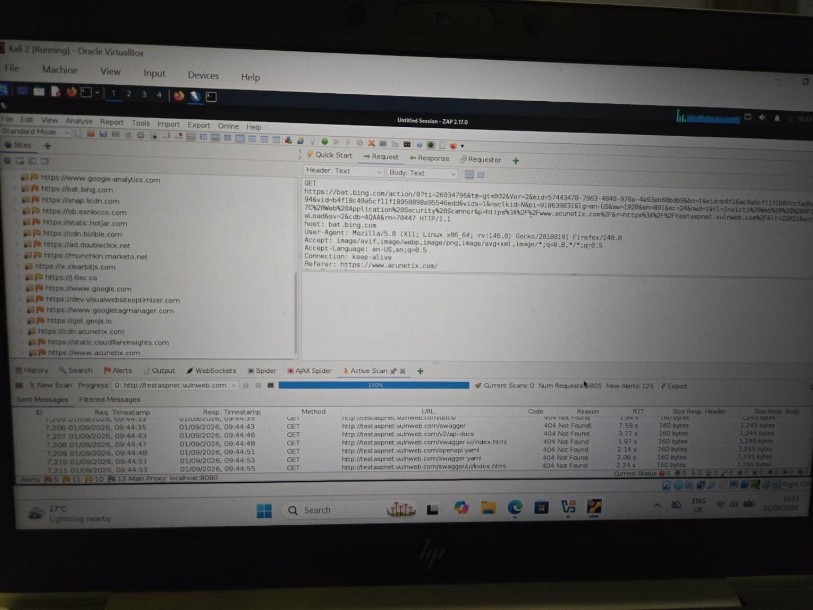

*Figure 18. The successful Active Scan completed after 6,805 requests and produced 125 new alert instances.*

This was completely different from the first scan, which had finished after only five requests.

### An important distinction I learned

**125 new alerts does not mean 125 different vulnerabilities.**

The 125 figure represents alert **instances** generated during the scan. The same alert type can occur on several URLs, requests or parameters. The final target-specific export contained **20 alert types**.

---

## 14. High-Risk Findings I Examined

I did not attempt to manually exploit every alert or extract data from the target. I reviewed the evidence ZAP produced and tried to understand what it was showing me.

### 14.1 DOM-Based Cross-Site Scripting

ZAP reported **Cross Site Scripting (DOM Based)** on `ReadNews.aspx`.

- **Risk:** High
- **Confidence:** High
- **Parameter shown by ZAP:** `NewsAd`

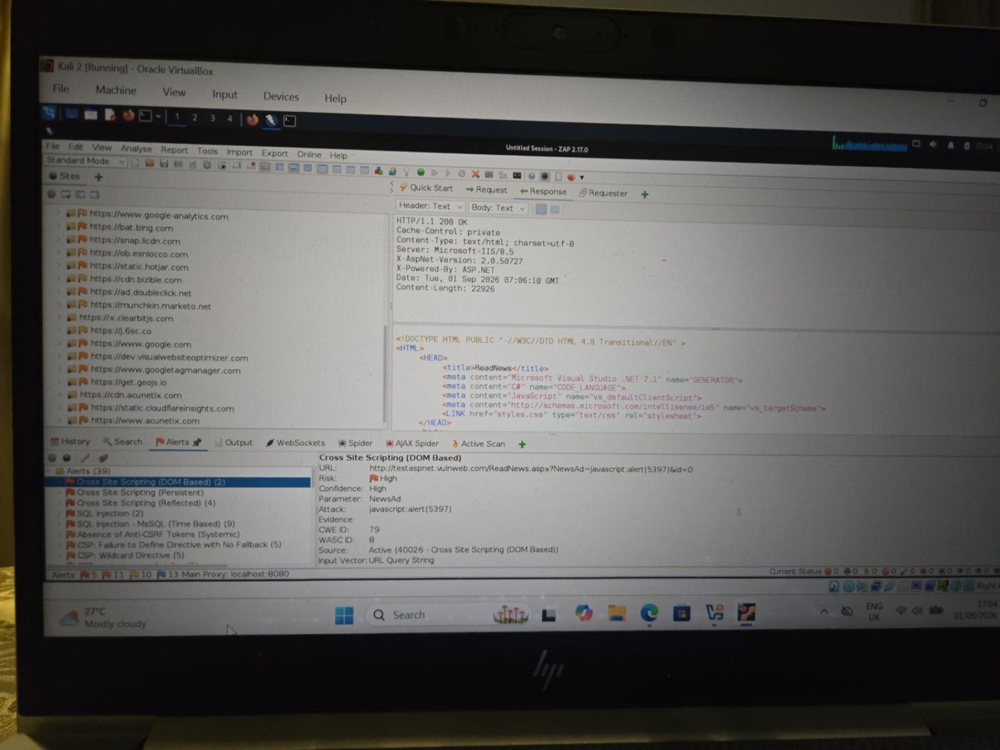

*Figure 19. DOM-based XSS reported by ZAP on the `NewsAd` parameter.*

At my current level, I understood this as user-controlled data reaching a dangerous JavaScript/browser context.

---

### 14.2 Persistent Cross-Site Scripting

ZAP also reported **Persistent XSS** on the comments functionality.

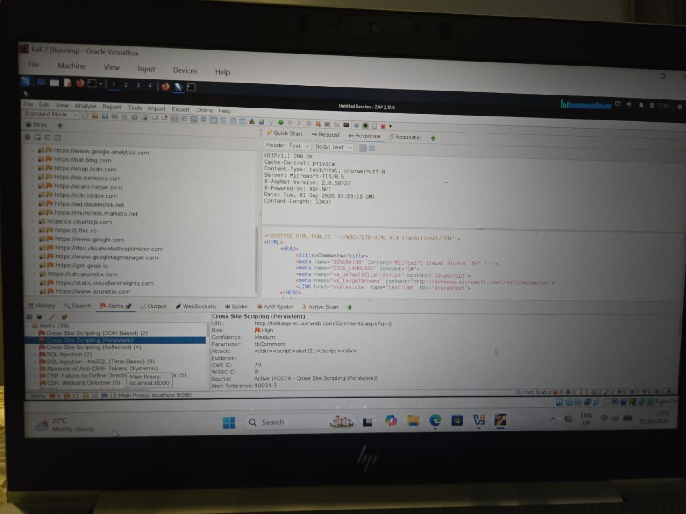

*Figure 20. Persistent XSS reported on the comments page.*

I understood persistent or stored XSS as input that can be saved by the application and later returned to a browser.

---

### 14.3 Reflected Cross-Site Scripting

ZAP reported **Reflected XSS** on the comments functionality as well.


*Figure 21. Reflected XSS evidence. A public IP visible in the response was redacted before publishing this image.*

In the response I could see the injected script string being returned. I understood this as different from persistent XSS because the input is reflected back in the response rather than necessarily being stored for later.

---

### 14.4 SQL Injection

ZAP reported **SQL Injection** on the `id` parameter of `Comments.aspx`.

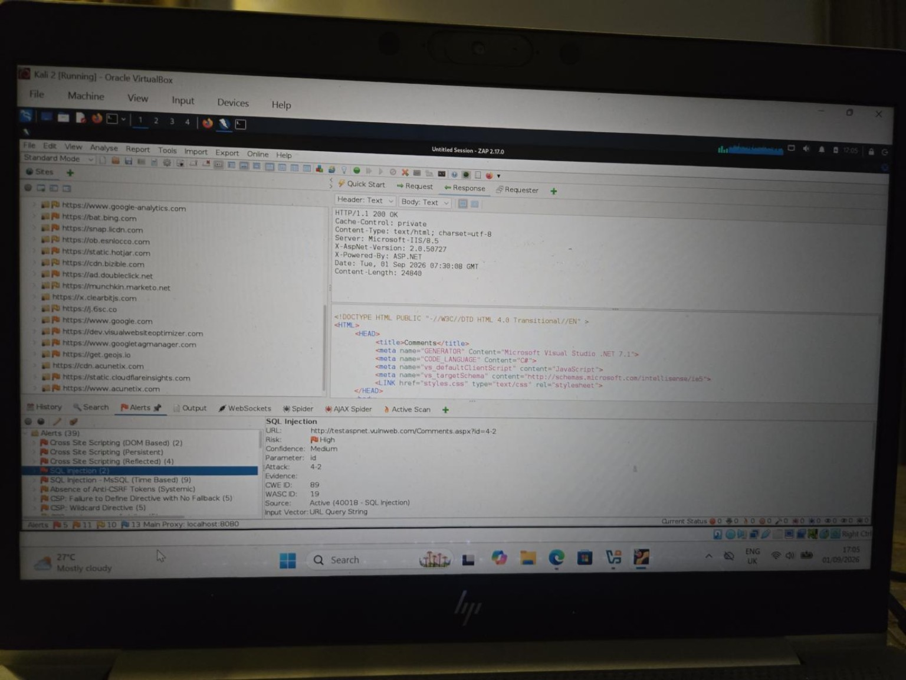

*Figure 22. SQL Injection reported by ZAP on the `id` parameter.*

This helped me understand why apparently simple URL parameters matter during web testing: a value used to identify a page or record may eventually be passed into a database query.

I did **not** try to dump the database or extend the test beyond the scanner evidence.

---

### 14.5 Microsoft SQL Server Time-Based SQL Injection

ZAP also reported **SQL Injection - MsSQL (Time Based)**.


*Figure 23. ZAP's MSSQL time-based SQL injection finding, showing the `WAITFOR DELAY` test payload.*

The scanner used a database delay and observed delayed behaviour. I understood the timing difference as evidence that the injected input may have reached Microsoft SQL Server as executable SQL.

Again, I did not use this to extract information from the database.

---

## 15. Other Alert Types in the Target Report

The final target-scoped export contained these additional alert types.

### Medium risk

- Absence of Anti-CSRF Tokens
- Content Security Policy (CSP) Header Not Set
- HTTP Only Site
- Missing Anti-clickjacking Header

### Low risk

- Cookie without SameSite Attribute
- Server information disclosed through `X-Powered-By`
- Server version information disclosed through the `Server` header
- `X-AspNet-Version` Response Header
- `X-Content-Type-Options` Header Missing

### Informational

- Authentication Request Identified
- Charset Mismatch
- GET for POST
- Session Management Response Identified
- User Agent Fuzzer
- User Controllable HTML Element Attribute (Potential XSS)

I did not treat the Informational items as vulnerabilities simply because ZAP listed them. Some of them are observations that help the scanner understand authentication, sessions, inputs or application behaviour.

---

## 16. What I Understood About Fixes

I am **not** presenting this as a professional remediation plan. These are only the basic fixes I understood from the exercise and from ZAP's descriptions:

- SQL injection should be prevented by keeping user input separate from SQL commands, for example with parameterised queries.
- XSS requires safer handling of untrusted input before it is placed back into HTML or JavaScript.
- Security headers such as CSP, anti-clickjacking protection and `X-Content-Type-Options` provide additional browser-side protection.
- A real application should use HTTPS instead of being HTTP-only.
- Server/version headers can reveal technology information that does not always need to be public.

At this stage, my main aim was to understand **why ZAP raised each category**, not to write a production remediation guide.

---

## 17. Exporting the Final Report — and Another Troubleshooting Step

I wanted to preserve the findings in ZAP's own HTML report rather than rely only on photographs of the screen.

I opened **Generate Report**, selected the Risk and Confidence HTML template and kept the request/response sections so the scanner evidence would remain available for later review.

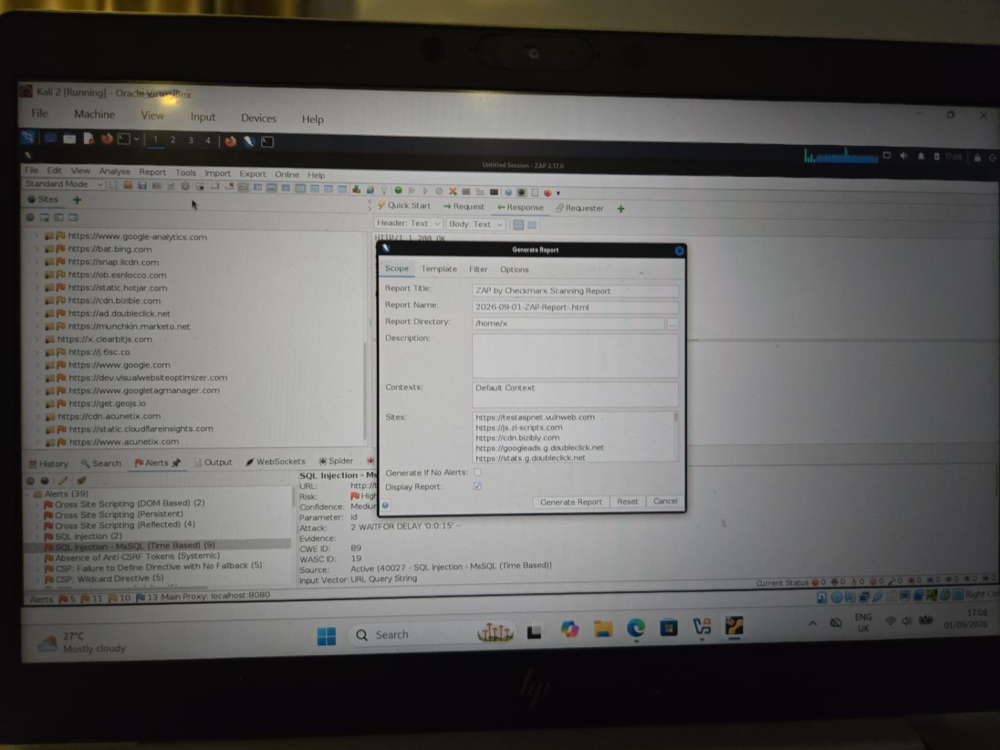

*Figure 24. The ZAP Generate Report dialog while I was preparing the final export.*

### 17.1 First report-generation failure: wrong site entry

My first attempt produced:

> Report would not contain any alerts and “Generate If No Alerts” not selected.

That confused me because I could clearly see alerts in the ZAP session.

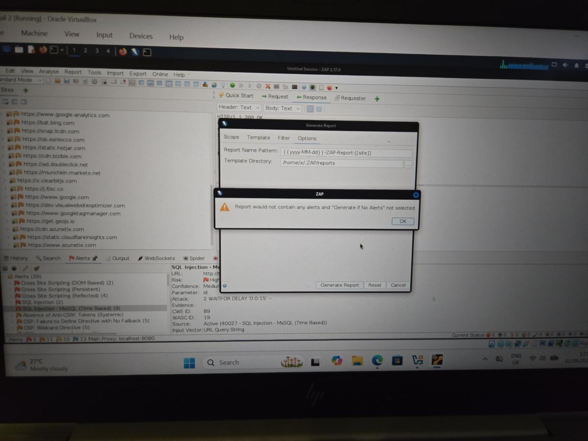

*Figure 25. My first report-generation warning.*

I then noticed that ZAP had both HTTP and HTTPS site entries and that the actual target I had scanned was the **HTTP** site at the bottom of the list.

### 17.2 Second report-generation failure: context filtering

After selecting the correct HTTP target, I still received the same warning.

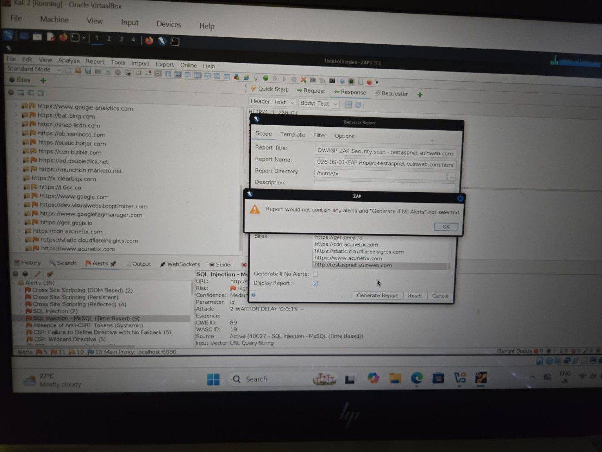

*Figure 26. The warning appeared again even after I selected the correct HTTP target.*

The remaining problem was the selected **Default Context**. The context and site selection together were filtering the report down to no matching alerts. Once I deselected the context and kept the correct HTTP site selected, the report generated successfully.

### What I learned

This was another small example of why I should not assume that a tool's error message tells me the whole story immediately. I had to check both the **site** and the **context** before the export matched what I expected to see.

---

## 18. Final Target-Scoped ZAP Report

The final report was generated for:

`http://testaspnet.vulnweb.com`


*Figure 27. The target-specific ZAP HTML report generated successfully.*

The exported Alerts section showed the High-risk findings under the authorised target.


*Figure 28. High-risk findings grouped under `testaspnet.vulnweb.com` in the exported report.*

The final **Alert Counts by Risk and Confidence** table showed:

| Risk | Alert types |
|---|---:|
| High | 5 |
| Medium | 4 |
| Low | 5 |
| Informational | 6 |
| **Total** | **20** |

The confidence totals were:

| Confidence | Alert types |
|---|---:|
| High | 6 |
| Medium | 11 |
| Low | 3 |
| User Confirmed | 0 |


*Figure 29. Final target-scoped Alert Counts by Risk and Confidence.*

This helped me understand why the **39 alert types visible in the wider ZAP session** and the **125 new alert instances from the Active Scan** should not be written up as 39 or 125 unique vulnerabilities against the target.

I also noticed a small reporting quirk: the overall alert-type summary totalled 20, while the normal detailed site-linked alert rows did not line up perfectly because **HTTP Only Site** is handled differently in the report. I kept ZAP's own final total instead of trying to force the tables to agree.

---

## 19. Comparing the Broken and Working Active Scans

| Measure | First scan | Repaired scan |
|---|---:|---:|
| Progress | 100% | 100% |
| Requests | 5 | 6,805 |
| New alert instances | 0 | 125 |
| Injection category | Empty | Populated |
| My interpretation | Result was not trustworthy | Scanner was clearly doing substantial testing |

For me, this comparison is one of the most important parts of the whole exercise.

Both scans said **100%**, but they did not mean the same thing.

---

## 20. Terms I Learned During the Exercise

**Proxy:** A program placed between the browser and the destination. Firefox sent traffic through ZAP on `localhost:8080`.

**Spider:** A crawler that follows discoverable links and application paths.

**AJAX Spider:** A browser-driven crawler that can discover dynamic content and application states.

**Passive Scan:** ZAP analyses traffic it has already observed without sending an attack payload for that rule.

**Active Scan:** ZAP deliberately sends modified requests and test payloads.

**Alert type:** A category such as SQL Injection or CSP Header Not Set.

**Alert instance:** One occurrence of an alert on a particular URL, request or parameter. Several instances can belong to the same alert type.

**Risk:** ZAP's estimate of how serious a finding could be if it is valid.

**Confidence:** ZAP's estimate of how strongly the evidence supports the finding.

**Scope:** The boundary of what I am authorised and intending to test.

**False positive:** A scanner alert that looks suspicious but does not actually represent the problem claimed by the scanner.

---

## 21. What I Learned

This exercise taught me much more than simply how to press **Active Scan**.

I learned that:

- a security scanner can be broken or incomplete while still displaying a normal-looking completion percentage;
- the number of requests can help me sanity-check whether a scan result makes sense;
- the regular Spider, AJAX Spider, passive scanner and Active Scan all have different jobs;
- discovery identifies things to investigate but does not automatically prove vulnerabilities;
- ZAP can collect third-party browser traffic that is outside my intended scope;
- I need to check the tool itself before trusting a strange result;
- add-ons can exist in user and system locations, which can make troubleshooting more complicated than the GUI suggests;
- sometimes a clean reinstall is more sensible than continuing to patch a setup I no longer trust;
- 125 new alert instances do not mean 125 different vulnerabilities;
- risk and confidence are different measurements;
- strong scanner evidence is still different from manually exploiting a vulnerability; and
- exporting a report also requires attention to site and context filters so that I do not accidentally report unrelated traffic.

The biggest lesson for me was to **question a result that does not make sense**. If I had accepted the first five-request Active Scan at face value, I would have documented a completely misleading result.

---

## 22. Limitations

This was a student assessment of an intentionally vulnerable training website, not a full professional penetration test.

I used ZAP's automated and semi-automated features and reviewed selected findings, but I did not:

- manually validate every alert instance;
- attempt to dump database contents;
- attempt account compromise or privilege escalation;
- test every possible authenticated state or business-logic path; or
- claim that the AJAX Spider exhaustively crawled every possible application state.

I manually stopped the AJAX Spider at 900 crawled URLs.

The Active Scan completed after 6,805 requests, but that still only represents the rules, scope and application states available to ZAP during this session.

The full exported HTML report contains verbose request and response data. I retained that report separately as evidence but did **not** include the raw HTML file in this public GitHub project.

---

## 23. Evidence and Privacy

The images in this repository are photographs/screenshots from my authorised training session. I did not recreate ZAP output for the write-up.

Before preparing the public version, I reviewed the images for information that did not need to be published. I redacted:

- a transient ASP.NET session identifier;
- a public IP address that appeared inside one response; and
- the Windows host folder path from the shared-folder setup image below.

I have not included the raw exported ZAP HTML report in the public repository because it contains substantially more request/response data than is necessary for a student portfolio.

---

<details>
<summary><strong>Appendix A — Preserving the exported report</strong></summary>

### Moving the HTML report out of Kali

After generating the report, I wanted to preserve the original HTML file outside the Kali VM without signing personal accounts into the cybersecurity environment.

I created a dedicated **VirtualBox shared folder** rather than exposing the whole Windows Desktop to Kali. The Windows host path has been redacted in the public image.

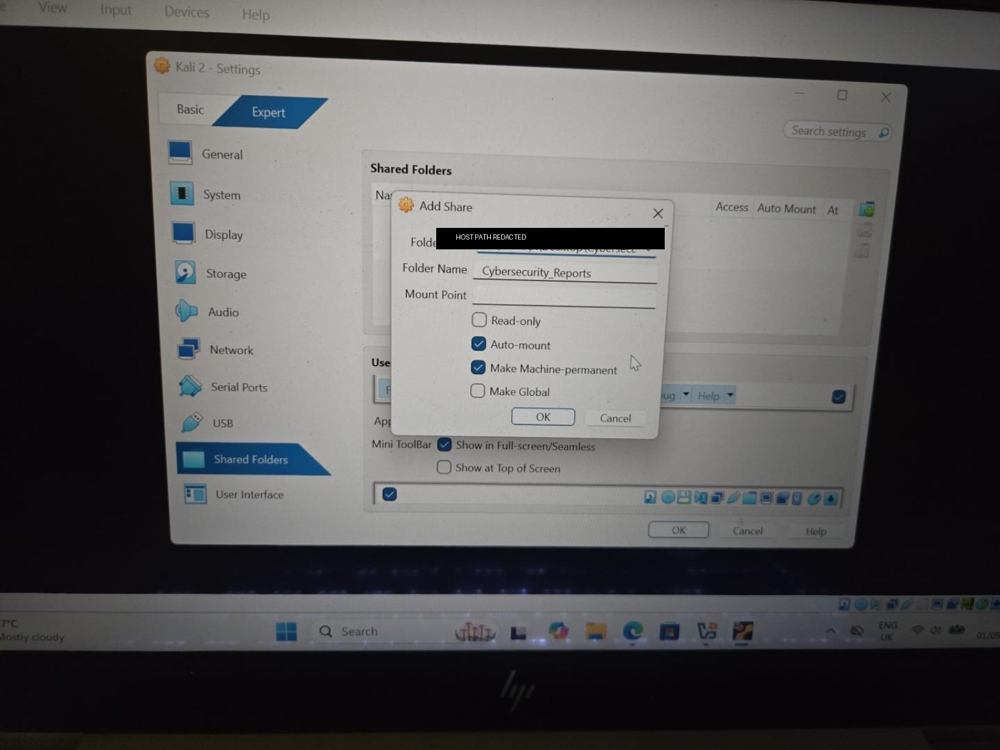

*Figure 30. VirtualBox shared-folder configuration. The Windows host path has been redacted.*

Inside Kali, the shared folder appeared as:

`/media/sf_Cybersecurity_Reports`

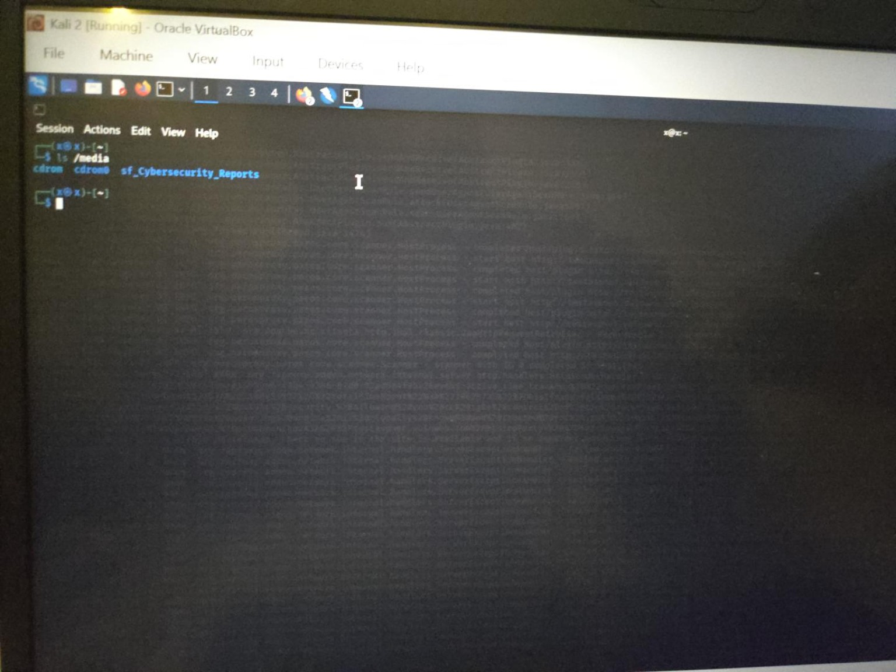

*Figure 31. Kali showing the automatically mounted `sf_Cybersecurity_Reports` folder.*

I copied the generated ZAP report into that folder and then used `ls -lh` to verify that the file existed there. The copied HTML report was approximately **655 KB**.

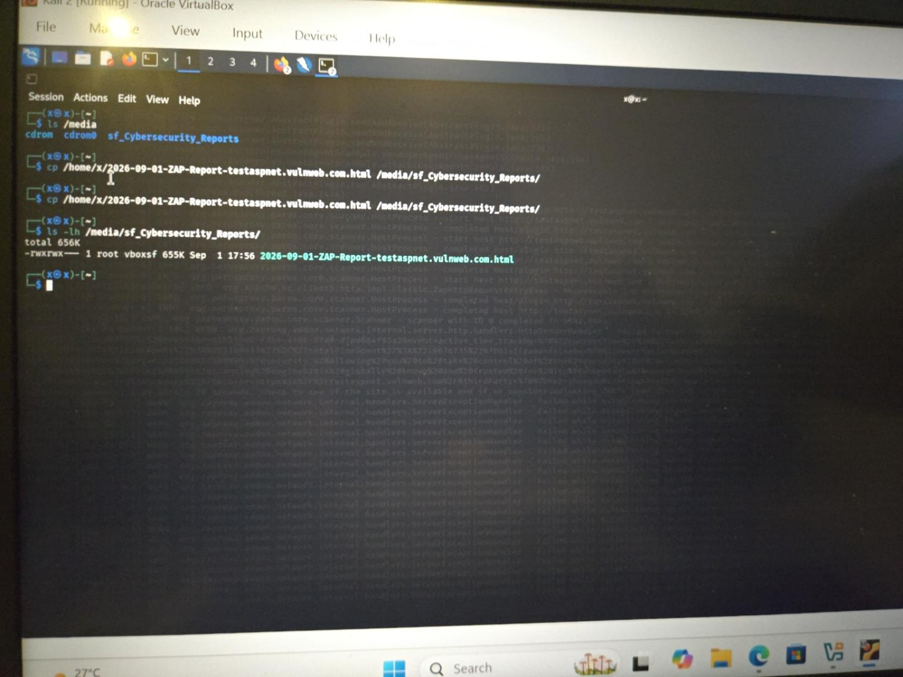

*Figure 32. The target-scoped ZAP HTML report copied into the shared folder and verified from Kali.*

This was not part of vulnerability testing, but I kept it as an evidence-handling note because it shows how I preserved the original report used for this write-up.

</details>

---

## Conclusion

This assessment started with a scan that appeared to work but did not.

I began with discovery, ran an Active Scan, noticed that five requests did not make sense, checked the Scan Policy, read the logs, investigated the add-ons, tried to repair the Common Library problem, and eventually decided to reinstall ZAP. After the reinstall I verified that the Injection rules had returned, repeated discovery, used the AJAX Spider, and ran the Active Scan again.

The repaired scan sent **6,805 requests** and produced **125 alert instances**. The final target-scoped report contained **20 alert types**, including XSS and SQL injection findings.

More importantly, I now understand the workflow better:

**discover → check what the tool can see → inspect passive findings → actively test → review the evidence → check scope → report only what the evidence supports**

The troubleshooting was not separate from the exercise. It was one of the main things I learned from it.

---

## Lab Note

This project documents **authorised security testing against Acunetix Test ASP.NET (`testaspnet.vulnweb.com`), an intentionally vulnerable training site provided for web security testing**.

It is a **student learning record**, not a professional penetration-test report.
