# OWASP ZAP Assessment of Metasploitable 2

| **Date** | 1–2 September 2026 |
|---|---|
| **Environment** | Kali Linux and Metasploitable 2 virtual machines in Oracle VirtualBox |
| **Security Tool** | OWASP ZAP 2.17.0 |
| **Browser** | Mozilla Firefox launched through ZAP |
| **Target** | Metasploitable 2 home-lab VM |
| **Target Address** | `http://192.168.1.114/` |
| **ZAP Proxy** | `localhost:8080` |

**Purpose: authorised cybersecurity training and web vulnerability-scanning practice in my own home lab.**

## 1. Overview

This project records my use of OWASP ZAP against the web applications running on my Metasploitable 2 virtual machine.

I had already worked with Metasploitable 2 using Nmap, so the main aim here was not to repeat a full network assessment. I wanted to practise using ZAP against a target inside my own lab, see how web discovery and active scanning behaved, and understand some of the findings ZAP reported.

The exercise became much more about troubleshooting than I expected. When I returned to Kali, ZAP was no longer installed. Reinstalling it then exposed networking problems involving VirtualBox Bridged networking, NAT, DHCP, routing and NetworkManager. I have kept those steps in this write-up because they were part of what I actually had to understand before I could use ZAP successfully.

Once the environment was working, the regular Spider found **6,080 URLs and added 3,247 nodes**. I decided not to run the AJAX Spider because the regular crawl had already discovered a very large amount of material and this was a familiarisation exercise rather than an attempt to exhaustively crawl every possible application state.

The Active Scan later became extremely large. I stopped it at **35%** after **403,913 requests** and **2,005 new alert instances**. I also noticed external URLs appearing in the Active Scan request list, which reinforced the importance of checking what the scanner is actually sending requests to rather than watching only the progress percentage.

I then reviewed a selection of findings across Mutillidae, TWiki, phpMyAdmin and DVWA. I did not manually prove every alert or attempt to turn the exercise into a complete penetration test.

---

### AI-Assisted Learning Note

During this lab, I used an AI assistant as a learning resource to help troubleshoot errors, interpret some command output, and suggest diagnostic commands that I would not necessarily have known as a beginner. I ran the commands and completed the practical work in my own lab environment.

---

## 2. Objectives

My objectives were to:

- confirm that the Metasploitable 2 VM was reachable from Kali;
- reinstall OWASP ZAP when I discovered it was missing;
- restore both local-lab connectivity and internet access in Kali;
- launch Firefox through the ZAP proxy;
- verify that ZAP's active scanner rules were actually available;
- use the regular Spider to map the web content ZAP could discover;
- review passive findings before active testing;
- run an Active Scan against the discovered Metasploitable site tree;
- examine representative findings from several applications hosted on Metasploitable 2; and
- explain the findings at the level I currently understand them rather than presenting scanner output as manual exploitation.

---

## 3. Scope and Lab Environment

The intended target was my own Metasploitable 2 VM:

`http://192.168.1.114/`

The final working network arrangement was:

`Kali eth0 (Bridged: 192.168.1.113) → Metasploitable 2 (192.168.1.114)`

and, at the same time:

`Kali eth1 (NAT: 10.0.3.15) → Internet`

Firefox sent its web traffic through ZAP on:

`localhost:8080`

This project therefore involved two different networking needs at once: Kali needed to remain on the same local subnet as Metasploitable 2, while still having internet access for package and ZAP add-on downloads.

---

## 4. Re-checking the Metasploitable 2 Baseline

Before opening ZAP, I checked that the Metasploitable 2 VM was still reachable.

```bash
ping -c 4 192.168.1.114
nmap 192.168.1.114
```

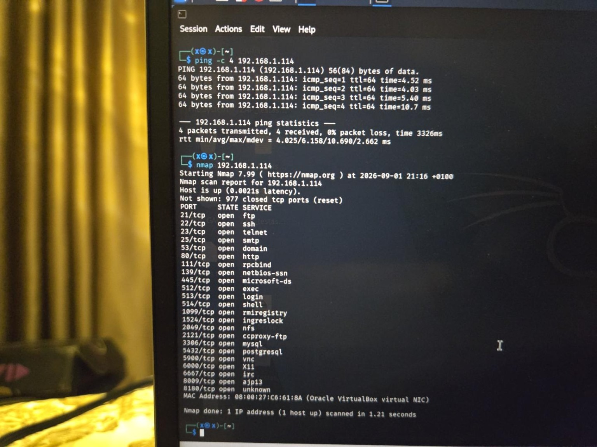

*Figure 1. Metasploitable 2 responded to ping and the initial Nmap scan again showed many exposed services.*

I also repeated a full TCP port scan and service/version detection.

```bash
nmap -p- 192.168.1.114
nmap -sV -p- 192.168.1.114
```

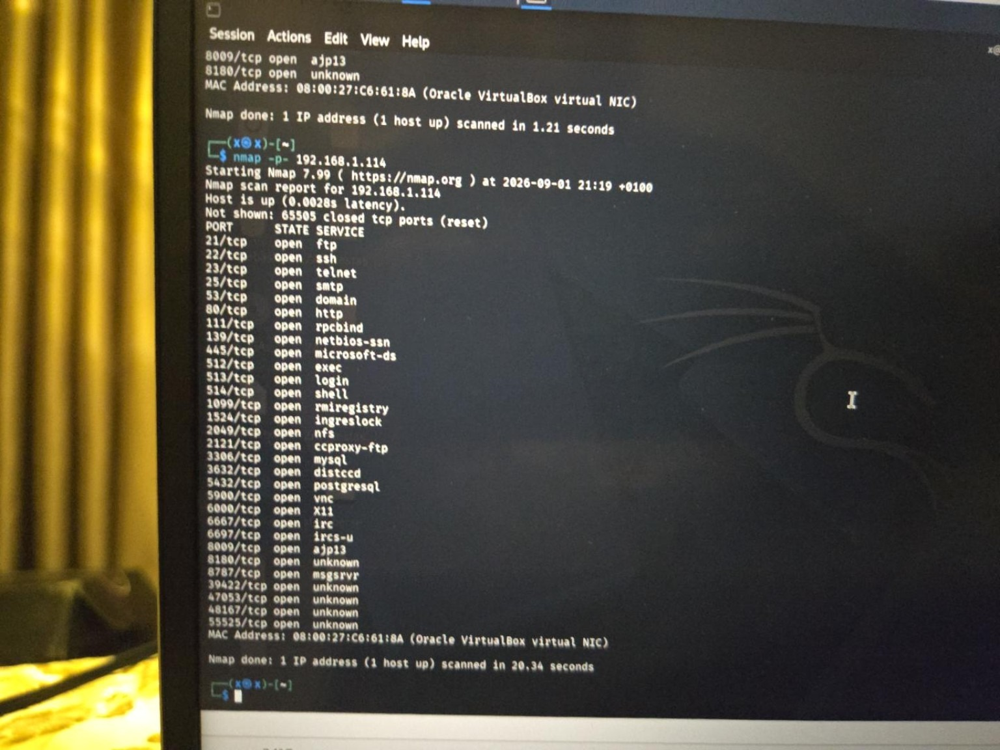

*Figure 2. Full TCP port scan of the lab target.*

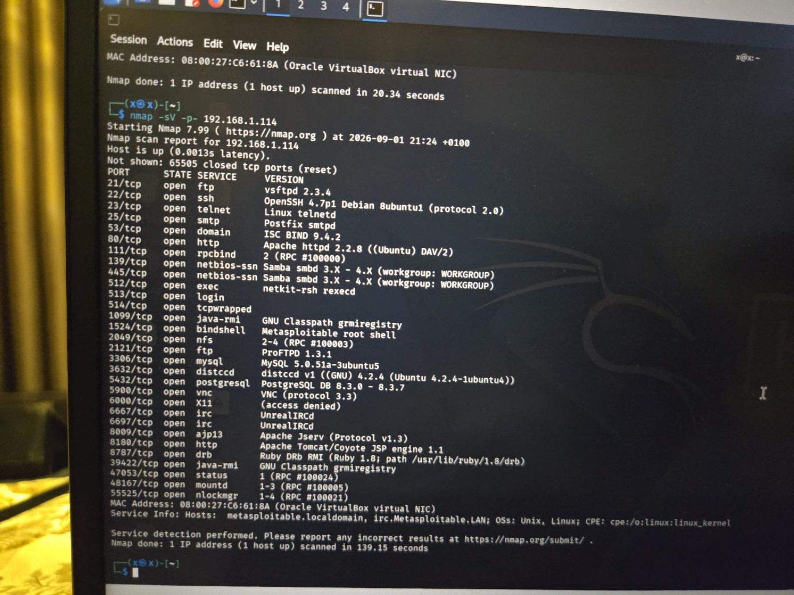

*Figure 3. Service/version detection showing the deliberately old services on Metasploitable 2.*

This was mainly a quick confirmation that the VM I intended to use for ZAP was still available and behaving like the same training target I had previously assessed with Nmap.

---

## 5. ZAP Was Missing When I Returned to Kali

After the network checks, I tried to start ZAP with:

```bash
zaproxy
```

Kali returned **command not found** and offered to install the package.

I did not immediately assume that I had simply typed the command incorrectly. I checked with:

```bash
which zaproxy
dpkg -l | grep -i zaproxy
```

Neither check showed an installed ZAP package.

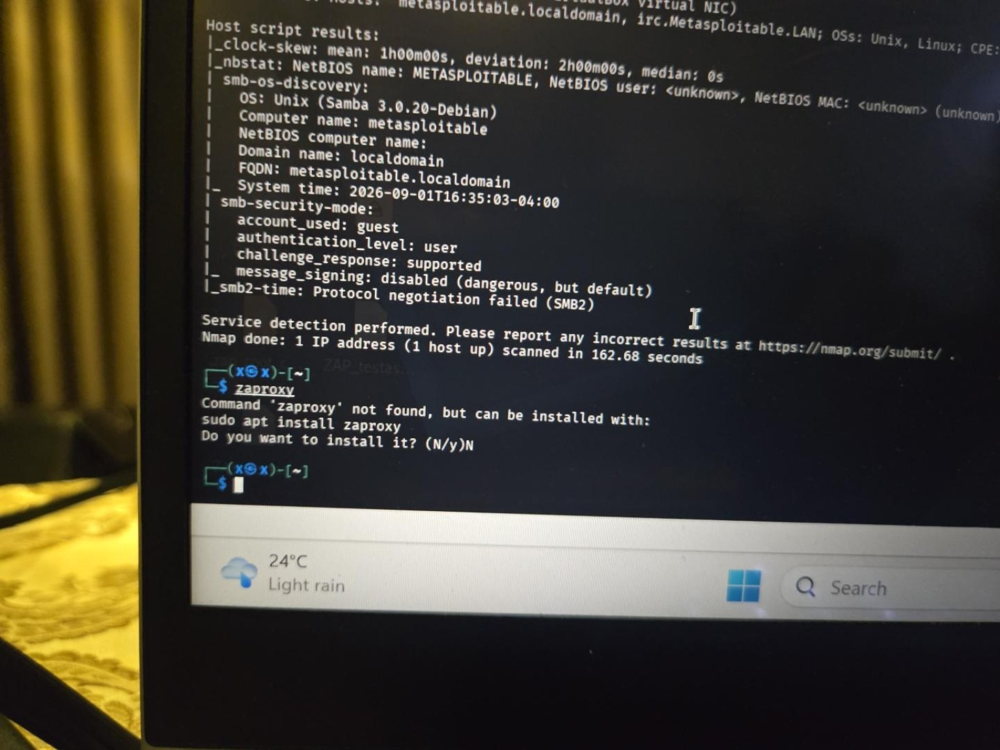

*Figure 4. `zaproxy` was not available and the package check did not show an installed ZAP package.*

I therefore started reinstalling ZAP.

---

## 6. Reinstalling ZAP Exposed a Network Problem

The reinstall did not initially go smoothly. `apt` produced errors including:

- **Network is unreachable**;
- **No route to host**;
- connection timeouts; and
- temporary DNS-resolution failures.

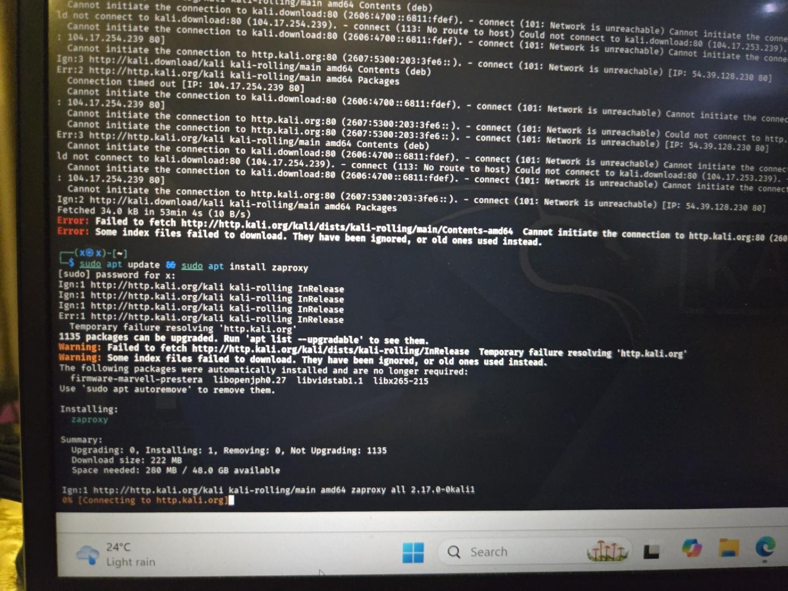

*Figure 5. The first reinstall attempts failed because Kali could not reliably reach the Kali package repositories.*

I also switched the Windows host from Wi-Fi to mobile data to see whether the internet connection itself was the problem. That did not solve the issue by itself.

I then enabled **Adapter 2 as NAT** in VirtualBox while keeping **Adapter 1 as Bridged**. This allowed Kali to download the ZAP package.

The successful reinstall finished with ZAP 2.17.0 and:

```bash
which zaproxy
```

returned:

`/usr/bin/zaproxy`

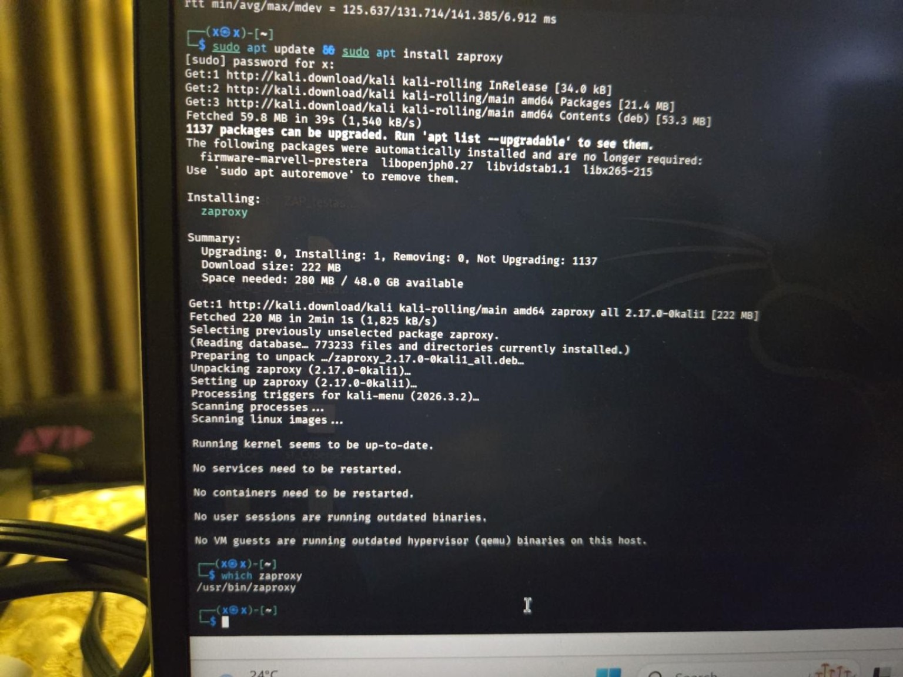

*Figure 6. ZAP reinstalled successfully and `which zaproxy` confirmed the executable path.*

### What I learned

At this stage I understood that **local VM connectivity and internet connectivity are separate things**. Kali could communicate with a lab VM while still having problems reaching external package repositories.

---

## 7. The First ZAP Manual Explore Attempt Timed Out

I opened ZAP, entered:

`http://192.168.1.114/`

in **Manual Explore**, and launched Firefox through ZAP.

The browser did not load the target and ZAP recorded a **504 Gateway Timeout**.

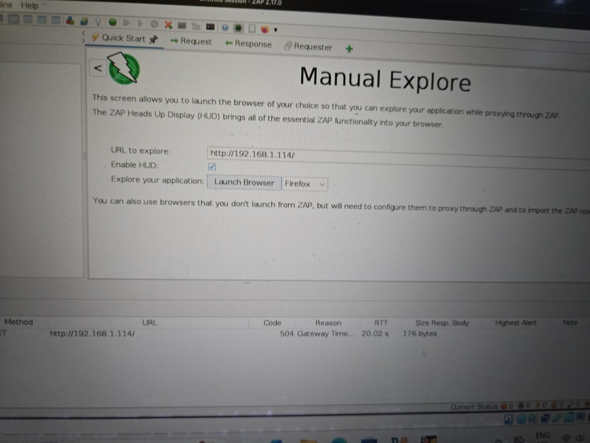

*Figure 7. ZAP received the HTTP request but timed out trying to reach the Metasploitable web server.*

I initially wondered whether this was a ZAP problem. A direct test from Kali showed that it was not.

```bash
curl -v --max-time 10 http://192.168.1.114/
ip route get 192.168.1.114
```

The `curl` request timed out, and the route check showed Kali trying to reach `192.168.1.114` through the NAT gateway on `eth1`.

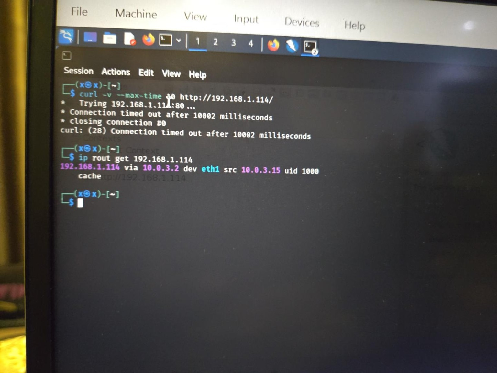

*Figure 8. Kali was trying to reach the `192.168.1.114` lab address through the NAT interface instead of the local Bridged connection.*

This told me the problem was below ZAP in the VM/network configuration.

---

## 8. Bridged Networking, Mobile Data and Stale Addresses

After reconnecting the Windows host to Wi-Fi, I checked both VM network configurations in VirtualBox.

Both Kali and Metasploitable 2 had Adapter 1 configured as a **Bridged Adapter** attached to the same Intel Wi-Fi interface.

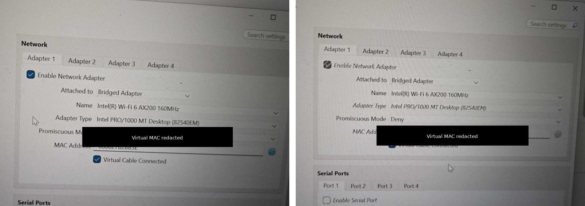

*Figure 9. Both VM Adapter 1 settings were bridged to the same Wi-Fi interface. VirtualBox MAC addresses were redacted for the public image.*

Metasploitable 2 was still using:

`192.168.1.114/24`

but Kali's bridged interface had previously acquired a `10.195.166.x` address while the host was on mobile data.

To decide which subnet was actually correct after returning to Wi-Fi, I checked the Windows Wi-Fi configuration. The host was back on:

- IPv4: `192.168.1.109`
- mask: `255.255.255.0`
- gateway: `192.168.1.1`

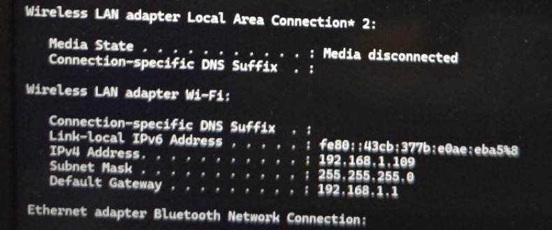

*Figure 10. The Windows Wi-Fi adapter confirmed that the home Wi-Fi network was `192.168.1.0/24`.*

That meant Metasploitable's `192.168.1.114` address was still appropriate and Kali was the VM that needed to rejoin the Wi-Fi subnet.

---

## 9. The Two Kali Adapters Were Sharing One NetworkManager Profile

I was able to reconnect `eth0` and obtain:

`192.168.1.113/24`

However, another strange problem appeared. When I activated `eth1` for NAT, `eth0` lost its IPv4 address. Activating one adapter seemed to take the working configuration away from the other.

I checked NetworkManager with:

```bash
nmcli -f NAME,UUID,TYPE,DEVICE connection show
```

The output showed only one ordinary Ethernet connection profile, **Wired connection 1**, attached to whichever Ethernet device had most recently been activated.

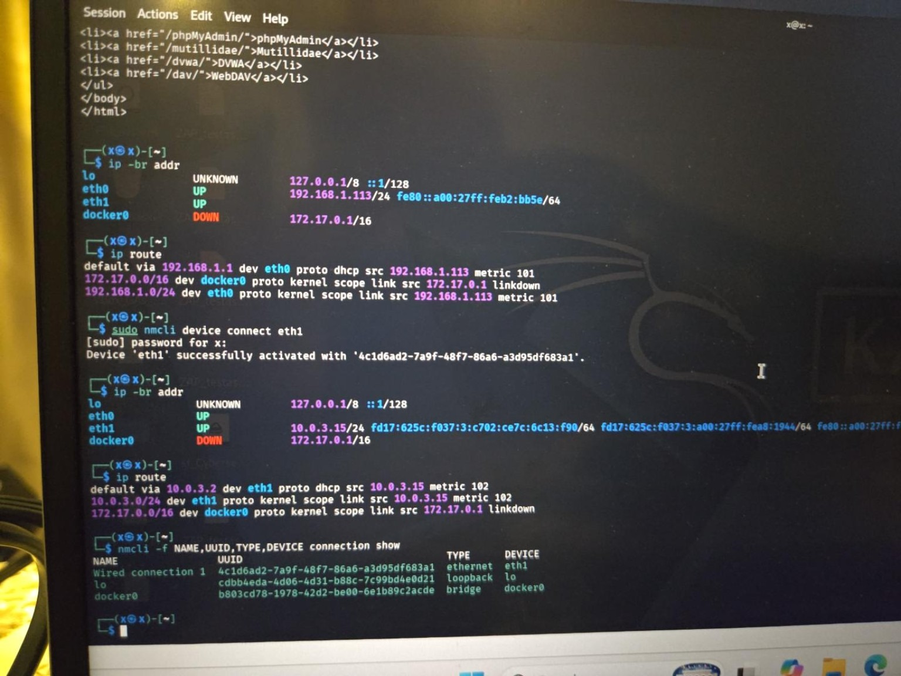

*Figure 11. NetworkManager showed only one ordinary Ethernet connection profile, which helped explain why the connection kept moving between `eth0` and `eth1`.*

This was one of the most useful troubleshooting discoveries in the exercise. The VirtualBox adapters themselves existed, but Kali did not yet have two separate NetworkManager connection profiles for the two different jobs.

---

## 10. Creating a Separate `Lab Bridge` Connection

I created a dedicated NetworkManager connection for the Bridged adapter:

```bash
sudo nmcli connection add type ethernet ifname eth0 con-name "Lab Bridge" ipv4.method auto ipv4.never-default yes
sudo nmcli connection up "Lab Bridge"
```

The `ipv4.never-default yes` setting allowed `eth0` to remain the local-lab connection without trying to become the main internet gateway.

After this change, both interfaces finally had IPv4 addresses at the same time:

- `eth0` → `192.168.1.113/24`
- `eth1` → `10.0.3.15/24`

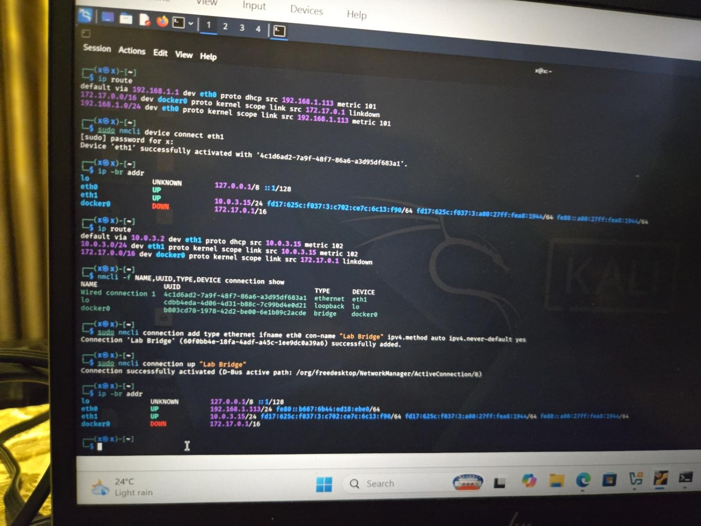

*Figure 12. The new `Lab Bridge` connection allowed the Bridged and NAT interfaces to remain active at the same time.*

I then tested both sides of the setup:

```bash
ping -c 3 192.168.1.114
curl --max-time 10 http://192.168.1.114/
ping -c 3 kali.org
```

The local Metasploitable page returned successfully and external connectivity worked at the same time.

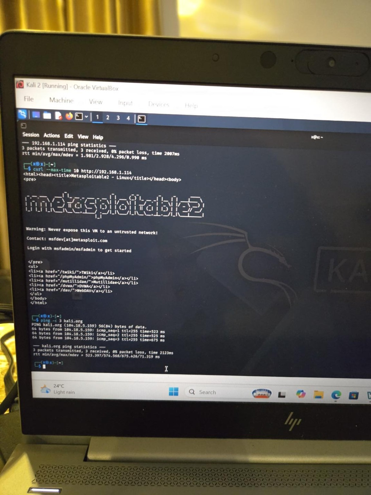

*Figure 13. Kali could reach the Metasploitable 2 web server and an external internet host in the same session.*

### What I learned

I had originally thought that simply enabling a Bridged adapter and a NAT adapter in VirtualBox meant Kali would automatically use both correctly. This exercise showed me that the guest operating system still needs sensible interface configuration and routing. In my case, NetworkManager's single Ethernet profile was part of the problem.

---

## 11. Updating ZAP Before Scanning

Because ZAP had been reinstalled, **Manage Add-ons** opened and began checking/downloading updates.

The process was very slow, which made me question whether anything was happening. I waited until ZAP had completed its update check and **Update All** became available.

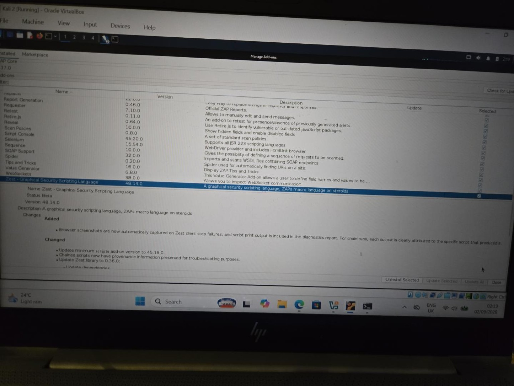

*Figure 14. Manage Add-ons after the reinstall while I checked that the ZAP components were updated.*

I did not want to repeat a problem from my earlier TestASP.NET exercise, where a scan had appeared to complete even though the Injection scanner rules were missing.

---

## 12. Manual Explore Worked After the Network Fix

I returned to **Manual Explore**, entered:

`http://192.168.1.114/`

and launched Firefox through ZAP.

The Metasploitable 2 page loaded successfully and the ZAP HUD appeared.

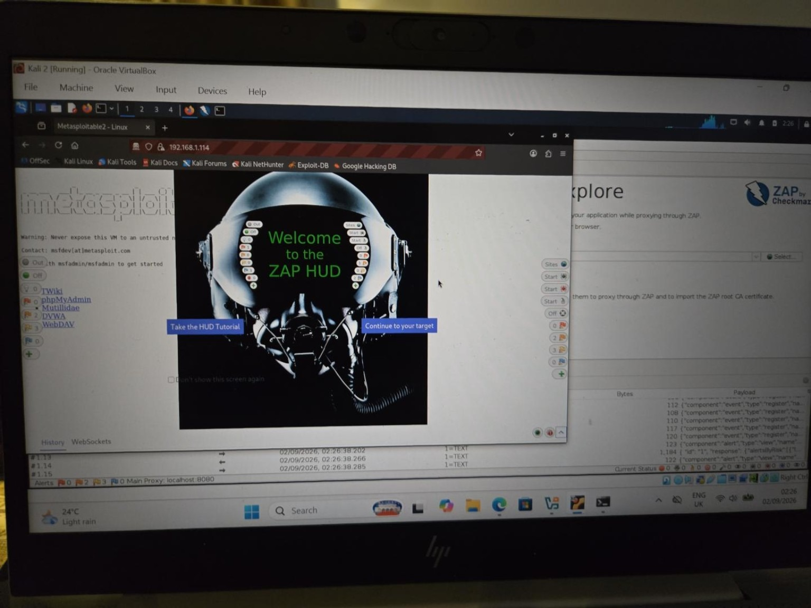

*Figure 15. Metasploitable 2 loaded through the ZAP-controlled Firefox session.*

The ZAP proxy remained:

`localhost:8080`

This reinforced the difference between the **proxy address** and the **target address**. Firefox sent traffic to ZAP locally, and ZAP then communicated with the Metasploitable VM.

---

## 13. Verifying the Active Scanner Rules

Before relying on an Active Scan, I opened the Scan Policy and checked the **Injection** category.

This time the rules were populated. I could see tests including:

- Cross-Site Scripting;
- SQL Injection and database-specific SQL Injection checks;
- Remote OS Command Injection;
- Server-Side Code Injection;
- Server-Side Template Injection;
- XML External Entity attacks; and
- other injection-related rules.

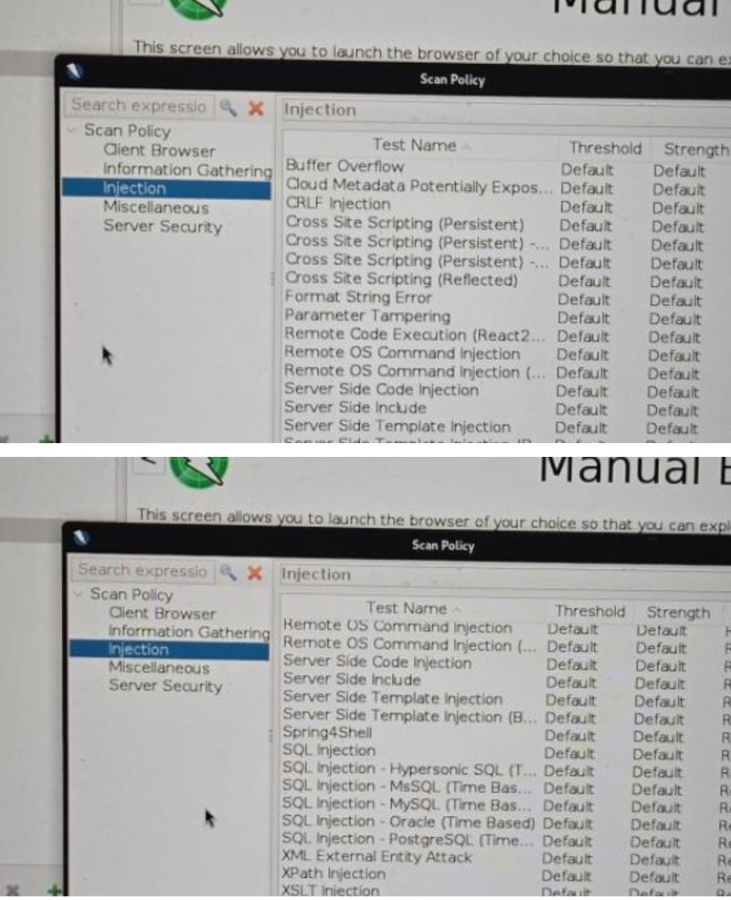

*Figure 16. The Injection category was populated, including XSS, SQL Injection and command/code-injection checks.*

I left the thresholds and strengths at their default settings.

### What I learned

A scanner can be installed and open normally while an important part of its rule set is missing or incomplete. Checking the scanner itself is part of checking whether the result is trustworthy.

---

## 14. Regular Spider

I started the regular Spider from the Metasploitable root site in the ZAP Sites tree.

The Spider completed at **100%** with:

- **6,080 URLs found**
- **3,247 nodes added**

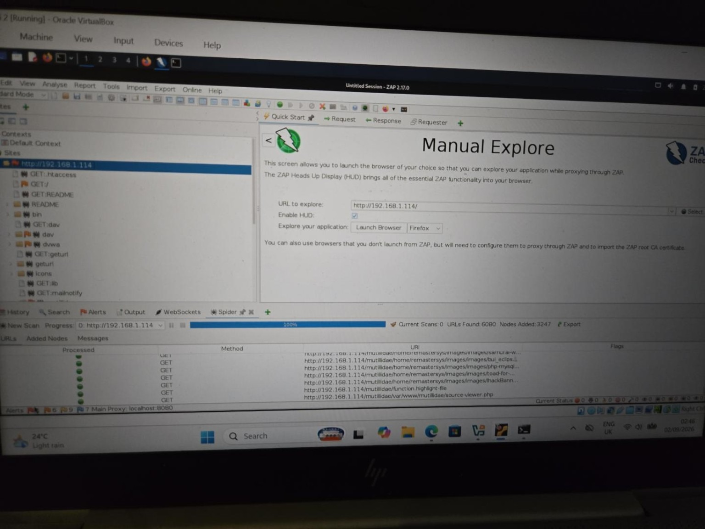

*Figure 17. The regular Spider completed after finding 6,080 URLs and adding 3,247 nodes.*

The Sites tree expanded far beyond the simple Metasploitable landing page and included application paths such as Mutillidae, DVWA and other web resources.

### What I understood

The Spider is a discovery tool. It follows links and builds a map of what ZAP can see. **Finding a URL is not the same as proving that the URL is vulnerable.**

---

## 15. Why I Did Not Run the AJAX Spider

I considered running the AJAX Spider as well, but the regular Spider had already produced more than six thousand URLs and more than three thousand nodes.

For this exercise, my aim was to become familiar with the workflow and understand representative findings. I therefore chose not to add another large crawl simply because the option existed.

I understand that this means I did **not** attempt exhaustive browser-driven discovery of every dynamic application state.

---

## 16. Passive Findings Before the Active Scan

ZAP had already populated a substantial Alerts list before the Active Scan.

One finding I opened was **Hash Disclosure - MD5 Crypt**, which ZAP rated High risk / High confidence on a Mutillidae source-viewer page.

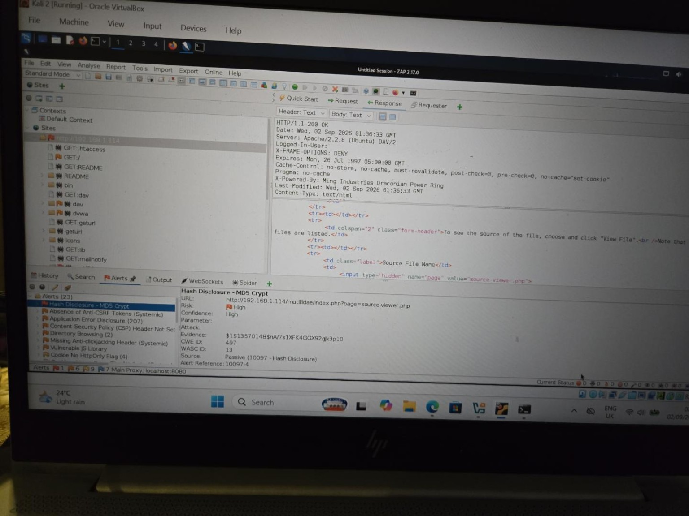

*Figure 18. A passive Hash Disclosure alert reported by ZAP on a Mutillidae page.*

### What I understood about hash disclosure

A password hash is not the same thing as the original password, but exposing a password-hash value can still be useful to an attacker. A hash may be copied and tested offline against possible passwords. In this exercise, I treated this as **ZAP identifying a value matching an MD5-crypt hash pattern**, not as me proving whose password it was or cracking it.

Other passive alerts I looked through included:

- missing anti-clickjacking protection;
- absence of anti-CSRF tokens;
- private IP disclosure;
- server information exposed through headers such as `X-Powered-By`;
- server-version disclosure; and
- authentication/session-related observations.

I did not treat every informational observation as a confirmed vulnerability.

---

## 17. Active Scan

I started an Active Scan from the main Metasploitable 2 site after the Spider had populated the Sites tree.

I had wondered whether starting from the root meant the scan would ignore the individual applications beneath it. The later results showed ZAP sending tests to paths under **Mutillidae, TWiki, phpMyAdmin and DVWA**, so the scan did reach several of those applications through the discovered site structure.

The Active Scan became much larger than I expected. After running for many hours, it had reached only **35%** but had already sent:

- **403,913 requests**
- **2,005 new alert instances**

I also noticed external URLs appearing in the Active Scan request list. At that point I stopped the scan rather than allowing it to continue indefinitely.

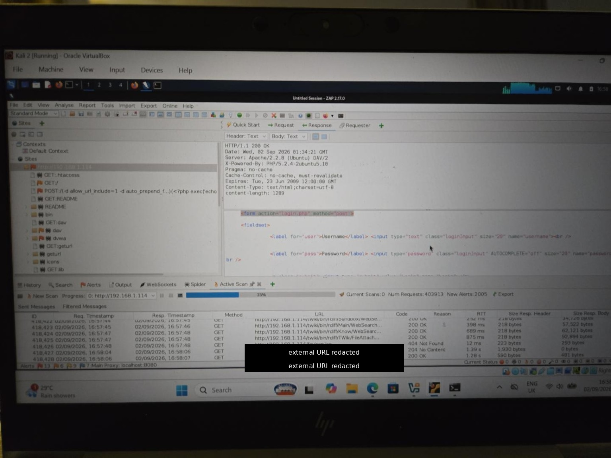

*Figure 19. I manually stopped the Active Scan at 35% after 403,913 requests. External URLs visible in the request list were redacted from the public image.*

### Important distinction

**2,005 new alerts does not mean 2,005 different vulnerabilities.**

The figure represents alert **instances** generated during the scan. The same alert type can appear on many URLs or parameters.

I also do not present this as a completed Active Scan. The final state was **35% with 0 current scans because I stopped it manually**.

### What I learned

A scan does not become more useful just because I allow it to run longer. I need to consider:

- whether the number of requests is proportionate to the exercise;
- whether the scan is still testing what I intended;
- whether third-party/external URLs have appeared; and
- whether I already have enough evidence to meet the learning objective.

---

## 18. Representative Active-Scan Findings

I did not try to open every alert. I selected examples that helped me understand the kinds of weaknesses ZAP was reporting and also showed that the root scan had reached several applications beneath the main Metasploitable page.

### 18.1 Remote Code Execution - CVE-2012-1823

ZAP reported **Remote Code Execution - CVE-2012-1823** on a request under the `/phpMyAdmin/` path.

- **Risk:** High
- **Confidence:** Medium
- **Source:** Active Scan

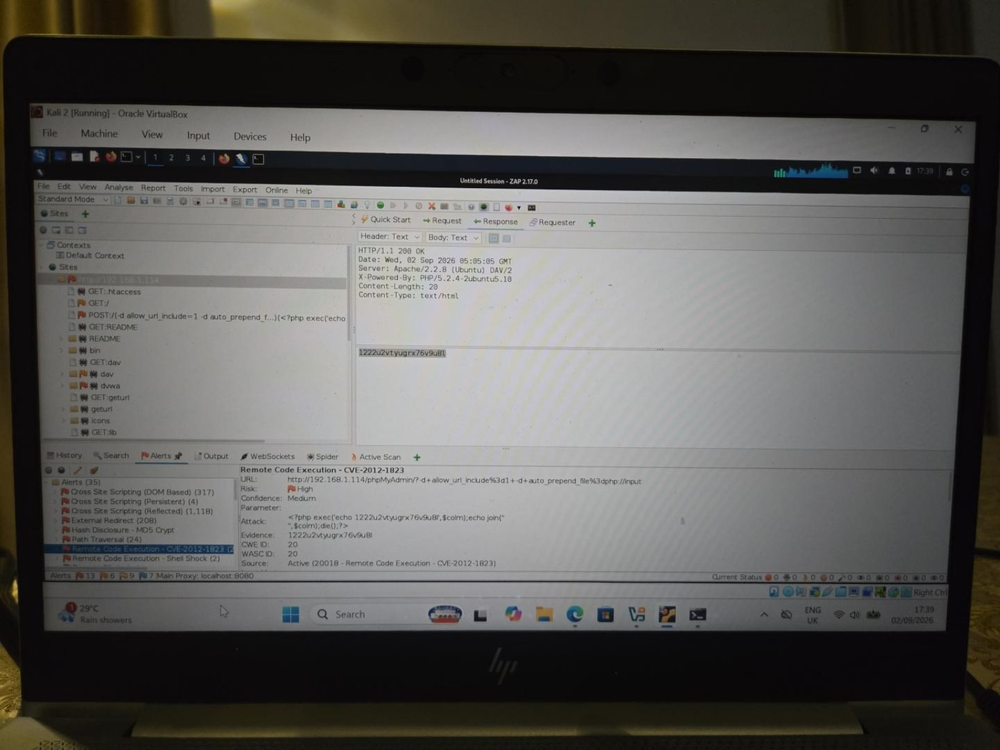

*Figure 20. ZAP's CVE-2012-1823 remote-code-execution alert on a request under the phpMyAdmin path.*

### What I understood

Remote Code Execution means a weakness may allow supplied input to become code or commands executed by the server. If a finding like this were valid on a real system, it could be extremely serious because an attacker might be able to make the server perform actions the application never intended.

I did not manually extend this alert into a separate exploitation exercise. I recorded what ZAP reported.

---

### 18.2 Remote Code Execution - Shellshock

ZAP also reported a **Shellshock**-related remote-code-execution alert on a Mutillidae page.

The evidence shown by ZAP included a deliberate delay of roughly 15 seconds.

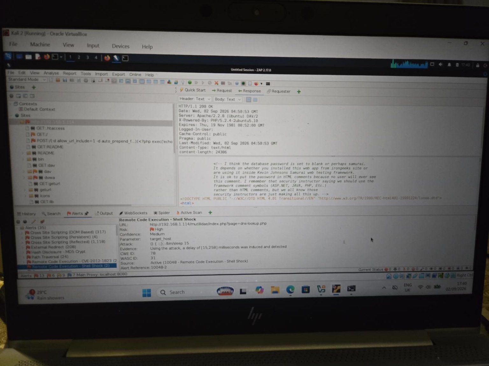

*Figure 21. ZAP's Shellshock-related Active Scan alert on a Mutillidae path.*

### What I understood

Shellshock is associated with unsafe handling of specially crafted input by vulnerable versions of the Bash shell. ZAP's timing test was being used as evidence that the supplied input may have influenced server-side command execution.

I treated this as scanner-generated evidence rather than a manually confirmed compromise.

---

### 18.3 SQL Injection on a TWiki Search Request

ZAP reported **SQL Injection** on a request under the TWiki application.

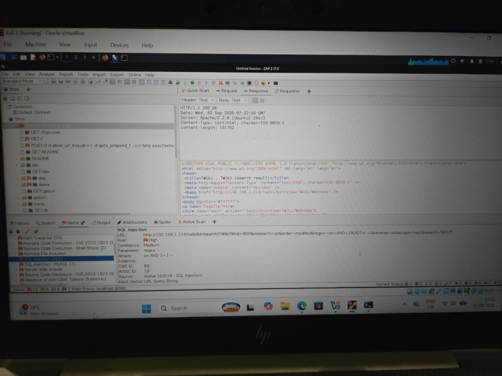

*Figure 22. SQL Injection reported by ZAP on a TWiki search request.*

### What I understood

SQL Injection can happen when untrusted input becomes part of a database query instead of being kept separate from the SQL command itself.

If a real application were vulnerable, an attacker might be able to change what the database query does and potentially read, modify or delete data depending on the database permissions and the exact weakness.

This screenshot was also useful because it showed that the scan had reached **TWiki**, even though I had started the scan from the main Metasploitable root rather than launching a separate scan for every hosted application.

---

### 18.4 Remote File Inclusion on Mutillidae

ZAP reported **Remote File Inclusion** on a Mutillidae file-viewer page.

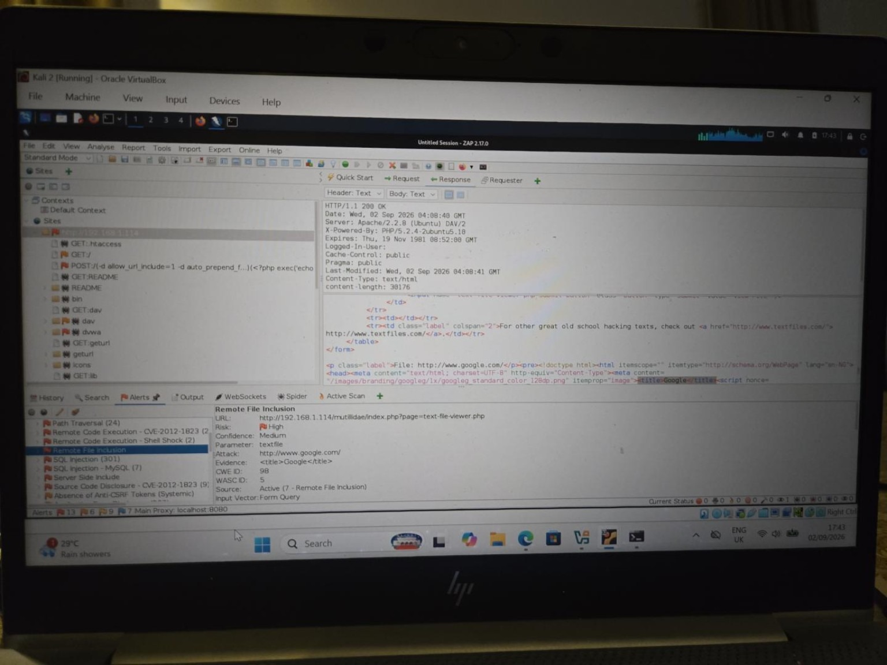

*Figure 23. Remote File Inclusion reported by ZAP on a Mutillidae page.*

### What I understood

Remote File Inclusion means an application may accept a location supplied by the user and load content from that remote location.

If this is not controlled safely, an attacker may be able to make the application include untrusted external content and, depending on how the application handles the file, this can become much more serious.

---

### 18.5 Private IP Disclosure

ZAP reported **Private IP Disclosure** on a Mutillidae page and showed a private `192.168.x.x` address as evidence.

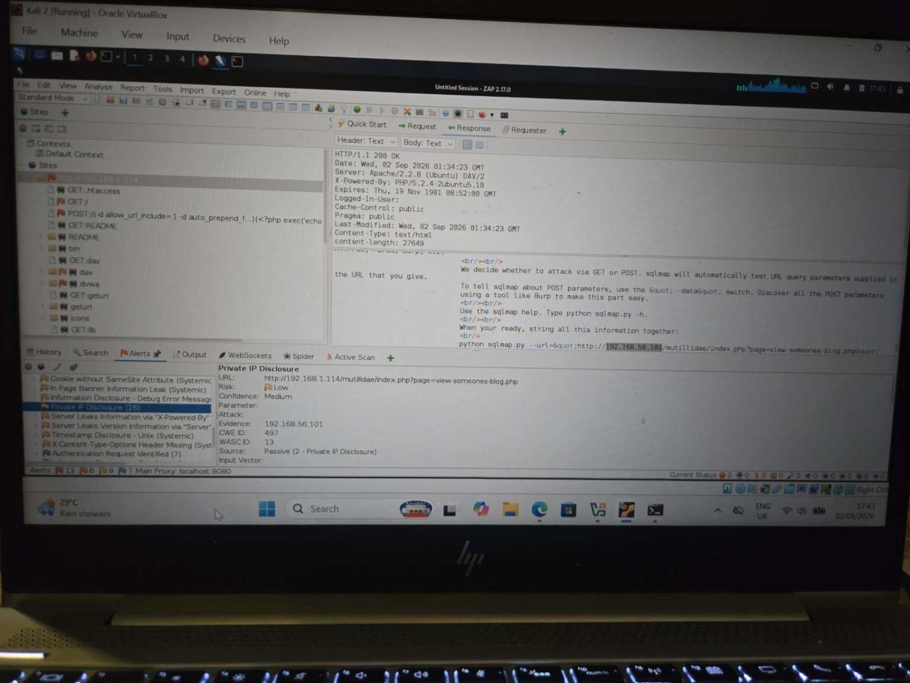

*Figure 24. Private IP Disclosure reported by ZAP.*

### What I understood

Private addresses such as `10.x.x.x`, `172.16.x.x`–`172.31.x.x` and `192.168.x.x` are normally used inside private networks and are not directly routable from the public internet.

Disclosing one is usually more useful for **reconnaissance** than as a direct compromise. It can reveal information about the internal network layout that did not necessarily need to be shown to a user.

In a deliberately vulnerable home-lab VM this was not surprising, but it helped me understand why information disclosure is still recorded by scanners.

---

### 18.6 Vulnerable JavaScript Library

ZAP identified **jQuery 1.3.2** on a Mutillidae JavaScript resource and flagged it as a vulnerable JavaScript library.

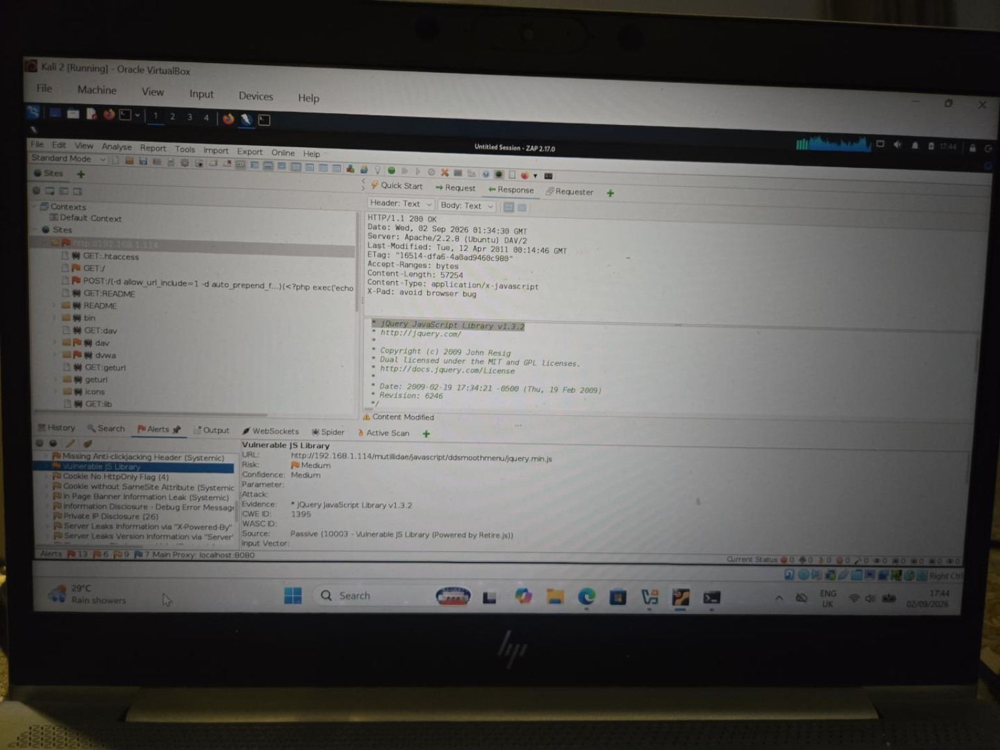

*Figure 25. ZAP identified the old jQuery 1.3.2 library in Mutillidae.*

### What I understood

The presence of an old library does not by itself tell me exactly which exploit will work. It does tell me the application is relying on an outdated component whose known security history can be researched.

This connected with what I had already learned from Nmap service/version detection: **software versions can provide useful reconnaissance information, but identifying a version is not the same thing as proving every vulnerability associated with that version.**

---

### 18.7 DVWA - Absence of Anti-CSRF Tokens

I also found a DVWA-specific alert. ZAP reported **Absence of Anti-CSRF Tokens** on:

`/dvwa/login.php`

- **Risk:** Medium
- **Confidence:** Low

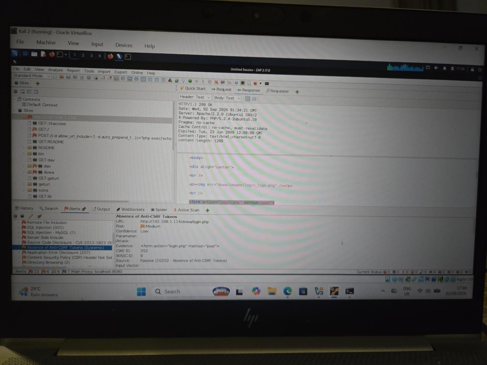

*Figure 26. ZAP did not detect an anti-CSRF token in the DVWA login form.*

### What I understood about CSRF tokens

A browser automatically sends some authentication information, such as session cookies, with requests to a site. A **Cross-Site Request Forgery (CSRF)** attack tries to abuse that by tricking a logged-in browser into sending a request the user did not intend to send.

An anti-CSRF token is an unpredictable value placed into a legitimate form/request. The server checks that value when the request comes back. A different website normally should not know the token, so it becomes harder to forge the request successfully.

ZAP's finding means it **did not detect the usual anti-CSRF token in the form**. I did not treat the alert as automatic proof that I had successfully performed a CSRF attack, especially because ZAP itself rated the confidence Low.

This screenshot also confirmed that ZAP had reached **DVWA** from the root Metasploitable scan.

---

## 19. Other Terms I Learned During the Exercise

**Proxy:** A program between the browser and the destination. Firefox sent web traffic to ZAP on `localhost:8080`, and ZAP then forwarded requests to the target.

**Spider:** A crawler that follows discoverable links and application paths to build a site map.

**Passive Scan:** ZAP examines traffic it has already observed without sending an attack payload for that rule.

**Active Scan:** ZAP deliberately sends modified requests and test payloads to look for weaknesses.

**Alert type:** A category such as SQL Injection, Remote File Inclusion or Missing Anti-CSRF Tokens.

**Alert instance:** One occurrence of an alert on a particular URL, request or parameter. Many instances can belong to the same alert type.

**Risk:** ZAP's estimate of how serious a finding could be if it is valid.

**Confidence:** ZAP's estimate of how strongly the evidence supports the finding.

**Missing anti-clickjacking protection:** A page may be allowed to load inside another site's frame when the usual browser protections are absent. This can contribute to attacks where the user is visually tricked into clicking something different from what they think they are clicking.

**Server information leakage:** Headers such as `Server` or `X-Powered-By` can reveal the web-server/framework technology and sometimes its version. This is mainly useful for reconnaissance because it helps somebody research weaknesses affecting the disclosed software.

---

## 20. Why I Did Not Generate Another ZAP HTML Report

I did **not** generate a standalone ZAP HTML report for this Metasploitable 2 exercise.

I had already practised ZAP's report-generation workflow in my **Acunetix Test ASP.NET** assessment. That was the earlier ZAP exercise where I generated and preserved a target-scoped HTML report.

For accuracy, I did **not** generate a ZAP HTML report for my **OWASP Juice Shop** exercise.

In this project, the regular Spider and partial Active Scan had already produced an enormous amount of data. Generating another very large automated report would have gone beyond what I needed for this particular familiarisation exercise. I chose instead to keep representative evidence screenshots and document what I understood from them.

---

## 21. What I Learned

This exercise taught me more about building and maintaining the testing environment than I expected.

I learned that:

- a tool I used previously may not still be installed when I return to a VM;
- confirming a missing command with `which` and the package database is better than assuming;
- local-lab connectivity and internet connectivity are different networking requirements;
- changing the host from Wi-Fi to mobile data can change the subnet seen by a Bridged VM;
- VirtualBox can expose two adapters to Kali while NetworkManager still needs separate connection profiles to use them the way I intend;
- routing determines which interface Kali actually uses for a destination;
- creating a dedicated `Lab Bridge` connection allowed me to keep local lab traffic on the Bridged interface while NAT handled internet access;
- ZAP add-ons and active scanner rules should be checked before I trust a scan result;
- a regular Spider can discover far more content than the landing page suggests;
- I do not need to run every available crawler simply because it exists;
- scanner alerts are leads/evidence, not automatic proof that I personally exploited the issue;
- the Active Scan reached several applications beneath the Metasploitable root, including Mutillidae, TWiki, phpMyAdmin and DVWA;
- 2,005 new alert instances do not mean 2,005 unique vulnerabilities;
- an Active Scan can become disproportionate to a learning exercise; and
- scope needs to be watched during the scan, not only decided before pressing Start.

The biggest practical lesson was that **troubleshooting the environment was part of the security exercise**. ZAP could not do useful work until I understood enough of the networking underneath it to make the lab and internet routes coexist.

---

## 22. Limitations

This was a student familiarisation exercise against my own deliberately vulnerable Metasploitable 2 lab VM. It was not an exhaustive professional penetration test.

In particular:

- I did not run the AJAX Spider;
- I did not manually explore or authenticate into every possible state of every hosted application;
- I did not manually validate every scanner alert;
- I did not attempt to extract database contents or extend every scanner finding into exploitation;
- the Active Scan was manually stopped at **35%** after **403,913 requests**;
- external URLs appeared in the Active Scan request list, so I stopped rather than allowing the scan to continue indefinitely; and
- I did not generate a standalone ZAP HTML report for this exercise.

The screenshots therefore document what ZAP observed and reported during this specific session rather than claiming complete coverage of every vulnerability in Metasploitable 2.

---

## 23. Evidence and Privacy

The images in this repository are original photographs/screenshots from my lab session. I did not recreate ZAP output for the write-up.

Before preparing the public version, I reviewed the selected images and removed information that did not need to be published. In particular:

- VirtualBox MAC addresses were redacted from the combined network-settings image;
- the Windows `ipconfig` image was cropped to the Wi-Fi subnet information rather than publishing the full command-prompt screen; and
- external URLs visible in the stopped Active Scan request list were redacted.

Private RFC1918 lab addresses such as `192.168.1.x` and `10.0.3.x` are retained where they are needed to explain the network configuration and troubleshooting.

---

## Conclusion

This exercise began as a straightforward plan to run OWASP ZAP against Metasploitable 2, but I first had to rebuild the environment around the tool.

I confirmed the target with Nmap, discovered ZAP was missing, reinstalled it, worked through routing and DHCP problems, separated the Bridged and NAT roles inside NetworkManager, verified local and internet connectivity, updated ZAP, checked that the Injection rules were present, launched the target through the proxy, and completed a large regular Spider.

The Spider found **6,080 URLs** and added **3,247 nodes**. I skipped the AJAX Spider because the discovery stage was already very large. The Active Scan was later stopped at **35% after 403,913 requests and 2,005 new alert instances** when it had become disproportionate to the learning objective and external URLs were visible in the request list.

I then reviewed representative findings across several of the applications hosted by Metasploitable 2, including remote-code-execution alerts, SQL Injection, Remote File Inclusion, private IP disclosure, an outdated JavaScript library and the absence of an anti-CSRF token in DVWA.

More importantly, I now understand the workflow more clearly:

**check the environment → confirm connectivity → proxy the target → verify the scanner → discover content → inspect passive findings → actively test → watch scope → review representative evidence → report only what the evidence supports**

---

## Lab Note

This project documents **authorised security testing against my own Metasploitable 2 home-lab virtual machine**.

It is a **student learning record**, not a professional penetration-test report.
