# CyberChef Data Analysis

| Item | Details |
|---|---|
| **Project** | CyberChef Data Analysis |
| **Date** | 3 September 2026 |
| **Environment** | Kali Linux VM in Oracle VirtualBox |
| **Browser** | Firefox |
| **Tool** | CyberChef |
| **Purpose** | Practise basic data transformation, hashing, extraction and layered decoding |

## 1. Overview

This project records my first focused practice with CyberChef. I had seen CyberChef used as part of a wider cybersecurity workflow, but I wanted to understand the tool itself before moving on to using its output with another tool such as SpiderFoot.

I worked through a series of small exercises covering Base64, hexadecimal, URL encoding, SHA-256 hashing, extracting indicators from text, CyberChef's Magic operation and chained decoding. I also kept the mistakes I made during the exercise because they helped me understand how CyberChef recipes actually work.

### AI-Assisted Learning Note

During this lab, I used an AI assistant as a learning resource to guide the exercises, explain outputs and help me troubleshoot when I misunderstood a result. I completed the practical steps in my own Kali environment.

## 2. Starting CyberChef

I opened CyberChef in Firefox inside Kali. The interface is divided into three main areas:

- **Input** — the data being worked on;
- **Recipe** — the operations CyberChef performs;
- **Output** — the result after the recipe is applied.

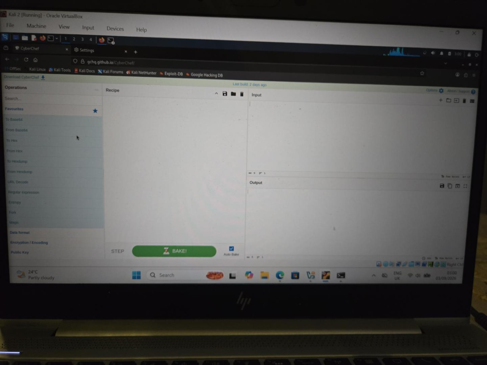

The basic model I learned was:

`Input -> Recipe -> Output`

I also learned that recipes normally run from top to bottom, with the output of one operation becoming the input of the next.

## 3. Base64 Encoding and Decoding

I started with the text:

```text
Cybersecurity is fun
```

Using **To Base64** changed the text into a Base64 representation.

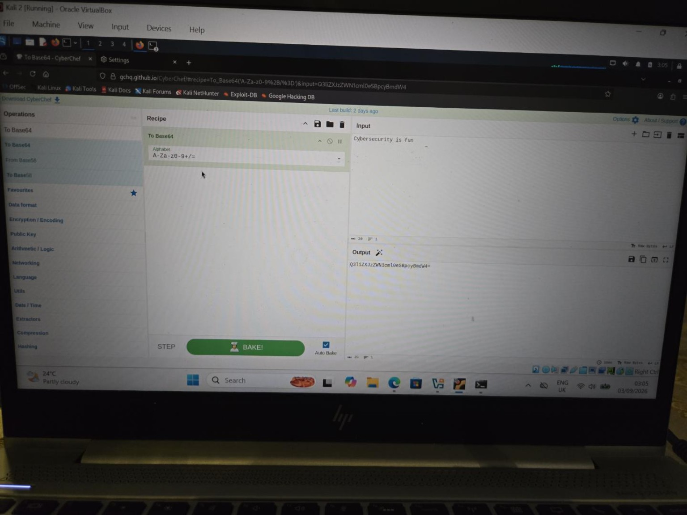

I then added **From Base64** underneath it. The output returned to the original text.


This helped me understand that Base64 is **encoding, not encryption**. It changes how data is represented, but it does not protect the data with a secret key.

I also noticed that Base64 strings may end in `=` or `==`, which is padding rather than a password or security marker.

## 4. Hexadecimal

I then converted the word:

```text
Cyber
```

to hexadecimal and back again.

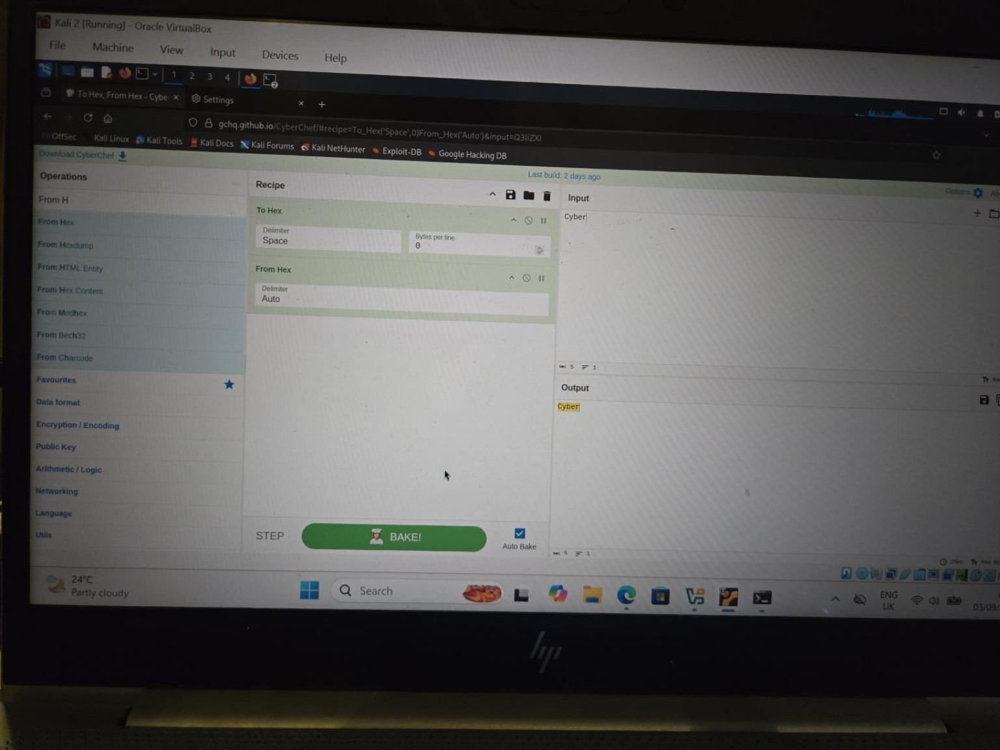

The text was represented as byte values such as:

```text
43 79 62 65 72
```

I learned that hexadecimal can use either uppercase or lowercase letters. It only uses the characters `0-9` and `A-F` / `a-f`.

That corrected one of my misunderstandings later in the exercise: I had initially assumed that lowercase letters meant a value probably was not hexadecimal.

## 5. URL Encoding

I used a short URL-like string containing spaces and special characters and applied **URL Encode**.

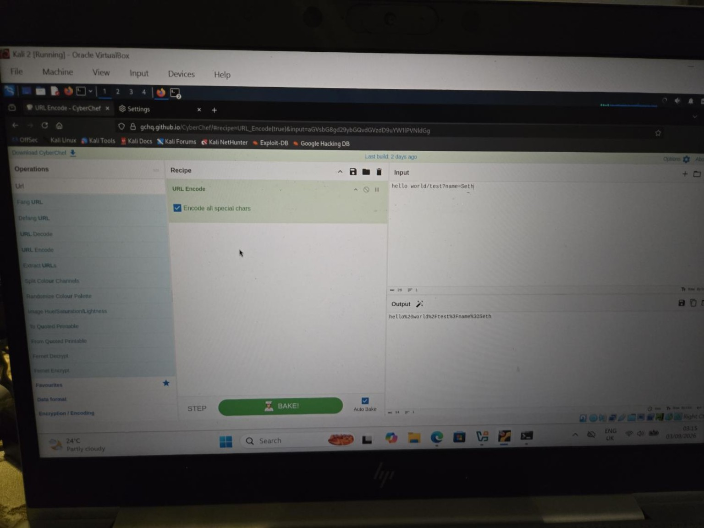

Characters such as spaces, `/`, `?` and `=` were represented using percent-encoded values such as `%20`, `%2F`, `%3F` and `%3D`.

This connected with some of the unusual-looking parameters I had already seen while working with OWASP ZAP. I understood that URL encoding is another reversible representation rather than encryption.

## 6. SHA-256 Hashing

I then moved to hashing, which behaved differently from the reversible encoding exercises.

I entered:

```text
Cybersecurity
```

and used SHA2 with a size of **256 bits**.

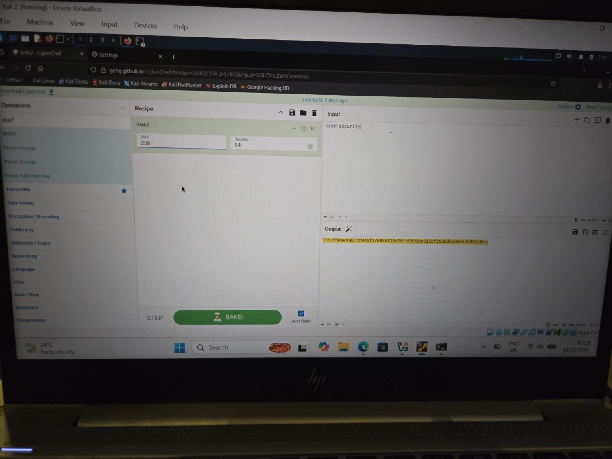

I then changed only the final letter from lowercase `y` to uppercase `Y`.

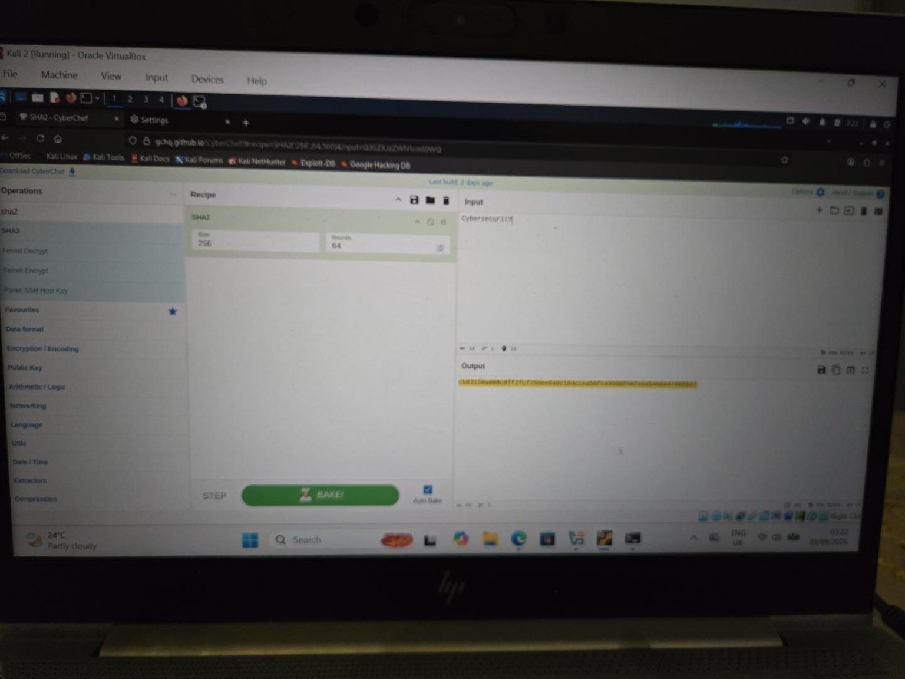

The resulting hash changed dramatically even though the input changed by only one character. This demonstrated the **avalanche effect**.

The important difference I learned was that a cryptographic hash is not intended to have a normal reverse operation in the way Base64, Hex or URL encoding does. Hashes can be used to compare data and detect changes.

## 7. Extracting Useful Data from Text

I next used a small fictional incident note containing:

- an IP address;
- two email addresses;
- a URL.

I used separate extraction recipes so that each operation worked against the original text.

### IP address

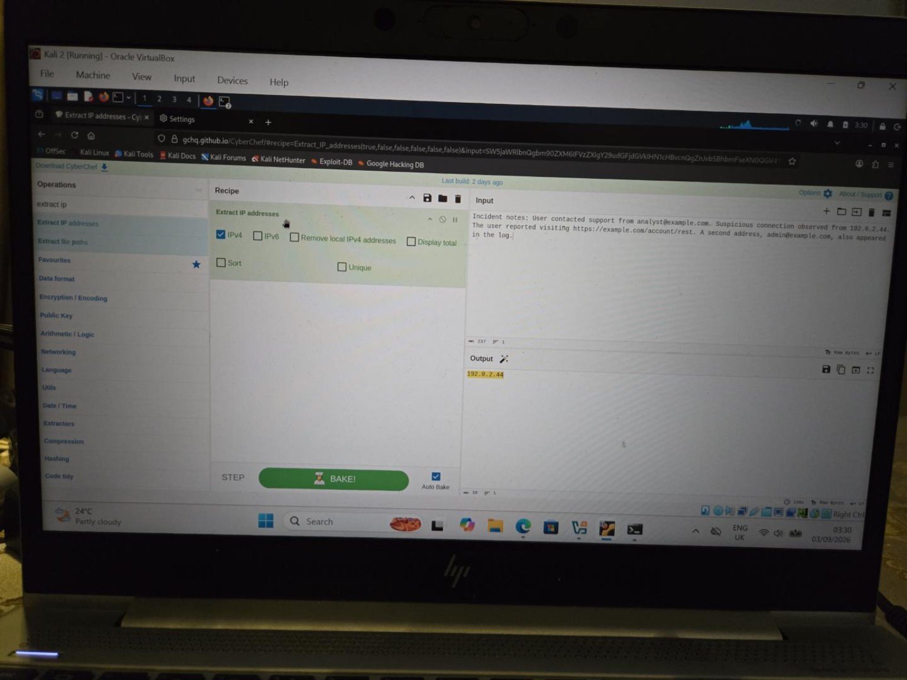

### Email addresses

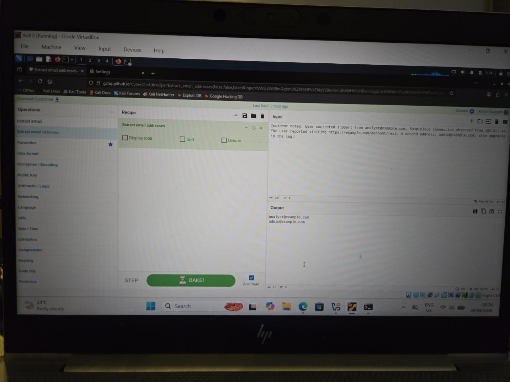

### URL

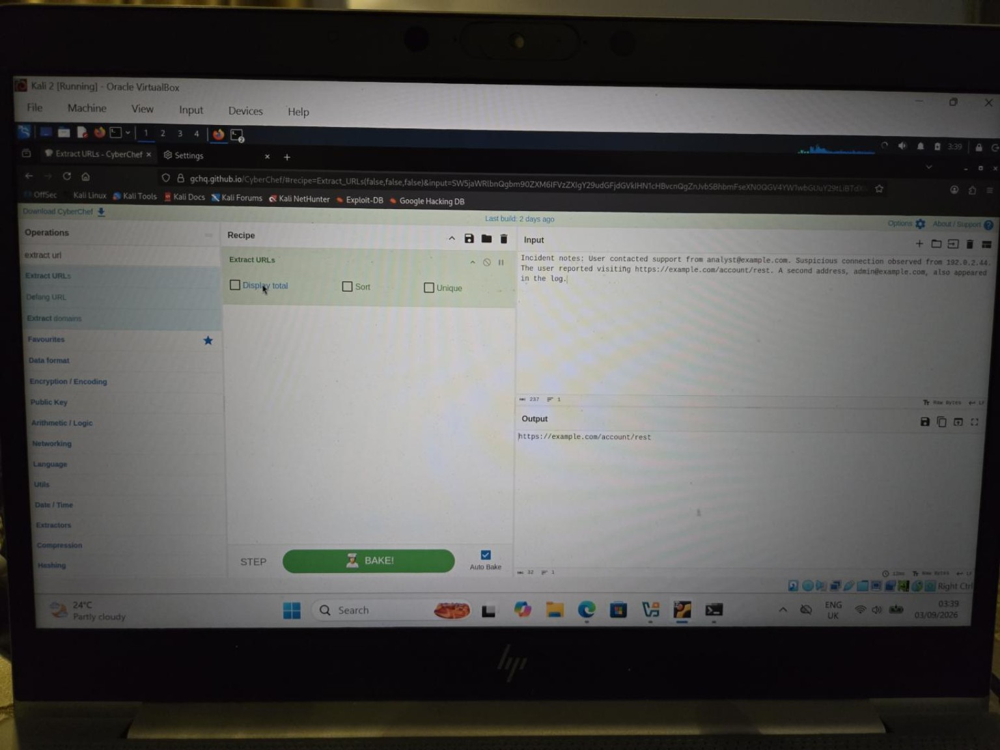

At first, I placed **Extract email addresses** underneath **Extract IP addresses** in the same recipe and got no email results. I learned that this was because the second operation was working on the first operation's output — which by then contained only the IP address.

This made the idea of recipe order much clearer. Independent searches of the same original text are easier to run as separate recipes unless I deliberately build a branching or more advanced recipe.

## 8. Magic

I then tested CyberChef's **Magic** operation using:

```text
SGVsbG8=
```

Without being told the format, Magic suggested **From Base64** and showed a readable result.

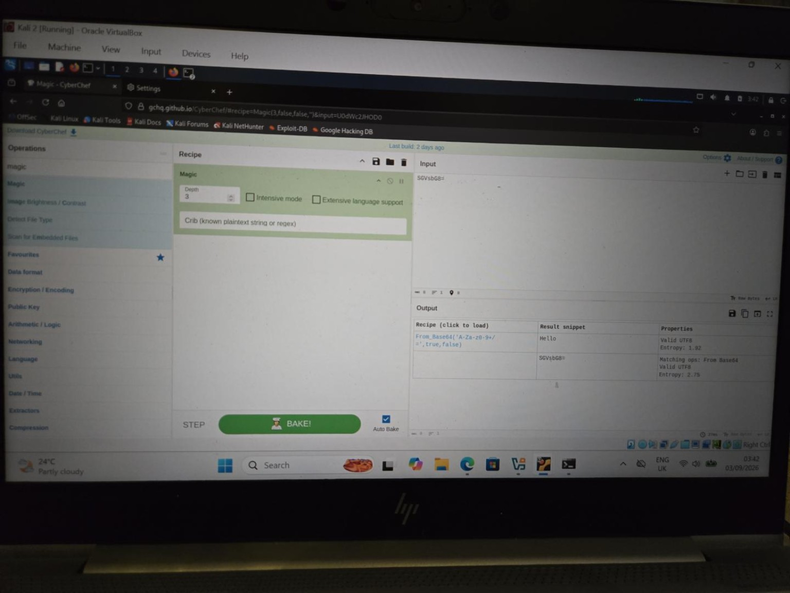

I clicked the suggested recipe and CyberChef loaded **From Base64**, producing:

```text
Hello
```

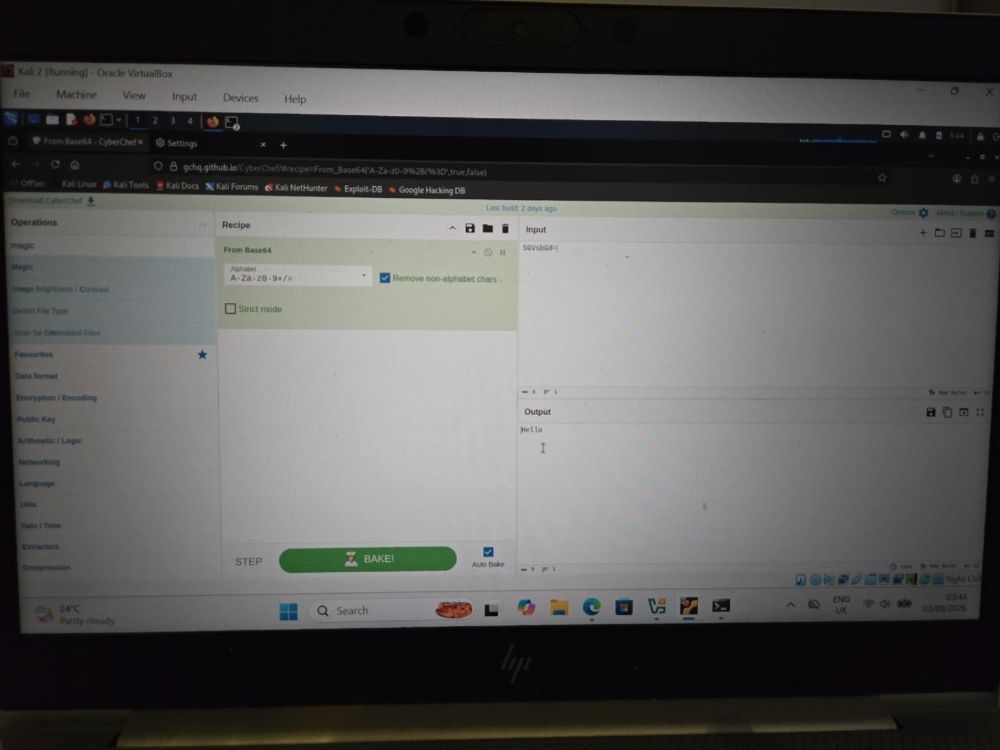

I learned that Magic is useful when I do not immediately recognise a data format. I would treat it as a suggestion rather than automatically assuming every result it produces is correct.

## 9. Chained Decoding

I then practised decoding data with more than one layer.

One exercise required:

```text
From Base64
From Hex
```

to recover:

```text
Hello
```

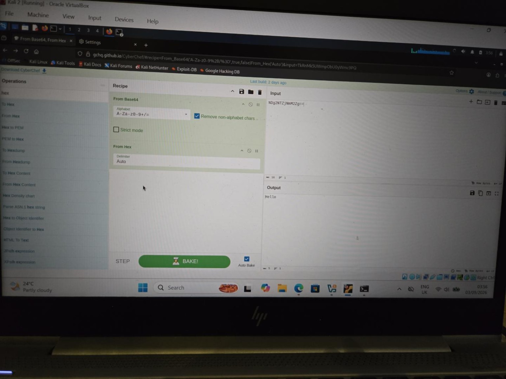

This reinforced the difference between **To** and **From**:

- **To** converts data into a format.
- **From** interprets data that is already in that format.

I also learned that an operation can be temporarily disabled without deleting it, and that I can remove an operation completely by dragging it out of the recipe.

## 10. Final Applied Exercise

For the final exercise, I was given:

```text
5533567a63476c6a61573931637942736232647062673d3d
```

I initially tried to recognise the encoding manually. I was unsure of the intermediate output and then used **Magic** to suggest a likely decoding recipe.

The working recipe was:

```text
From Hex
From Base64
```

and the final plaintext was:

```text
Suspicious login
```

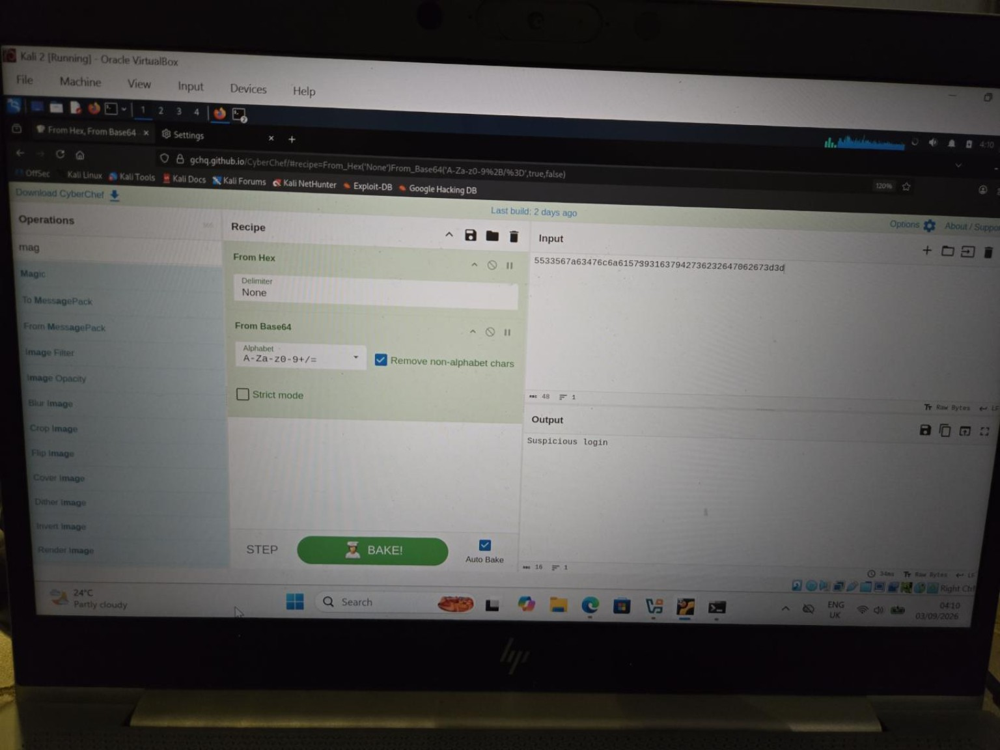

The useful part of this exercise was not just obtaining the answer. I realised that the original value contained only hexadecimal characters, even though the letters were lowercase. I also learned that using Magic when I am unsure is not the same as blindly accepting an answer: I can inspect the suggested recipe and understand why it works.

## 11. What I Learned

This exercise gave me a practical introduction to CyberChef rather than treating it as a tool that simply produces answers.

The main points I took away were:

- Base64, Hex and URL encoding are reversible forms of representation, not encryption.
- Hexadecimal can use uppercase or lowercase `A-F`.
- Base64 can contain uppercase letters, lowercase letters, numbers, `+`, `/` and padding such as `=`.
- SHA-256 hashing is different from reversible encoding.
- A very small change in input can produce a completely different hash.
- CyberChef can extract indicators such as IP addresses, email addresses and URLs from larger bodies of text.
- Recipe order matters because operations normally work on the output of the previous step.
- `To` and `From` describe opposite directions of transformation.
- Magic can help identify likely transformations when the data format is not immediately obvious.
- Layered data may require several decoding operations in sequence.

## 12. Conclusion

This was a small fundamentals project, but it helped me understand how CyberChef processes data and how I can reason about unfamiliar encoded values rather than only following preset instructions.

My next step is to use CyberChef as part of a wider workflow, including taking useful indicators or decoded values into another tool such as SpiderFoot for further OSINT analysis.
