# SpiderFoot Reconnaissance and CyberChef Data Extraction

| Item | Details |
|---|---|
| **Project** | SpiderFoot Reconnaissance and CyberChef Data Extraction |
| **Date** | 3 September 2026 |
| **Environment** | Kali Linux VM in Oracle VirtualBox |
| **Browser** | Firefox |
| **Tools** | SpiderFoot 4.0.0 and CyberChef |
| **Authorised target** | `testphp.vulnweb.com` |
| **SpiderFoot interface** | `127.0.0.1:5001` |
| **Scan use case** | Footprint |
| **Purpose** | Practise broad information gathering, export the results, then filter a large dataset with CyberChef |

## 1. Overview

This project records my use of SpiderFoot and CyberChef together.

I had already used SpiderFoot during an earlier Metasploitable 2 exercise, but this time I wanted to understand the workflow more clearly. The aim was to let SpiderFoot collect a large amount of information from an authorised public training target, export that information, and then use CyberChef to extract specific types of data from the larger result.

This also helped me recreate an idea I had seen during class. SpiderFoot produced a large body of information, and CyberChef was useful for filtering that information into smaller groups such as email addresses, IP addresses, URLs, domains and dates.

I am still learning, so I have kept the write-up focused on what I actually did, what the tools showed me, and what I understood from the results. I have not treated every SpiderFoot relationship as proof that an organisation owns or controls the item that was found.

### AI-Assisted Learning Note

During this lab, I used an AI assistant as a learning resource to help reconstruct the class workflow, troubleshoot the startup process, suggest appropriate CyberChef extraction steps and interpret some of the results. I ran the commands and completed the practical work in my own Kali environment.

## 2. Objectives

My objectives were to:

- confirm that SpiderFoot was installed and working;
- start the SpiderFoot web interface locally;
- run a Footprint scan against an authorised training target;
- review the categories of information SpiderFoot collected;
- export the scan data as CSV;
- load the CSV into CyberChef;
- extract email addresses, IPv4 addresses, URLs, domains, dates and IPv6-like values;
- compare CyberChef's pattern-based output with SpiderFoot's own categories; and
- identify cases where automated extraction produced misleading results.

## 3. Confirming SpiderFoot Was Installed

I first checked SpiderFoot from the Kali terminal with:

```bash
spiderfoot -h
```

The help output confirmed that **SpiderFoot 4.0.0** was installed. It also showed the automatic use cases available in this version, including `all`, `footprint`, `investigate` and `passive`.

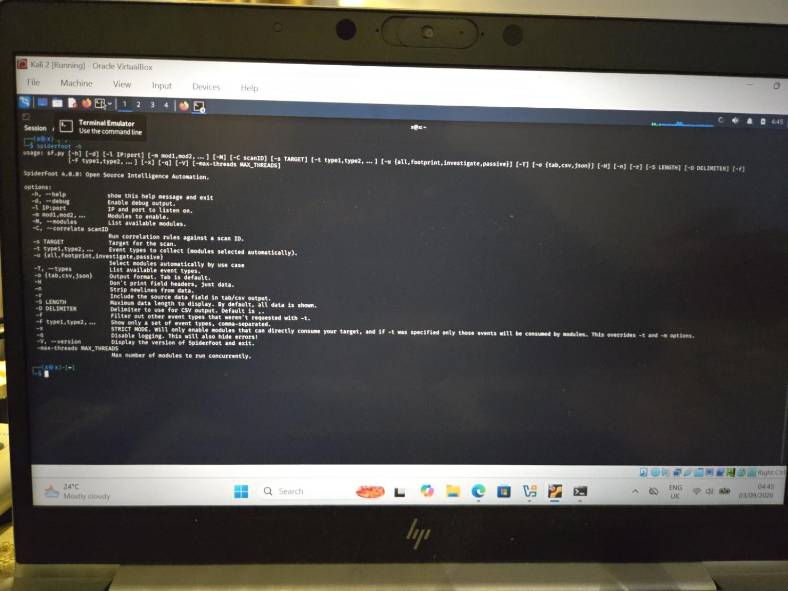

*Figure 1. SpiderFoot 4.0.0 responding to the help command in Kali.*

## 4. Starting the Local SpiderFoot Interface

I started the SpiderFoot web interface with:

```bash
spiderfoot -l 127.0.0.1:5001
```

I learned that `127.0.0.1` is the loopback address, meaning the SpiderFoot interface is being served by the same Kali machine. Port `5001` is the local port used to access the interface in Firefox.

The terminal startup seemed to be taking longer than I expected. Instead of waiting indefinitely for the terminal activity to settle, I opened Firefox and visited:

```text
http://127.0.0.1:5001
```

The SpiderFoot interface was already available.

My scan history also showed earlier Metasploitable 2 scans from **4 August 2026**, confirming that I had used SpiderFoot before this project. The private lab IP has been redacted from the public image.

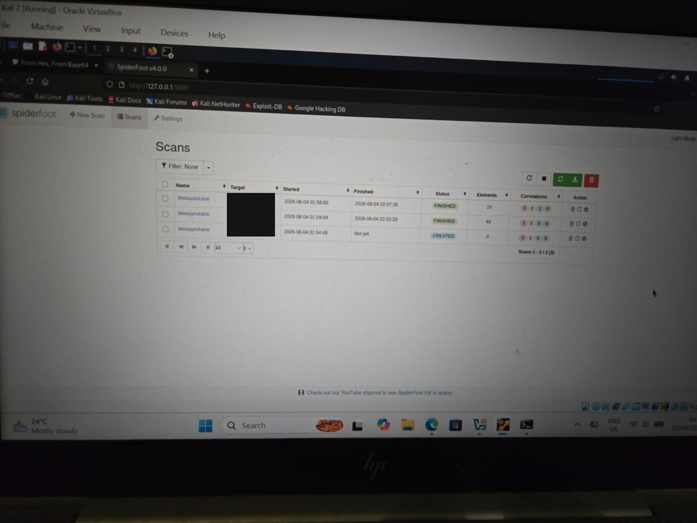

*Figure 2. Previous SpiderFoot Metasploitable 2 scans. The old private lab IP has been redacted for the public repository.*

## 5. Creating the New Footprint Scan

I created a new scan with:

```text
Scan Name:   Acunetix TestPHP Recon
Scan Target: testphp.vulnweb.com
Use Case:    Footprint
```

I selected **Footprint** because the purpose of the exercise was broad information gathering. I did not choose Passive because I wanted a richer dataset from the authorised training target, and I did not choose All because that would have enabled an even larger set of modules than I needed for this student exercise.

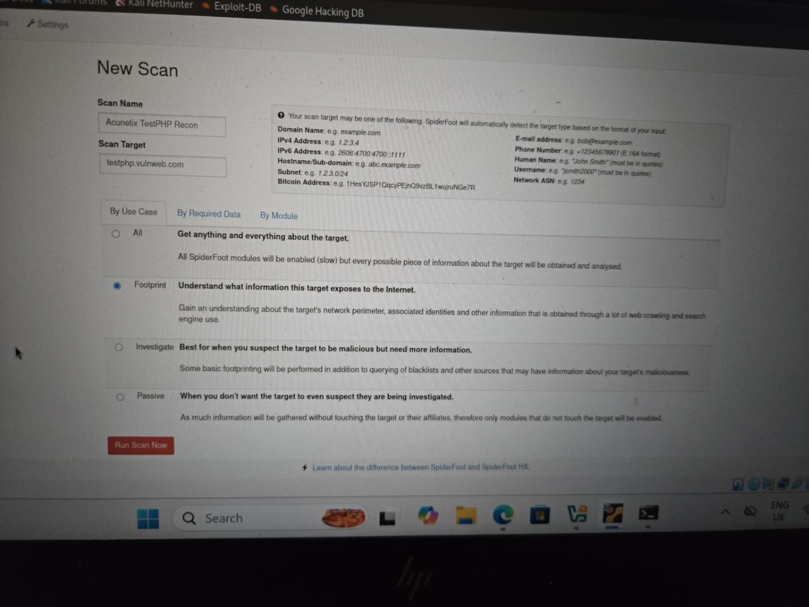

*Figure 3. New SpiderFoot scan configured for the Acunetix TestPHP training target using the Footprint use case.*

## 6. The Scan Took Much Longer Than Expected

The scan continued for a long time.

At the point shown below, SpiderFoot reported:

| Measure | Value |
|---|---:|
| Total data elements | 507 |
| Unique data elements | 364 |
| Errors | 375 |
| Status | Running |

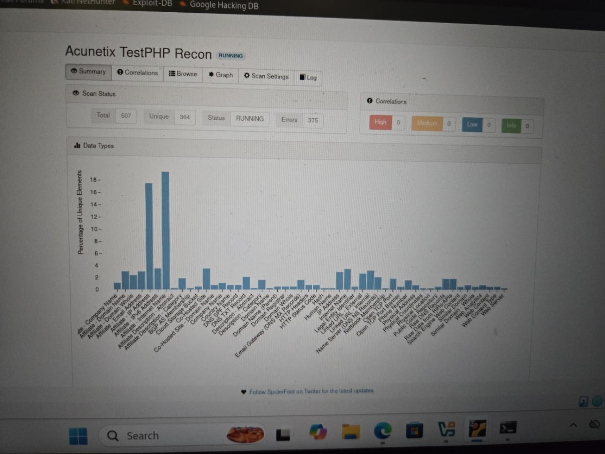

*Figure 4. The Footprint scan still running after it had already accumulated hundreds of data elements.*

The large number of errors was visible in the interface, but I did not investigate every error individually. I therefore do not assume that all 375 errors had the same cause. What mattered for this exercise was that SpiderFoot had still collected a substantial amount of data.

The scan had started at approximately **04:58** and was still running close to **05:50**. Since the aim was to learn the workflow rather than wait for an exhaustive scan, I decided to stop it after it had already produced enough data for analysis.

## 7. Aborting the Scan

I returned to the scans page and requested that SpiderFoot stop the running scan.

The status first changed to:

```text
ABORT-REQUESTED
```

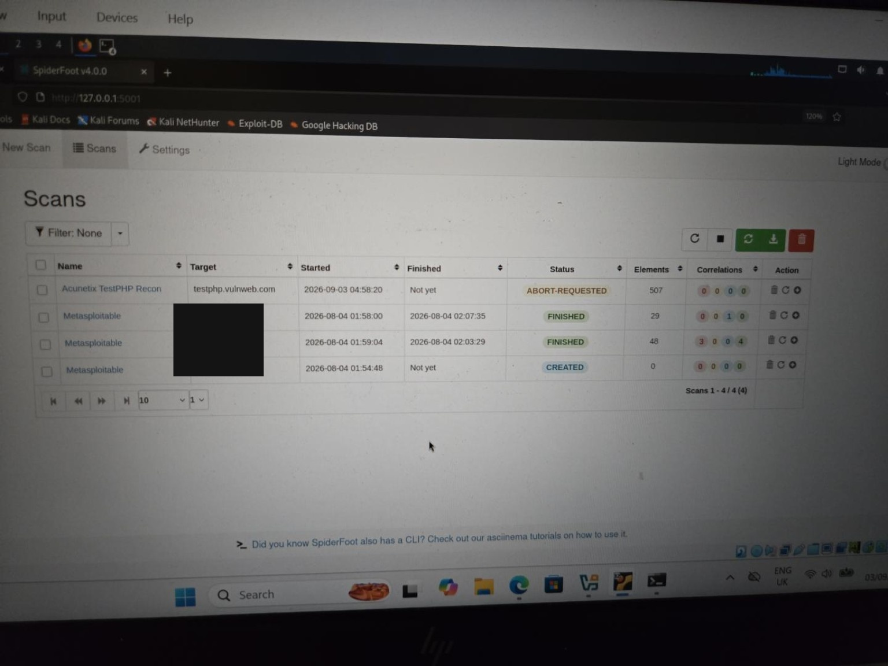

*Figure 5. SpiderFoot acknowledging the request to stop the running scan. Old private lab IPs have been redacted.*

After a short wait, the final status changed to:

```text
ABORTED
```

The scan table showed:

- start time: **04:58:20**;
- finish time: **05:49:39**;
- final status: **ABORTED**; and
- **507 elements** retained.

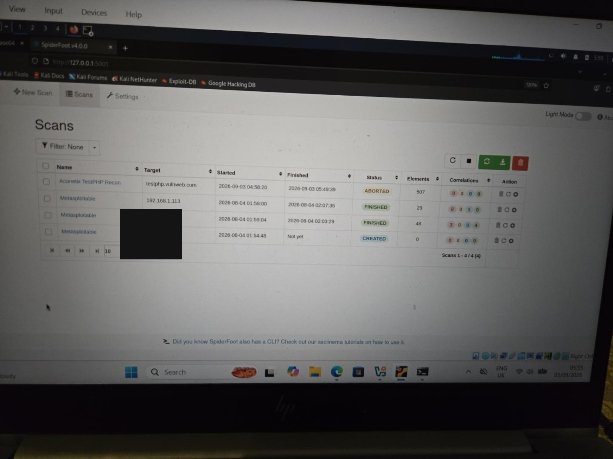

*Figure 6. Final aborted status after approximately 51 minutes. The collected data was retained.*

I do not present this as a completed or exhaustive Footprint scan. I manually stopped it after it had already produced enough information for the exercise.

## 8. Reviewing SpiderFoot's Collected Data

I opened the **Browse** view to see how SpiderFoot had categorised the information.

Some of the visible categories included:

| SpiderFoot category | Unique elements | Total elements |
|---|---:|---:|
| Affiliate - Company Name | 4 | 27 |
| Affiliate - Domain Name | 11 | 26 |
| Affiliate - Domain Whois | 9 | 9 |
| Affiliate - Email Address | 11 | 36 |
| Affiliate - IP Address | 64 | 64 |
| Affiliate - IPv6 Address | 13 | 13 |
| Affiliate - Internet Name | 71 | 90 |

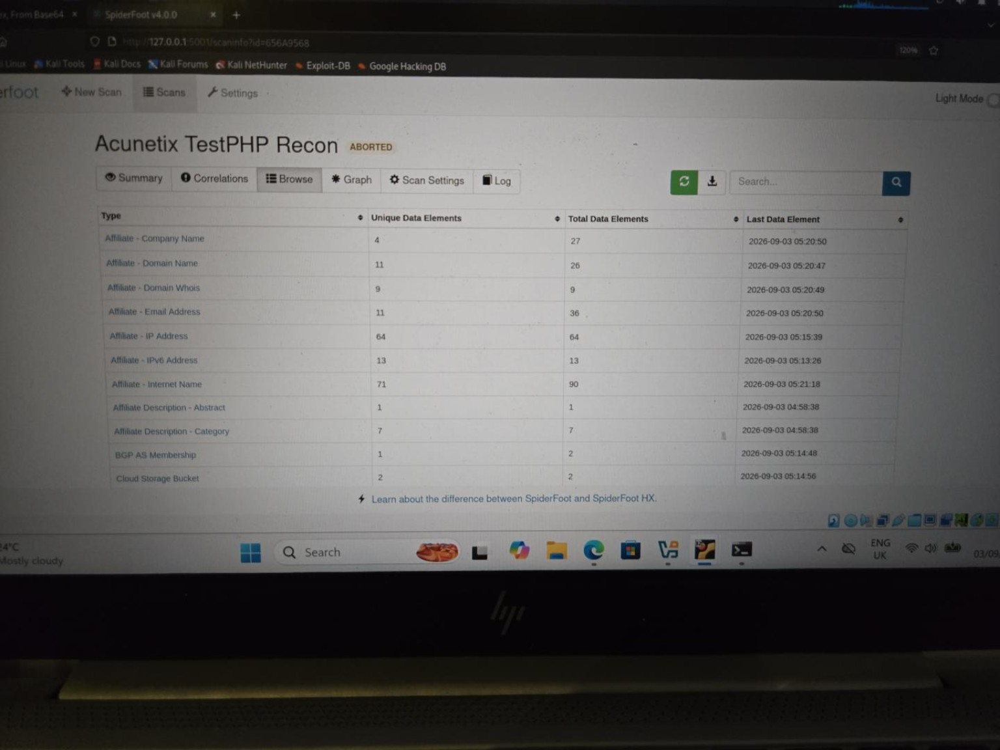

*Figure 7. SpiderFoot Browse view showing several categories of collected information.*

The word **Affiliate** is important here. I did not interpret every item in those categories as confirmed Acunetix-owned infrastructure or an Acunetix employee. SpiderFoot was reporting relationships and data it discovered through its modules. Some information could come from registrars, WHOIS records, service providers or related infrastructure.

## 9. Exporting the SpiderFoot Data

SpiderFoot offered the Browse data as either **CSV** or **Excel**.

I chose **CSV** because it is plain text and could be loaded directly into CyberChef for pattern-based extraction.

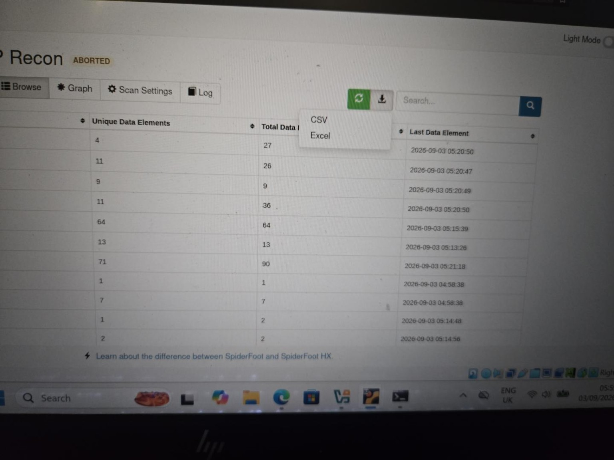

*Figure 8. SpiderFoot export options showing CSV and Excel.*

## 10. Loading the CSV Into CyberChef

A normal file click did not work the way I expected, so I dragged the exported CSV directly into CyberChef's Input pane.

CyberChef loaded the file successfully. The file details showed approximately **154,808 bytes**, and the input contained real SpiderFoot records such as WHOIS information, dates, domains, URLs and email addresses.

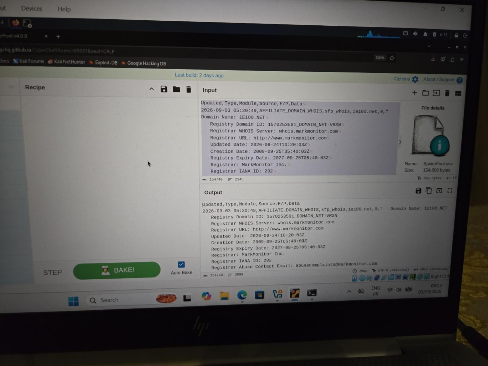

*Figure 9. The exported SpiderFoot CSV loaded into CyberChef by drag-and-drop.*

With no recipe selected, CyberChef simply displayed the input. I then began running separate extraction recipes against the full CSV.

## 11. Extracting Email Addresses

I first used:

```text
Extract email addresses
```

The initial output contained repeated values.

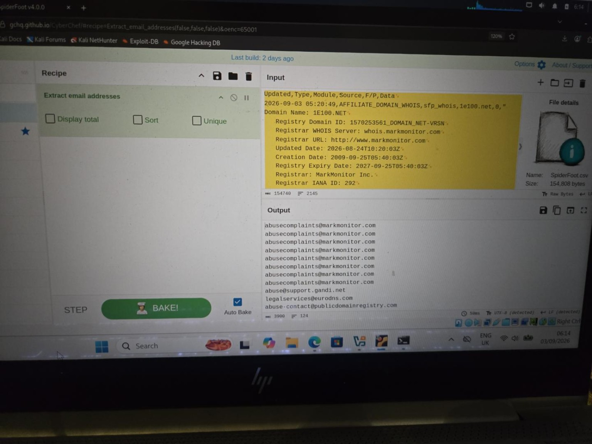

*Figure 10. Email extraction before duplicate values were removed.*

I then enabled **Unique** and **Display total**.

CyberChef reported:

```text
Total found: 11
```

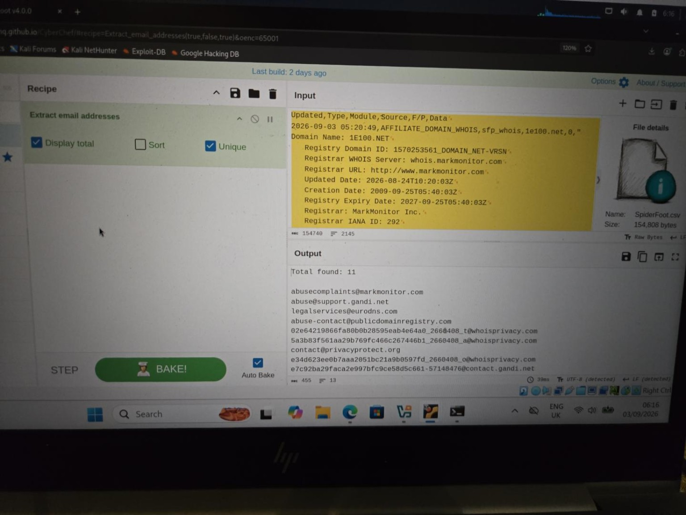

*Figure 11. CyberChef reporting 11 unique email-address strings from the SpiderFoot CSV.*

This matched the 11 unique email elements shown in SpiderFoot's Affiliate - Email Address category, but I did not treat the addresses as 11 Acunetix employee accounts. The output included registrar, WHOIS and service-provider addresses. My interpretation is simply that these were email-address strings present in the reconnaissance data.

## 12. Extracting IPv4 Addresses

Next I used:

```text
Extract IP addresses
```

with:

- IPv4 enabled;
- Unique enabled; and
- Display total enabled.

CyberChef reported:

```text
Total found: 66
```

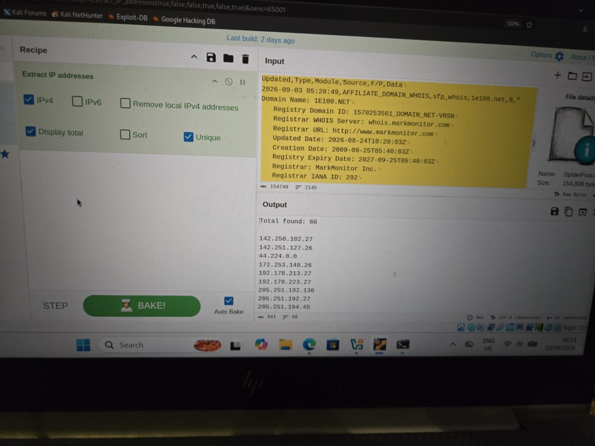

*Figure 12. CyberChef finding 66 unique IPv4-formatted values across the complete CSV.*

SpiderFoot's Browse page had shown **64 unique Affiliate - IP Address elements**, while CyberChef found **66 IPv4-formatted values**.

I learned that these numbers do not have to match. SpiderFoot's 64 belonged to one specific category. CyberChef was scanning the entire exported CSV for anything that matched an IPv4 pattern, including values that might appear inside other types of records.

## 13. Extracting URLs

I removed the IP extractor and ran:

```text
Extract URLs
```

with **Unique** and **Display total** enabled.

CyberChef reported:

```text
Total found: 54
```

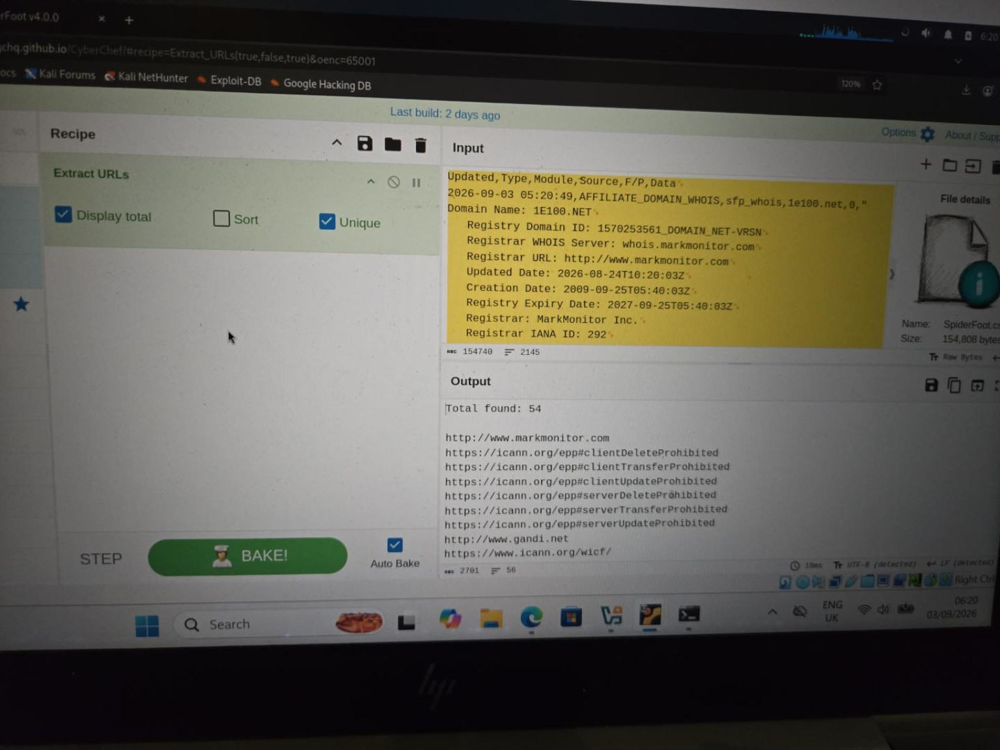

*Figure 13. CyberChef extracting 54 unique URL strings from the full SpiderFoot export.*

The output included URLs connected to WHOIS and registrar information as well as other collected data. I therefore treated these as URLs present in the dataset rather than assuming that every URL belonged to the original target.

## 14. Extracting Domains

I then used:

```text
Extract domains
```

with **Unique** and **Display total** enabled.

CyberChef reported:

```text
Total found: 154
```

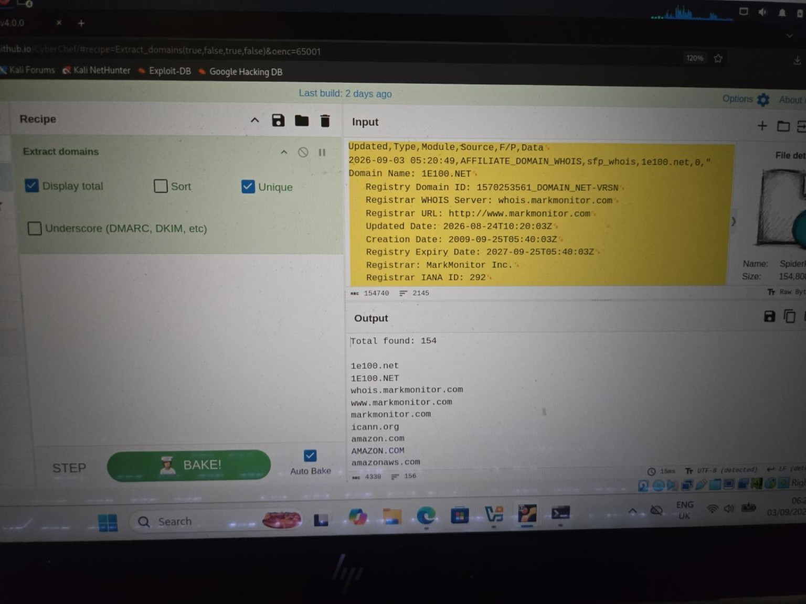

*Figure 14. CyberChef extracting 154 unique domain strings from the SpiderFoot CSV.*

I noticed that the output contained differently capitalised versions of the same domain, for example:

```text
1e100.net
1E100.NET
```

and:

```text
amazon.com
AMAZON.COM
```

DNS domain names are case-insensitive, so I would not describe this as 154 confirmed distinct DNS domains. It is more accurate to say that CyberChef returned **154 unique domain strings based on its extraction output**.

This was another example of why automatic filtering still needs interpretation.

## 15. Extracting Dates

I then used:

```text
Extract dates
```

with **Display total** enabled.

CyberChef reported:

```text
Total found: 787
```

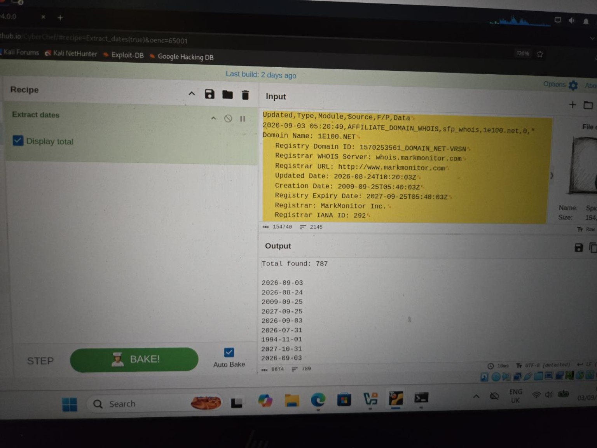

*Figure 15. CyberChef extracting 787 date occurrences from the SpiderFoot CSV.*

This directly resembled the type of CyberChef filtering I had previously seen demonstrated in class.

The CSV contained timestamps from SpiderFoot, WHOIS creation and update dates, expiry dates and other date values. The extractor did not provide a Unique option in this view, so the 787 figure represents **date occurrences**, not 787 different dates.

## 16. IPv6 Extraction and a False-Positive Lesson

For the final extraction I used **Extract IP addresses** again, but this time with:

- IPv4 disabled;
- IPv6 enabled;
- Unique enabled; and
- Display total enabled.

CyberChef reported:

```text
Total found: 37
```

At first, that looked like 37 IPv6 results.

However, manual inspection showed that CyberChef had also matched time values such as:

```text
05:13:26
05:07:18
05:07:25
```

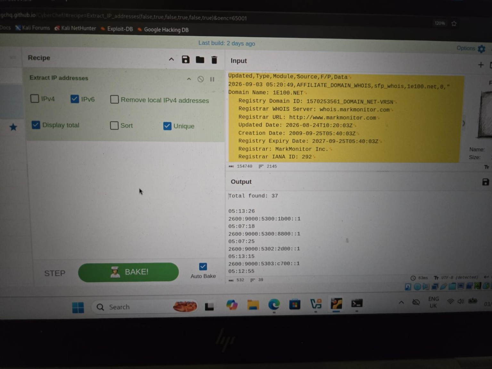

*Figure 16. The IPv6 extractor returned 37 unique matches, including timestamps that were not IPv6 addresses.*

A second view made the problem clearer because genuine IPv6-formatted values appeared alongside obvious timestamps.

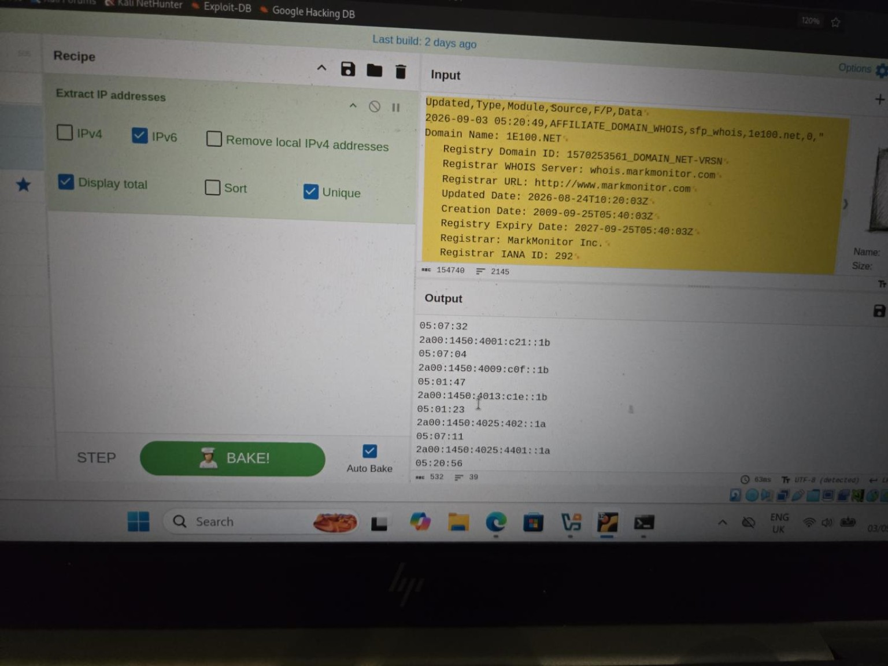

*Figure 17. Genuine IPv6-formatted values and timestamp false positives visible in the same CyberChef result.*

SpiderFoot itself had shown **13 unique Affiliate - IPv6 Address elements**, but I did not replace that number with CyberChef's 37.

The lesson for me was that an extractor can recognise a text pattern without understanding the full context. A colon-separated time can partially resemble IPv6 syntax, so the output still has to be checked manually.

## 17. Results Summary

| Analysis step | Result I recorded | How I interpreted it |
|---|---:|---|
| SpiderFoot Footprint scan | 507 total elements | Scan manually stopped, not exhaustive |
| SpiderFoot unique elements while running | 364 | Broad set of collected data |
| SpiderFoot errors while running | 375 | Visible errors, not individually diagnosed |
| SpiderFoot Affiliate email category | 11 unique | Relationship data, not 11 confirmed employees |
| SpiderFoot Affiliate IPv4 category | 64 unique | SpiderFoot category count |
| SpiderFoot Affiliate IPv6 category | 13 unique | SpiderFoot category count |
| CyberChef email extraction | 11 unique strings | Emails anywhere in full CSV |
| CyberChef IPv4 extraction | 66 unique matches | Pattern matches across entire CSV |
| CyberChef URL extraction | 54 unique strings | URLs present anywhere in dataset |
| CyberChef domain extraction | 154 unique strings | Includes case variants |
| CyberChef date extraction | 787 occurrences | Repeated dates/timestamps included |
| CyberChef IPv6 extraction | 37 unique matches | Included false-positive timestamps |

## 18. Terms I Learned or Reinforced

**Loopback / `127.0.0.1`:** An address that points back to the same computer. In this exercise it was used to access SpiderFoot's local web interface.

**Port 5001:** The local port SpiderFoot used for its web interface.

**Footprint:** A SpiderFoot use case intended to build a broad picture of information exposed around a target. It is different from the Passive use case.

**CSV:** A plain-text, comma-separated data format that was useful for moving the SpiderFoot results into CyberChef.

**Unique:** A CyberChef option that removes duplicate extracted strings.

**False positive:** A result that matches the tool's rule or pattern but is not actually the thing I was trying to identify. The timestamp values found by the IPv6 extractor were a clear example.

## 19. What I Learned

The main lessons I took from this exercise were:

- SpiderFoot can turn one target domain into a much larger set of related information.
- A Footprint scan can take a long time, and I do not need to wait forever if the learning objective has already been met.
- Aborting a scan does not mean the data already collected is useless.
- SpiderFoot's categories and CyberChef's extraction totals measure different things.
- CyberChef can quickly filter a large raw export into smaller sets of useful strings.
- Unique values are useful for removing repetition, but they do not automatically remove contextual duplicates such as differently capitalised domain names.
- A relationship reported by SpiderFoot is not automatically proof of ownership.
- A pattern match is not automatically a valid result.
- Manual checking still matters even when the extraction tool appears confident.
- The IPv6 exercise gave me a practical example of a false positive rather than only learning the definition theoretically.

## 20. Limitations

This was a student information-gathering exercise, not a complete professional OSINT assessment.

The Footprint scan was manually stopped after approximately 51 minutes, so I do not claim that SpiderFoot exhausted every module or every possible source.

I did not investigate every one of the 375 errors reported during the running scan.

I also did not independently verify ownership of every domain, IP address, email address or relationship SpiderFoot collected. The goal was to understand the workflow and learn how to filter and interpret a large dataset.

## 21. Evidence and Privacy Note

The screenshots in this repository are from my own lab session.

I excluded an earlier SpiderFoot screenshot that displayed a personal email address. I also redacted old private Metasploitable lab IP addresses from screenshots used in the public repository. The current Acunetix training target, `testphp.vulnweb.com`, and the loopback address `127.0.0.1` are intentionally visible because they are part of the documented lab setup.

The exported `SpiderFoot.csv` file is not included in this public GitHub folder. It contains far more raw reconnaissance data than is necessary to demonstrate the student exercise. The screenshots show the relevant filtering steps without publishing the entire dataset.

## Conclusion

This project helped me understand the relationship between two tools that initially felt separate.

SpiderFoot was useful for gathering and organising a large amount of information around a target. CyberChef was useful after that, because it could take the large exported dataset and quickly extract specific types of information.

The most useful lesson was not the number of IP addresses, domains or dates found. It was learning that automated output still needs interpretation. The difference between SpiderFoot's IPv4 count and CyberChef's IPv4 count, the case variants in the domain extraction, and the timestamp false positives in the IPv6 extraction all showed me that a tool can produce a technically valid pattern match without giving me the full meaning of the result.

My working process from this exercise was:

```text
choose authorised target
-> gather information with SpiderFoot
-> review what the tool actually collected
-> export the data
-> filter it with CyberChef
-> remove duplicates where useful
-> manually check the output
-> report only what the evidence supports
```
