# Shodan Reconnaissance, Internet Exposure, and Nmap Corroboration

| Item | Details |
|---|---|
| **Project** | Shodan Reconnaissance, Internet Exposure, and Nmap Corroboration |
| **Date** | 3 September 2026 |
| **Environment** | Kali Linux VM in Oracle VirtualBox |
| **Browser** | Firefox |
| **Tools** | Shodan, Shodan InternetDB, `dig`, Nmap 7.99 |
| **Primary authorised target** | `scanme.nmap.org` |
| **Initial training target** | `testphp.vulnweb.com` |
| **Shodan account level** | Free account |
| **Purpose** | Learn how Shodan indexes internet-facing services, practise search filters and banner interpretation, explore aggregate exposure data, and compare Shodan observations with a small live Nmap scan of an authorised target |

## 1. Overview

This project records my first focused practical exercise with **Shodan**.

I had previously seen Shodan demonstrated in class, including examples showing that it can discover much more than websites. The aim of this exercise was therefore not only to search one host, but to understand the wider idea behind the platform: Shodan indexes internet-facing services and makes the information it has collected searchable.

I started with an Acunetix public training target that I had already used in other exercises. That target did not produce useful Shodan data, so I troubleshot the result and then changed to `scanme.nmap.org`, which Nmap explicitly provides as an authorised scanning target.

Once I had a useful Shodan result, I practised:

- hostname filtering;
- port filtering;
- product filtering;
- organisation filtering;
- reading HTTP, SSH and NTP banners;
- distinguishing IPv4 and IPv6 observations;
- comparing Shodan's indexed observations with a small live Nmap scan;
- exploring Shodan's Internet Exposure Observatory;
- reviewing database, network infrastructure and industrial control system categories; and
- exploring the `has_screenshot:true` capability without interacting with or publishing third-party remote systems.

The most useful lesson was that Shodan is **not simply a website scanner**. It is a search platform for information Shodan has already collected from internet-facing services.

I am still learning, so this write-up focuses on what I actually did, what the interfaces showed me, and what I understood from the results. I have not treated an exposed service, version string, Shodan category or screenshot as automatic proof of a vulnerability.

### AI-Assisted Learning Note

During this lab, I used an AI assistant as a learning resource to help troubleshoot errors, interpret some command output, and suggest diagnostic commands that I would not necessarily have known as a beginner. I ran the commands and completed the practical work in my own lab environment.

---

## 2. Objectives

My objectives were to:

- understand what Shodan searches and how that differs from a normal web search engine;
- practise basic Shodan filters;
- learn how to read service banners;
- understand why one host can produce several Shodan results;
- compare indexed Shodan observations with a live network scan;
- explore Shodan beyond one authorised host;
- understand how Shodan can categorise databases, network infrastructure and industrial control systems;
- understand the remote-screen and screenshot capability I had previously seen demonstrated in class;
- avoid unnecessary interaction with third-party systems; and
- prepare a public portfolio record without republishing identifying third-party infrastructure.

---

## 3. Scope and Safety

For detailed host-level analysis and live Nmap scanning, I used:

```text
scanme.nmap.org
```

Nmap explicitly permits Nmap scanning of this host for testing purposes, while excluding exploit testing and denial-of-service activity.

I also used:

```text
testphp.vulnweb.com
```

as an initial Shodan lookup because it is a public Acunetix training target I had already used in earlier web-security exercises.

When Shodan later displayed individual third-party MongoDB, remote desktop, webcam and other service observations, I used them only to understand what Shodan can index. I did **not**:

- attempt authentication;
- connect to databases;
- control remote desktops;
- interact with cameras;
- scan those third-party IP addresses with Nmap;
- test credentials;
- exploit any listed service; or
- publish unredacted identifying host details.

This separation became an important part of the exercise:

```text
search Shodan data
-> understand what is exposed
-> use authorised systems for active validation
-> do not treat discoverability as permission to interact
```

---

## 4. Account Setup and Privacy

I initially had difficulty accessing an older Shodan account because the password-reset route did not produce a usable recovery email.

I resolved this by using a separate Google identity created specifically for cybersecurity work rather than signing a personal Google account into my Kali environment.

The account was a **Free** Shodan account.

I deliberately excluded account screenshots from this public project because they displayed:

- the account email address;
- the Shodan display name;
- account details; and
- the API-key area.

I also excluded the QR-code account-verification screenshots.

The API key was never included in the public evidence folder.

---

## 5. First Target: Acunetix TestPHP

I first searched:

```text
hostname:testphp.vulnweb.com
```

Shodan returned:

```text
No results found
```

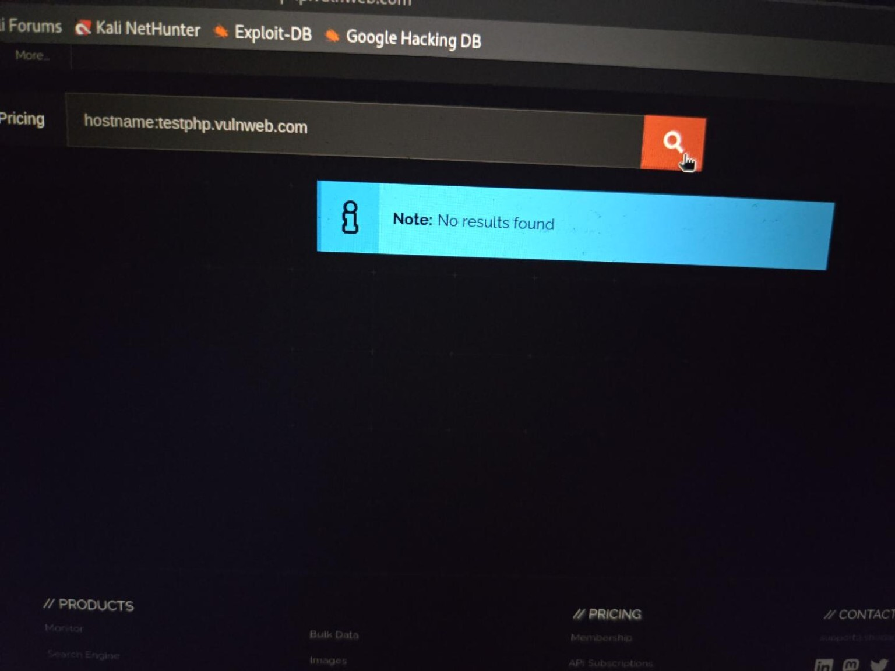

*Figure 1. My initial Shodan hostname search for the Acunetix TestPHP training target returned no indexed results.*

I also tried the broader text:

```text
vulnweb.com
```

and again received no useful result.

This taught me an important point immediately:

> **No Shodan result does not mean that a website is offline or has no exposed services. It means Shodan did not return matching indexed data for that search.**

---

## 6. Resolving the TestPHP Host with `dig`

To check whether the hostname itself still resolved, I used:

```bash
dig +short testphp.vulnweb.com
```

The result was:

```text
44.228.249.3
```

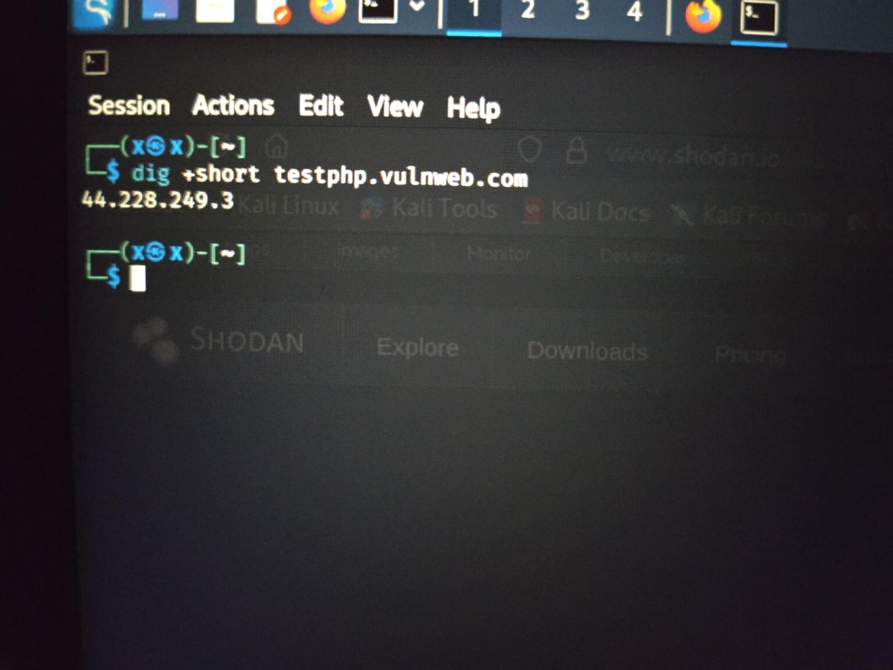

*Figure 2. `dig +short` successfully resolved the TestPHP hostname even though Shodan had returned no search result.*

I then searched the resolved IP address directly in Shodan:

```text
44.228.249.3
```

Shodan still returned no results.

This helped separate two different questions:

```text
DNS: What IP address does this hostname currently resolve to?

Shodan: What service observations has Shodan indexed that match my search?
```

The successful DNS resolution did not guarantee that Shodan would have a corresponding record.

---

## 7. Checking Shodan InternetDB

I also checked Shodan's InternetDB service for the same IP.

I initially made a small mistake by navigating directly to the IP address in Firefox. Firefox returned an **Unable to connect** page because that was not the correct way to query InternetDB.

I corrected this and used the InternetDB address format:

```text
https://internetdb.shodan.io/44.228.249.3
```

The response was:

```json
{"detail":"No information available"}
```

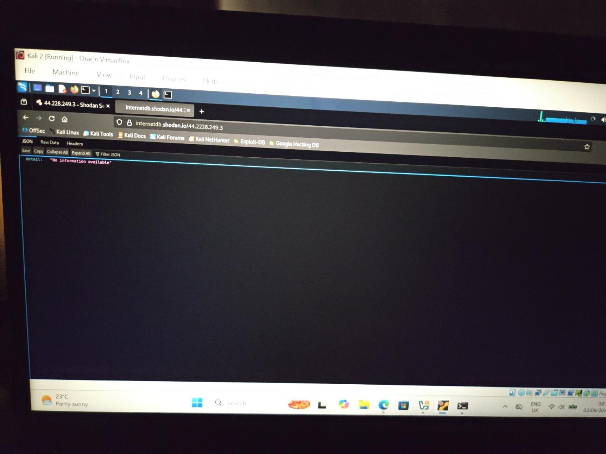

*Figure 3. Shodan InternetDB also had no information available for the resolved TestPHP IP.*

At this point, I decided that continuing to force the TestPHP target into the exercise would add little value. The troubleshooting itself had already shown me the difference between DNS resolution and Shodan indexing.

I therefore changed targets.

---

## 8. Switching to `scanme.nmap.org`

I selected:

```text
scanme.nmap.org
```

because it is maintained by the Nmap project specifically for authorised scanning practice.

I searched:

```text
hostname:scanme.nmap.org
```

This returned **9 Shodan results**.

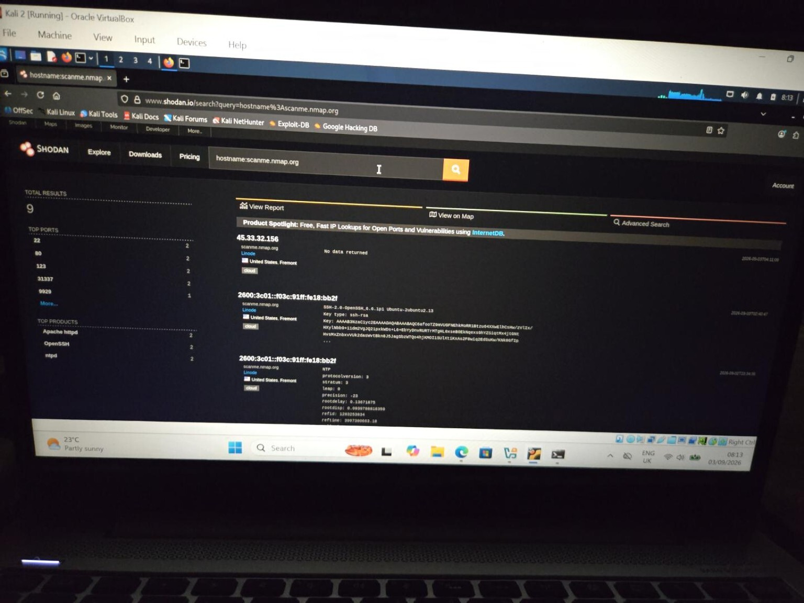

*Figure 4. The broad hostname search returned nine service observations and immediately gave me useful data to analyse.*

The summary showed the following visible top ports:

| Port | Shodan count shown |
|---:|---:|
| 22 | 2 |
| 80 | 2 |
| 123 | 2 |
| 31337 | 2 |
| 9929 | 1 |

The visible top products were:

| Product | Count |
|---|---:|
| Apache httpd | 2 |
| OpenSSH | 2 |
| ntpd | 2 |

The results included both:

```text
45.33.32.156
```

and:

```text
2600:3c01::f03c:91ff:fe18:bb2f
```

These were associated with `scanme.nmap.org`, Linode and Fremont, United States in the Shodan interface.

### A result count is not a machine count

One of the most important points I learned here was that:

```text
9 Shodan results != 9 separate computers
```

Shodan stores observations about **services**. The same host can therefore appear several times because different ports and protocols return different banners.

---

## 9. Reading the Service Banners

The broad results showed several different types of service information.

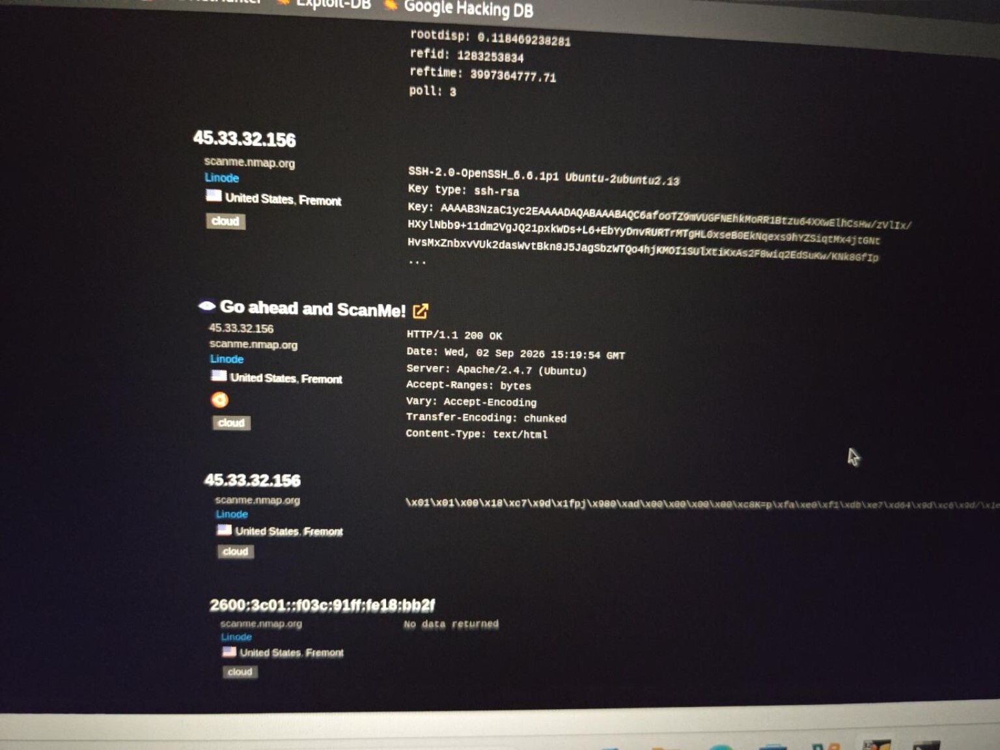

*Figure 5. Shodan displayed SSH and HTTP banner data for the authorised ScanMe host.*

### SSH

A visible SSH banner contained:

```text
SSH-2.0-OpenSSH_6.6.1p1 Ubuntu-2ubuntu2.13
```

It also displayed SSH host-key information.

At this stage I treated that as **service identification**, not a vulnerability finding.

An old-looking version string can be useful for research, but a banner alone does not prove that a specific CVE applies or is exploitable.

### HTTP

The IPv4 HTTP observation showed:

```text
HTTP/1.1 200 OK
Server: Apache/2.4.7 (Ubuntu)
Content-Type: text/html
```

The IPv6 HTTP observation showed:

```text
HTTP/1.1 400 Bad Request
Server: Apache/2.4.7 (Ubuntu)
```

I learned that a `400 Bad Request` response is not automatically a vulnerability. It means the request Shodan sent was not accepted as a valid request, but the response still disclosed useful service metadata such as the Apache banner.

### NTP

Shodan also displayed NTP data.

This reinforced that Shodan is not limited to web protocols. It can index services that use protocols such as NTP, SSH and many others.

---

## 10. Learning the Search-Filter Syntax

The next stage was to practise Shodan filters.

My first attempt at combining a hostname filter and port filter was:

```text
hostname:scanme.nmap.orgport:80
```

I had accidentally omitted the space between the two filters.

Shodan returned:

```text
No results found
```

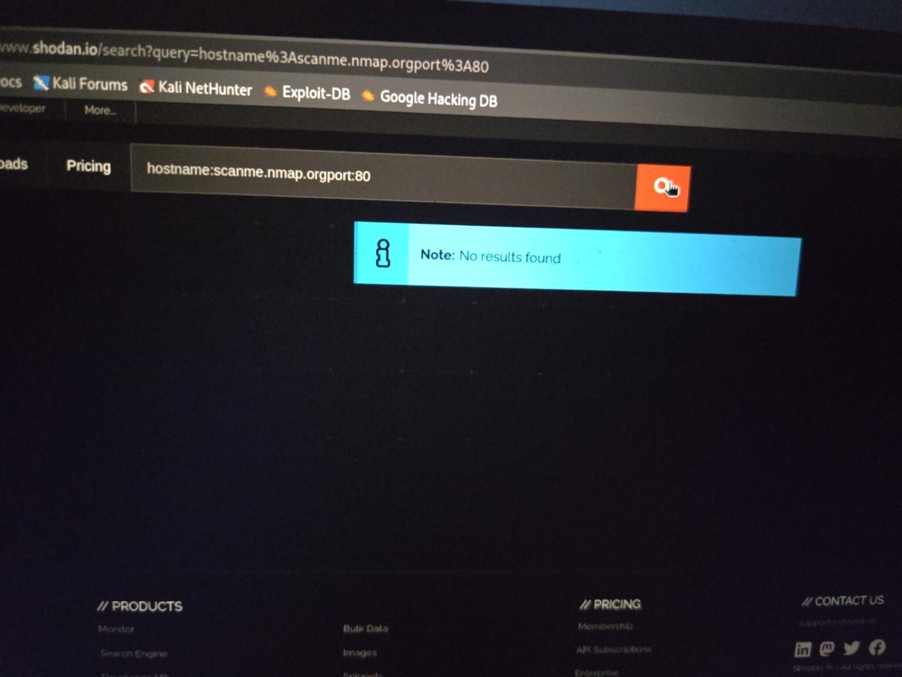

*Figure 6. My first combined filter failed because I omitted the space between the hostname and port filters.*

I corrected it to:

```text
hostname:scanme.nmap.org port:80
```

This was a small mistake, but it helped me understand that Shodan expects separate filters to be separated correctly.

---

## 11. Filtering by Port 80

The corrected query:

```text
hostname:scanme.nmap.org port:80
```

returned **2 results**.

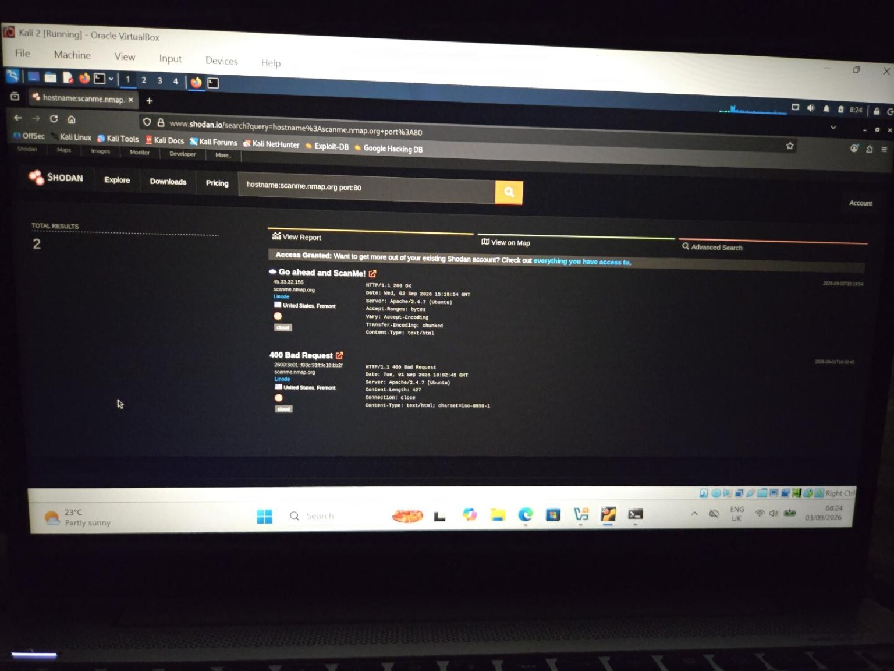

*Figure 7. Filtering by port 80 reduced the broad ScanMe result set to the two HTTP observations.*

The two observations corresponded to IPv4 and IPv6.

This query taught me:

```text
hostname:scanme.nmap.org
```

selects observations associated with the hostname, while:

```text
port:80
```

narrows the result to observations on port 80.

---

## 12. Filtering by Port 22

I then searched:

```text
hostname:scanme.nmap.org port:22
```

Again, Shodan returned **2 results**.

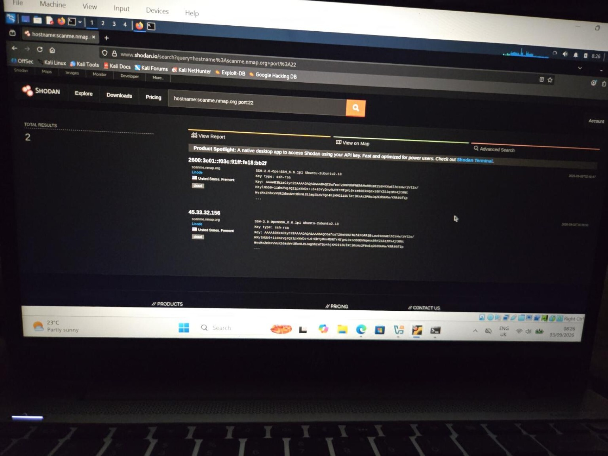

*Figure 8. Port 22 filtering isolated the two SSH observations.*

Both displayed the OpenSSH banner.

This gave me a clean comparison:

```text
port 80 -> HTTP / Apache
port 22 -> SSH / OpenSSH
```

---

## 13. Filtering by Product

I then used:

```text
hostname:scanme.nmap.org product:OpenSSH
```

This also returned **2 results**.

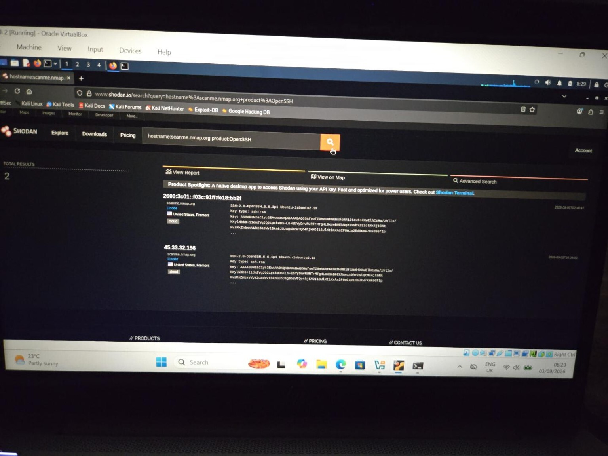

*Figure 9. The product filter selected services that Shodan identified as OpenSSH.*

This helped me understand the difference between:

```text
port:22
```

and:

```text
product:OpenSSH
```

A port filter asks for observations on a particular port.

A product filter asks for services that Shodan has identified as a particular product.

Those can overlap, but conceptually they are not the same thing. A service can also be configured on a non-standard port.

---

## 14. Filtering by Organisation

I then searched:

```text
hostname:scanme.nmap.org org:"Linode"
```

The result count returned to **9**.

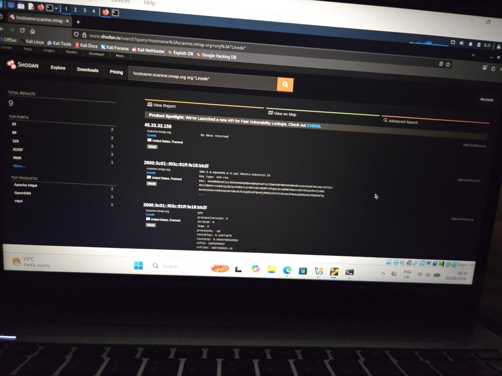

*Figure 10. The organisation filter still returned all nine observations because the visible ScanMe results were associated with Linode.*

Unlike the port and product filters, this filter did not reduce the result set.

That was still useful because it demonstrated that all of the observations already matched the provider/organisation condition shown by Shodan.

It also reinforced that location and organisation information in Shodan is **network/provider metadata**, not proof that the organisation behind the hostname physically operates from the displayed city.

---

## 15. Shodan as Indexed Intelligence

By this point I understood the basic difference between Shodan and a tool such as Nmap.

A simplified model is:

```text
Shodan infrastructure
-> contacts internet-facing services
-> collects banners and metadata
-> stores/indexes observations
-> I search those observations
```

By contrast:

```text
my Kali VM
-> Nmap sends probes directly to the authorised target
-> I observe what is reachable from my network at that moment
```

Shodan's normal website search uses recently collected observations, but it is still not the same as my own machine performing a live scan at that exact moment.

This made a live comparison with Nmap a useful final validation step.

---

## 16. First Nmap Comparison Attempt

I first ran:

```bash
nmap -sV -p 22,80,31337,9929 scanme.nmap.org
```

The command returned:

```text
Failed to resolve "scanme.nmap.org".
WARNING: No targets were specified, so 0 hosts scanned.
```

This was not a port-scan result because Nmap never resolved the target hostname.

I checked DNS separately with:

```bash
dig +short scanme.nmap.org
```

This returned:

```text
45.33.32.156
```

The DNS lookup was therefore working again.

Instead of relying on the hostname for the next attempt, I used the resolved IPv4 address directly.

---

## 17. Live TCP Comparison with Nmap

I ran:

```bash
nmap -sV -p 22,80,31337,9929 45.33.32.156
```

Nmap confirmed:

```text
Host is up
```

but returned:

```text
22/tcp      filtered  ssh
80/tcp      filtered  http
9929/tcp    filtered  nping-echo
31337/tcp   filtered  Elite
```

The **VERSION** column was blank.

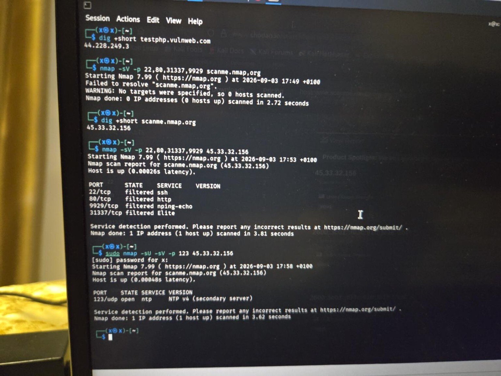

*Figure 11. The same terminal session shows the transient hostname-resolution problem, successful DNS resolution, filtered TCP results and the later UDP NTP result.*

### What `filtered` meant

I learned that `filtered` does **not** mean:

```text
open
```

and it does not mean:

```text
closed
```

It means Nmap could not determine the open/closed state because probes were being filtered or blocked somewhere along the path.

### A useful beginner trap

The Nmap output still displayed familiar service names beside the ports:

```text
22 -> ssh
80 -> http
9929 -> nping-echo
31337 -> Elite
```

However, because the ports were filtered and the VERSION column was blank, I did **not** report that Nmap had successfully identified those running services.

The names are consistent with Nmap's normal port-to-service mappings.

This was a useful reminder to read the **state and evidence**, not only the service label.

---

## 18. UDP Port 123 and NTP

Shodan had also shown NTP on port 123.

Because NTP normally uses UDP, I checked it separately with:

```bash
sudo nmap -sU -sV -p 123 45.33.32.156
```

This returned:

```text
123/udp open ntp NTP v4 (secondary server)
```

This was a successful live service identification.

The NTP result gave me a useful example where Shodan and my live Nmap observation agreed.

---

## 19. Comparing Shodan and Nmap

The comparison was one of the most useful parts of the exercise.

| Service/Port | Shodan observation | My live Nmap observation |
|---|---|---|
| TCP 22 | OpenSSH banner indexed | Filtered from my network |
| TCP 80 | Apache HTTP banner indexed | Filtered from my network |
| TCP 31337 | Service observation indexed | Filtered from my network |
| TCP 9929 | Service observation indexed | Filtered from my network |
| UDP 123 | NTP/ntpd observation indexed | Open, NTP v4 identified |

The important lesson was not that one tool was "right" and the other was "wrong".

They were answering slightly different questions from different vantage points and at different times.

Shodan showed what its infrastructure had recently observed and indexed.

Nmap showed what my Kali VM could observe live from my own network during this session.

The disagreement on the selected TCP ports therefore became part of the learning outcome rather than something to hide.

---

## 20. Exploring Shodan Beyond One Host

After completing the authorised host exercise, I wanted to understand the wider capability that I remembered seeing in class.

I used Shodan's **Explore** area.

The categories visible during the session included examples such as:

- Industrial Control Systems;
- Databases;
- Network Infrastructure;
- Video Games;
- Ethereum miners;
- Apple AirPlay receivers;
- door/lock access controllers; and
- wind-turbine controllers.

This was the point where the purpose of Shodan became much clearer to me.

Shodan can search for many kinds of internet-facing technology, not only conventional websites.

---

## 21. Internet Exposure Observatory

I opened Shodan's **Internet Exposure Observatory**.

The Observatory offered pre-built country dashboards.

Nigeria was not present in the available dashboard list during this session, so I selected the **United States** as a large example.

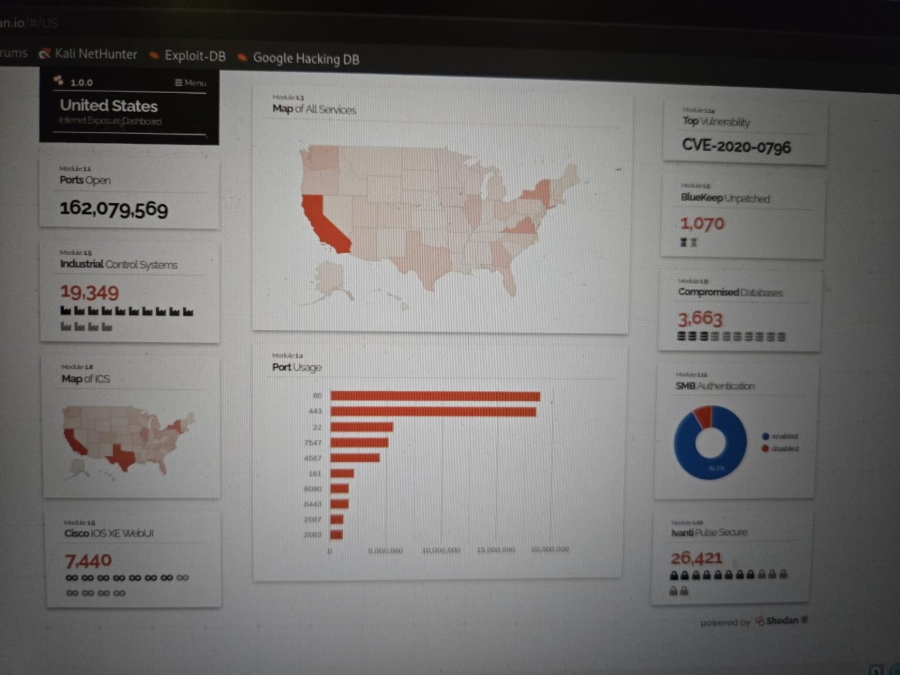

*Figure 12. Shodan's United States Internet Exposure Observatory dashboard as displayed during my session.*

The dashboard displayed values including:

| Dashboard item | Value shown during my session |
|---|---:|
| Ports Open | 162,079,569 |
| Industrial Control Systems | 19,349 |
| BlueKeep Unpatched | 1,070 |
| Compromised Databases | 3,663 |
| Cisco IOS XE WebUI | 7,440 |
| Ivanti Pulse Secure | 26,421 |
| Top Vulnerability | CVE-2020-0796 |

It also displayed:

- a map of all services;
- a map of industrial control systems;
- port-usage statistics; and
- an SMB Authentication chart.

I treated these numbers as a **snapshot of what the dashboard displayed during this exercise**, not permanent statistics.

This demonstrated a completely different use of Shodan:

```text
individual service search
-> aggregate internet exposure analysis
```

---

## 22. Database Technology Categories

I then opened the **Databases** category.

The page presented several database and data-storage technologies, including:

- MySQL;
- PostgreSQL;
- MongoDB;
- Riak;
- Elasticsearch;
- Redis;
- Memcached;
- Cassandra; and
- CouchDB.

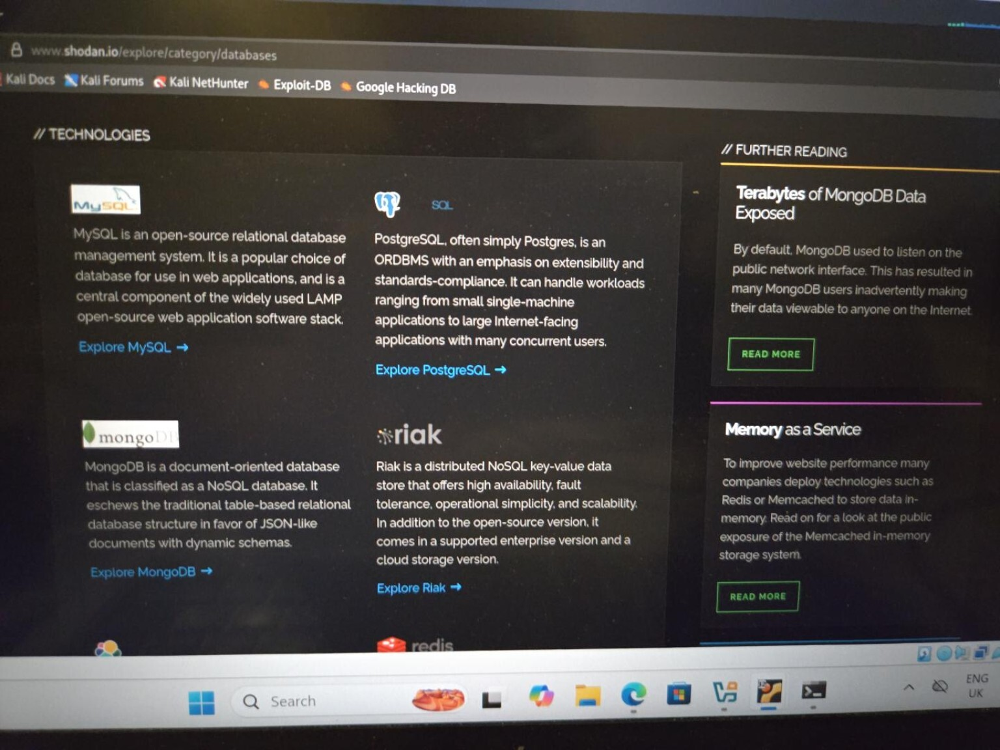

*Figure 13. The first database category view included MySQL, PostgreSQL, MongoDB and Riak, plus Shodan reading about MongoDB exposure.*

The page also included educational material about exposed MongoDB data and in-memory storage exposure.

I scrolled further.

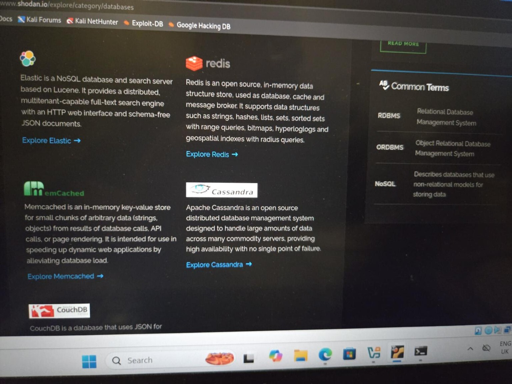

*Figure 14. Additional technologies included Elasticsearch, Redis, Memcached and Cassandra, together with basic RDBMS, ORDBMS and NoSQL terminology.*

### Database terms reinforced

The category page reinforced some basic terminology:

**RDBMS:** Relational Database Management System.

**ORDBMS:** Object-Relational Database Management System.

**NoSQL:** A broad category for databases that use non-relational models for storing data.

The important security lesson was that Shodan can often identify the **type of database service** exposed to the Internet.

That does not mean every database result is unauthenticated or vulnerable.

---

## 23. MongoDB Product Search

I clicked **Explore MongoDB**.

The resulting Shodan search used:

```text
product:MongoDB
```

The page showed approximately:

```text
165,110 total results
```

during my session.

The visible country summary showed:

| Country | Count shown |
|---|---:|
| United States | 57,427 |
| Germany | 14,201 |
| China | 11,412 |
| Netherlands | 8,448 |
| India | 7,633 |

The visible top ports included:

| Port | Count shown |
|---:|---:|
| 27017 | 152,805 |
| 2701 | 4,862 |
| 5432 | 449 |
| 7000 | 383 |

Port `27017` is commonly associated with MongoDB, which made the dominant result understandable.

Some individual banners displayed information such as:

```text
MongoDB Server Information
Authentication partially enabled
```

while other observations displayed HTTP response information.

### Privacy decision

The original screen also displayed individual third-party IP addresses, providers, locations and host details.

I did not need those identifiers to demonstrate the learning objective.

The public evidence image therefore redacts the identifying host sections while preserving the aggregate counts and generic service information.

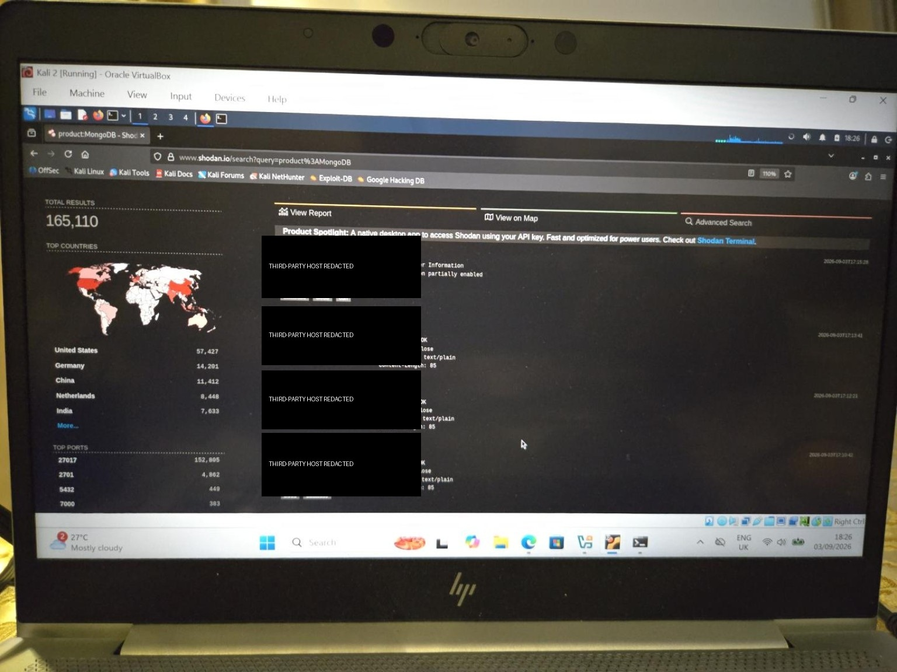

*Figure 15. Public version of the MongoDB search. Individual third-party host details are intentionally redacted.*

I did not attempt to connect to any MongoDB service.

---

## 24. Network Infrastructure

I next explored Shodan's **Network Infrastructure** category.

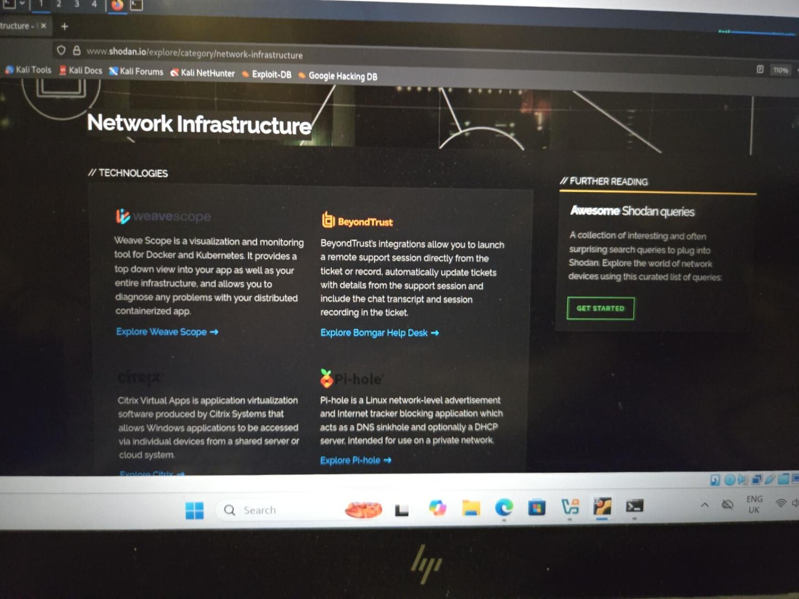

*Figure 16. Shodan's Network Infrastructure category showed examples of internet-facing infrastructure and administration technologies.*

Visible examples included:

- Weave Scope;
- BeyondTrust / Bomgar Help Desk;
- Citrix Virtual Apps; and
- Pi-hole.

This helped me understand that Shodan can identify technology close to an organisation's **management and infrastructure layer**, not only end-user websites.

I clicked into Weave Scope briefly.

That result mainly produced individual IP-address listings, so I did not retain those host details for the public project.

The page also linked to a public third-party GitHub collection called **Awesome Shodan Search Queries**.

I looked at the repository to understand the idea of more specialised Shodan queries, but I did not use it as project evidence and did not blindly run queries designed to locate vulnerable third-party systems.

---

## 25. Industrial Control Systems

I then opened the **Industrial Control Systems** category.

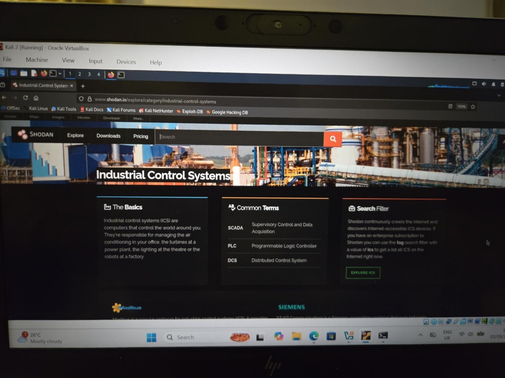

*Figure 17. The ICS category introduced SCADA, PLC and DCS terminology and explained Shodan's internet-accessible ICS search capability.*

The page introduced:

**SCADA:** Supervisory Control and Data Acquisition.

**PLC:** Programmable Logic Controller.

**DCS:** Distributed Control System.

Shodan's examples made it clear that industrial control systems can affect the physical world, including:

- turbines;
- factory equipment;
- building systems;
- lighting; and
- other operational technology.

The page also showed industrial technologies and vendors lower down, including examples such as Modbus and Siemens.

I did **not** continue into individual ICS host listings.

The category page was enough to understand the concept without republishing specific industrial infrastructure.

---

## 26. Remote Access, Screenshots and `has_screenshot:true`

One part of the class demonstration I remembered involved Shodan displaying graphical remote-access or camera-related images.

I wanted to understand whether my Free account could reproduce the concept.

I returned to the normal Shodan search interface and searched:

```text
has_screenshot:true
```

The search worked.

I did **not** take or retain screenshots of the result page for the public project because it displayed identifiable third-party systems and screen captures.

During the exploration I observed examples labelled or associated with:

- RFB/VNC;
- Remote Desktop Protocol;
- RTSP;
- webcams;
- HTTP responses;
- SSL/TLS certificates; and
- different countries and network providers.

One result showed:

```text
RFB authentication disabled
```

I treated this as a Shodan-observed exposure signal and did not test it.

I also saw remote-desktop screenshots and webcam/RTSP-related observations.

### Static observation, not a live feed

The screenshots appeared to be captured observations.

I learned not to assume that an image displayed by Shodan is a live feed. It can be a screenshot collected when Shodan observed the service.

### Remote-access concepts reinforced

**SSH:** Remote command-line access, commonly associated with port 22.

**RDP:** Microsoft's Remote Desktop Protocol, commonly associated with port 3389.

**VNC / RFB:** Graphical remote-control technology. RFB is the protocol used by VNC.

**RTSP:** Real Time Streaming Protocol, commonly used with video and camera systems.

**X Windows:** A graphical display system that can also be exposed over a network.

Shodan's documentation states that its screenshot data can come from VNC, RDP, RTSP, webcams and X Windows.

The dedicated Shodan Images interface is a membership feature, but the main search engine can also find screenshot-bearing observations using:

```text
has_screenshot:true
```

My Free account therefore still allowed me to understand the concept firsthand without needing the dedicated Images interface.

---

## 27. Self-Signed Certificates

While reviewing screenshot-enabled results, I encountered the term:

```text
self-signed certificate
```

I learned that a self-signed certificate is a certificate signed by the system itself rather than by a publicly trusted certificate authority.

A self-signed certificate can still be used to encrypt traffic.

However, by itself it does not provide the same public third-party identity assurance as a certificate issued through a trusted public certificate authority.

I also learned that seeing a self-signed certificate does not automatically mean the service is malicious or vulnerable. They are common in internal systems, appliances, labs and administration interfaces.

---

## 28. Terms I Learned or Reinforced

### Banner

The service data Shodan collects and indexes. A banner can contain software names, versions, protocol responses, configuration information and other metadata returned by a service.

### Search filter

A Shodan field selector written in the form:

```text
filter:value
```

Examples from this exercise included:

```text
hostname:scanme.nmap.org
port:80
product:OpenSSH
org:"Linode"
```

### Hostname

A human-readable network name associated with a host.

### Product

Shodan's identification of the software or service product represented by a banner.

### Organisation

The organisation/provider Shodan associates with the IP space.

### IPv4 / IPv6

Two versions of Internet Protocol addressing. ScanMe produced both IPv4 and IPv6 Shodan observations.

### HTTP 200 OK

A successful HTTP response.

### HTTP 400 Bad Request

A response indicating that the server considered the request invalid. It is not automatically a vulnerability.

### SSH

A protocol for secure remote command-line access.

### NTP

Network Time Protocol, used to synchronise clocks across networked systems.

### Filtered port

An Nmap state meaning that the scanner cannot determine whether the port is open or closed because probes are being filtered or blocked.

### RFB

Remote Framebuffer, the protocol used by VNC.

### RDP

Remote Desktop Protocol, commonly used for graphical Windows remote access.

### RTSP

Real Time Streaming Protocol, commonly associated with media streaming and camera systems.

### ICS

Industrial Control System.

### SCADA

Supervisory Control and Data Acquisition.

### PLC

Programmable Logic Controller.

### DCS

Distributed Control System.

### RDBMS

Relational Database Management System.

### ORDBMS

Object-Relational Database Management System.

### NoSQL

A broad term for non-relational database models.

### Self-signed certificate

A certificate signed by the system/entity itself rather than by an external trusted public certificate authority.

---

## 29. Results Summary

| Stage | Result | My interpretation |
|---|---|---|
| `hostname:testphp.vulnweb.com` | No results | Shodan had no matching indexed result |
| `dig +short testphp.vulnweb.com` | `44.228.249.3` | DNS resolution worked |
| Search TestPHP IP | No results | DNS resolution did not imply Shodan coverage |
| InternetDB TestPHP IP | No information available | InternetDB also had no record to use |
| `hostname:scanme.nmap.org` | 9 results | Multiple service observations, not nine machines |
| `port:80` | 2 results | HTTP observations isolated |
| `port:22` | 2 results | SSH observations isolated |
| `product:OpenSSH` | 2 results | Product-based filtering worked |
| `org:"Linode"` | 9 results | All visible ScanMe observations already matched Linode |
| Live Nmap TCP scan | 4 selected ports filtered | My network could not determine their open/closed state |
| Live Nmap UDP 123 | Open, NTP v4 | Shodan and Nmap agreed on NTP exposure |
| U.S. Observatory | Large aggregate dashboard | Shodan can analyse exposure at population scale |
| Database category | Multiple database technologies | Shodan can fingerprint database services |
| `product:MongoDB` | ~165,110 results shown | Internet-wide product search, not proof all are vulnerable |
| Network Infrastructure | Multiple administration/infrastructure products | Shodan extends beyond ordinary websites |
| ICS category | SCADA, PLC, DCS and industrial technologies | Shodan can identify operational technology exposure |
| `has_screenshot:true` | RDP/VNC/RTSP/webcam-related observations visible | Shodan can index visual observations of some remote services |

---

## 30. What I Learned

The main lessons I took from this exercise were:

- Shodan is a search engine for internet-connected services and devices, not simply a search engine for web pages.
- The fundamental thing being searched is service information collected by Shodan, often described as a banner.
- A single machine can produce several Shodan results because multiple services can be observed on the same host.
- Search filters can target properties such as hostname, port, product and organisation.
- A missing space between filters can completely change a query.
- A service/version banner is useful reconnaissance information but is not automatic proof of a vulnerability.
- An HTTP `400 Bad Request` response can still disclose useful service information.
- Shodan can index non-web protocols such as SSH and NTP.
- No Shodan result does not prove that a target is offline.
- DNS resolution and Shodan indexing answer different questions.
- Shodan's observations do not have to match what my own Nmap scan sees from my network at the same moment.
- `filtered` in Nmap is different from `open` and `closed`.
- Nmap's SERVICE label beside a filtered port should not be treated as a successful service-version identification.
- UDP services need to be scanned differently from TCP services.
- Corroboration between tools can increase confidence, as happened with NTP on UDP 123.
- Shodan can be used for aggregate research, not only host-by-host lookup.
- Shodan can categorise databases, network-management technologies and industrial control systems.
- Shodan can surface remote desktop, VNC, RTSP, webcam and other screenshot-bearing observations.
- An indexed screenshot is not automatically a live stream.
- Seeing an exposed third-party service does not give me permission to interact with it.
- Publicly searchable information can still deserve careful handling when preparing a public portfolio.
- Redacting unnecessary third-party host identifiers is a better choice than republishing them just because Shodan already makes them searchable.

The overall workflow I came away with was:

```text
choose an authorised target for active validation
-> search Shodan
-> interpret banners and metadata
-> narrow results with filters
-> troubleshoot results that do not make sense
-> corroborate with an authorised live tool where appropriate
-> explore aggregate exposure data
-> separate observation from proof
-> avoid unnecessary interaction with third-party systems
-> publish only the evidence needed for the learning objective
```

---

## 31. Basic Defensive Takeaways

This exercise also gave me a beginner-level understanding of why organisations care about Shodan.

From a defensive point of view, it is useful to know what an outside observer can discover about an organisation.

Basic lessons I understood from the exercise include:

- keep an inventory of internet-facing systems;
- remove public exposure that is not required;
- protect remote administration interfaces with appropriate authentication and access controls;
- do not leave databases publicly reachable unless there is a deliberate and secured reason;
- treat exposed ICS/OT interfaces with particular caution because they can affect physical processes;
- review software and service banners because they can reveal useful information to outsiders; and
- periodically check what external search engines such as Shodan can see about infrastructure that an organisation owns.

I have kept these as basic learning points rather than presenting them as a professional remediation plan.

---

## 32. Limitations

This was a student reconnaissance and learning exercise, not a professional attack-surface assessment.

Important limitations include:

- I used a Free Shodan account, so some Shodan features were not available at the same level as paid or academic membership.
- The TestPHP target produced no useful Shodan data and was abandoned as the main example.
- I did not attempt to validate every Shodan service observation with a live connection.
- I only ran a small number of Nmap checks against the authorised ScanMe host.
- I did not scan the ScanMe IPv6 address from my own machine.
- I did not investigate why each selected TCP port appeared filtered from my particular network path.
- I did not use Shodan's `vuln` filter.
- I did not independently validate the vulnerability counts displayed by the Internet Exposure Observatory.
- The Observatory values recorded here are the values shown during this session and can change over time.
- The MongoDB result total and country/port counts were recorded from the interface during this session and should not be treated as permanent statistics.
- I did not connect to any third-party MongoDB instance.
- I did not open or control any third-party VNC or RDP desktop.
- I did not interact with any webcam or RTSP stream.
- I did not interact with individual ICS devices.
- The remote-screen section is based on what I observed through Shodan's search results and what Shodan documents about screenshot sources, not on active testing of those systems.

---

## 33. Evidence and Privacy Note

The screenshots in this repository are photographs from my own Shodan and Kali session.

I reviewed the evidence before preparing the public version.

I intentionally excluded:

- Shodan account-overview screenshots;
- the account email address;
- the API-key area;
- Google account-verification QR codes;
- individual third-party remote-desktop screenshots;
- webcam/RTSP screenshots;
- individual third-party Weave Scope host listings; and
- screenshots that added no learning value.

The MongoDB search screenshot originally contained individual third-party IP addresses, hostnames, provider/location information and host-level identifiers.

Those identifying host sections have been redacted in:

```text
images/15-mongodb-results-redacted.jpg
```

The public training targets `testphp.vulnweb.com` and `scanme.nmap.org`, together with their IP addresses used during the documented exercise, are intentionally retained because they are necessary to explain the troubleshooting and authorised validation workflow.

No Shodan API key is included.

---

## 34. References

Official resources used to confirm the concepts in this write-up:

- [Shodan Help Center: What is Shodan?](https://help.shodan.io/the-basics/what-is-shodan)
- [Shodan Help Center: Search Query Fundamentals](https://help.shodan.io/the-basics/search-query-fundamentals)
- [Shodan Help Center: Navigating the Website](https://help.shodan.io/the-basics/navigating-the-website)
- [Nmap Network Scanning: Legal Issues and scanme.nmap.org Permission](https://nmap.org/book/legal-issues.html)

---

## Conclusion

This exercise started with a target that returned no Shodan data.

Instead of treating that as the end of the exercise, I checked DNS, tested the resolved IP, checked Shodan InternetDB and then changed to an authorised target that provided useful indexed information.

With `scanme.nmap.org`, I learned how to move from a broad hostname search to narrower port, product and organisation filters. I read HTTP, SSH and NTP banner information and learned not to turn version strings into vulnerability claims without evidence.

The Nmap comparison was particularly useful because it showed that reconnaissance tools can disagree without either result being meaningless. Shodan had indexed TCP service banners, while my own live TCP probes saw the selected ports as filtered. NTP on UDP 123 was visible to both Shodan and my Nmap scan.

I then expanded the exercise beyond one host by using the Internet Exposure Observatory and Shodan's database, network infrastructure and industrial control system categories. Finally, I used `has_screenshot:true` to understand the remote-access and camera capability I remembered from class.

The biggest conceptual change for me was understanding Shodan as a way of asking:

> **What does the public Internet appear to expose, and what information can an outside observer learn from those exposed services?**

The exercise also reinforced a boundary that I want to keep in my future work:

**discoverability is not authorisation.**

I can use Shodan to understand exposure, but active validation belongs on systems I own or have explicit permission to test.

---

## Lab Note

This project is a student learning record.

The only live Nmap validation documented here was performed against `scanme.nmap.org`, an Nmap-authorised scanning target. Third-party systems discovered through Shodan were viewed only as indexed search results and were not actively tested.
