# Privilege Escalation Using LinPEAS: Second Try

| **Date** | 24 September 2026 |
|---|---|
| **Environment** | Kali Linux and Metasploitable 2 virtual machines in Oracle VirtualBox |
| **Tools** | Metasploit Framework, LinPEAS, OpenSSH/Linux shell commands, `wget`, `curl`, `ss`, `ping` |
| **Kali VM** | `192.168.1.115` |
| **Target VM** | `192.168.1.116` |
| **Scope** | My own deliberately vulnerable home-lab virtual machine |
| **Evidence** | 43 original screenshots in `images/`, ordered by capture time |

**Purpose: authorised cybersecurity training, Linux enumeration and privilege-escalation assessment in a controlled home lab.**

## 1. Overview

This was my **second attempt at a LinPEAS-based privilege-escalation exercise**. I wanted to establish access to Metasploitable 2 through different services, run LinPEAS, and compare what I could see from the shell or session I had actually obtained.

This session was not one clean sequence. I ran into a broken `locate` database, confused Linux shell commands with Meterpreter commands, changed access routes when sessions ended, encountered a payload error, and restarted LinPEAS several times under different accounts. I have kept those attempts rather than rewriting the exercise as if I understood everything at the start.

**Important distinction:** in this exercise I obtained access as different accounts, including `root` through the Samba route, but the evidence does **not** show a separate, completed step in which LinPEAS led me from a low-privilege account to a higher-privilege account. The LinPEAS output is an **enumeration and prioritisation aid**, not automatic proof of exploitation. This README records the successful access, the tool output, and the remaining limitations separately.

---

## 2. Objectives

My aims were to:

- establish an initial session with the deliberately vulnerable target;
- transfer and run LinPEAS on the target, including learning the difference between Meterpreter and a normal shell;
- examine Linux configuration, permissions, scheduled tasks, processes and possible escalation leads;
- try more than one service and observe the differences between the resulting user contexts;
- distinguish a Metasploit session opening from confirmed user identity or privilege escalation;
- preserve errors, interruptions and changes of approach as part of the evidence; and
- write only what the screenshots support.

---

## 3. Scope and Working Environment

The lab path was:

`Kali Linux (192.168.1.115) → private lab network → Metasploitable 2 (192.168.1.116)`

I used deliberately vulnerable services on my own VM. The IP addresses in the screenshots are private lab addresses. Other socket addresses visible in the translucent terminal background are not targets of this exercise.

I had previously scanned and assessed Metasploitable 2 in earlier repository projects. This README begins with the commands visible in **this** session; I have not invented a fresh Nmap scan for it.

---

## 4. Locating LinPEAS and a Misleading Download

I first tried to locate the LinPEAS script, but the `locate` database returned a short-read / possible corruption error. I also moved into `~/Downloads` and ran a test `wget` against the GitHub homepage. That command saved an `index.html` file, **not** the LinPEAS script.

The directory listing nevertheless showed a `linpeas.sh` file already present in `~/Downloads`, which I later used for the upload.

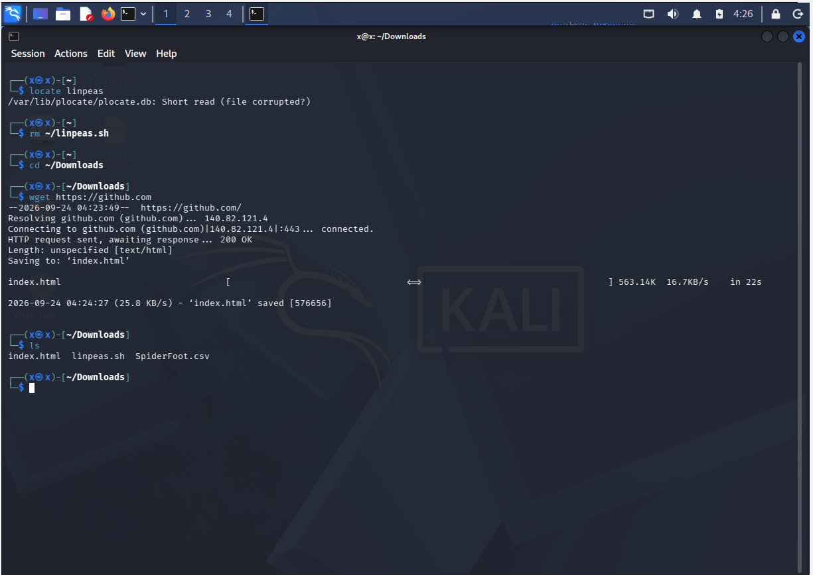

*Figure 1. My initial file-location problem, the GitHub homepage download, and the existing LinPEAS script in Downloads.*

### What I learned

I should verify both the requested URL and the resulting filename instead of assuming any successful download is the file I wanted. A broken `locate` index does not by itself prove that a file is missing.

---

## 5. Initial VSFTPD Session and LinPEAS Transfer

The VSFTPD backdoor route opened a Meterpreter session on the target. I also checked network connections from Kali during the session.

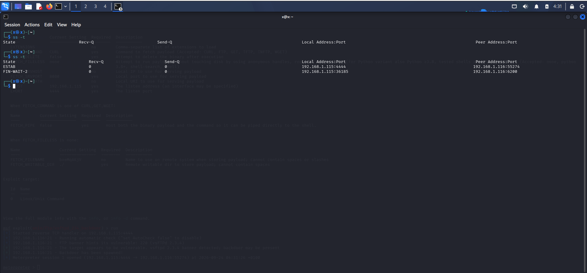

*Figure 2. The VSFTPD-based session and an accompanying socket check.*

Inside Meterpreter I inspected the filesystem and changed to `/tmp`. I then tried `wget` and `nc` directly at the Meterpreter prompt. Both were rejected as unknown Meterpreter commands, because they are normal system commands rather than commands available in that session's Meterpreter command set.

I used Meterpreter's own `upload` command instead to transfer my local `linpeas.sh` into the target's `/tmp` directory.


*Figure 3. The unsuccessful Meterpreter `wget`/`nc` attempts followed by a successful `upload` of `linpeas.sh`.*

I opened a system shell, changed to `/tmp`, made the script executable, and ran it:

```sh
cd /tmp
chmod +x linpeas.sh
./linpeas.sh
```

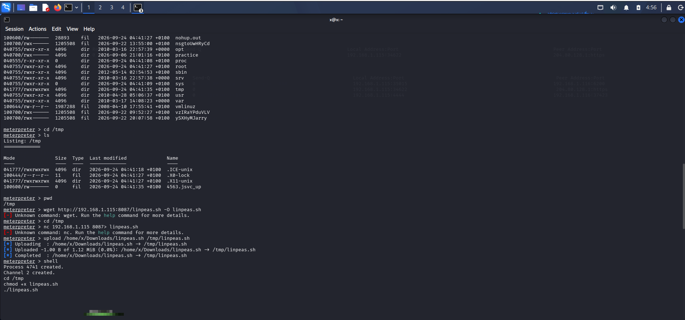

*Figure 4. The switch from Meterpreter to a normal shell and the first LinPEAS execution.*

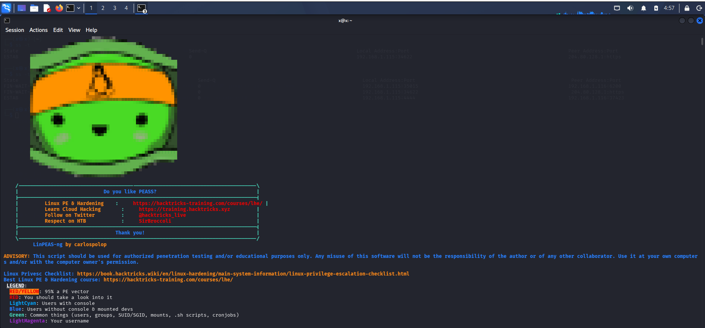

*Figure 5. The first LinPEAS banner and colour legend.*

### What I understood

A file transfer succeeding is different from executing the file successfully. I needed the system shell to use commands such as `chmod`, and the LinPEAS banner provided visible evidence that the script had started.

---

## 6. Reviewing the First LinPEAS Output

I reviewed part of the long output, including its scheduled-task section. LinPEAS highlighted cron paths and showed scripts under the hourly, daily, weekly and monthly directories. It labelled several cron directories as writable.

I did **not** independently demonstrate that a low-privilege user could modify an executable cron job or have it executed as root. The screenshot is a **permission-check lead** that would need validation in the relevant user context.

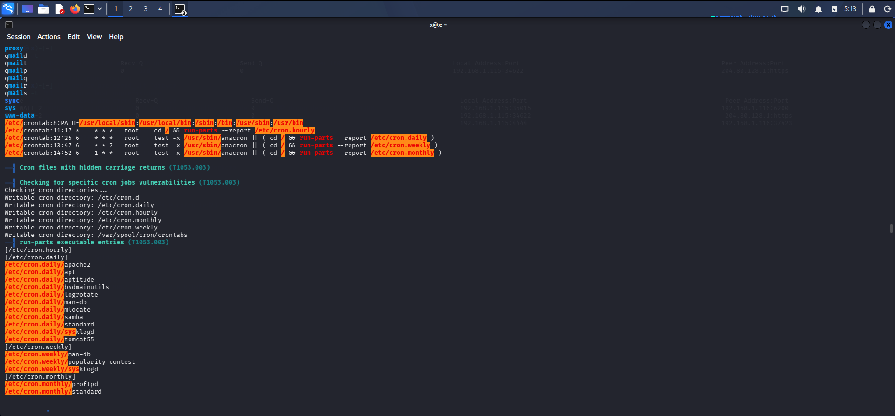

*Figure 6. LinPEAS checks of cron directories and scheduled-task entries.*

The output also displayed service/configuration text, including Postfix-related settings. I later interrupted the output and backgrounded the shell channel rather than keeping this long run open indefinitely.

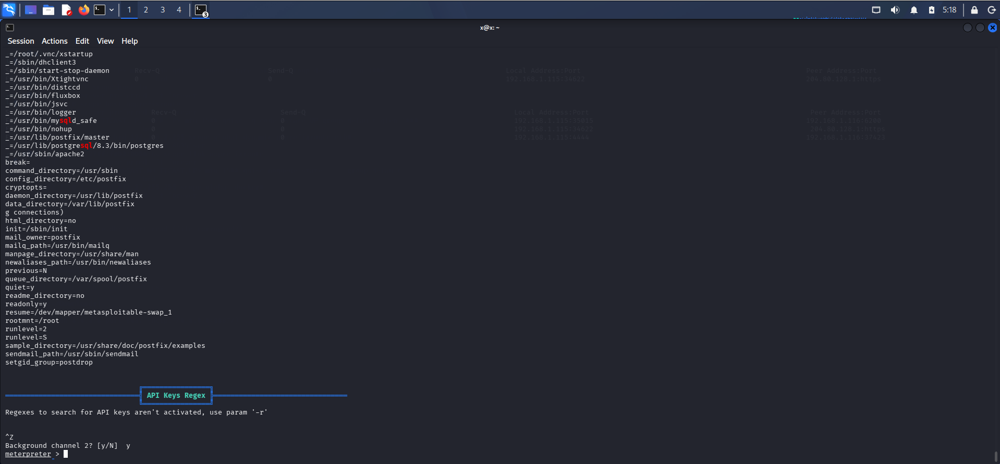

*Figure 7. Configuration output and backgrounding the first shell channel.*

---

## 7. Session Checks and Moving Toward Samba

Back on Kali, I checked for the previous listener, confirmed that the target still replied to `ping` with no packet loss, and checked socket state. When I returned to Metasploit, there was no active VSFTPD session. I then searched for Samba modules.

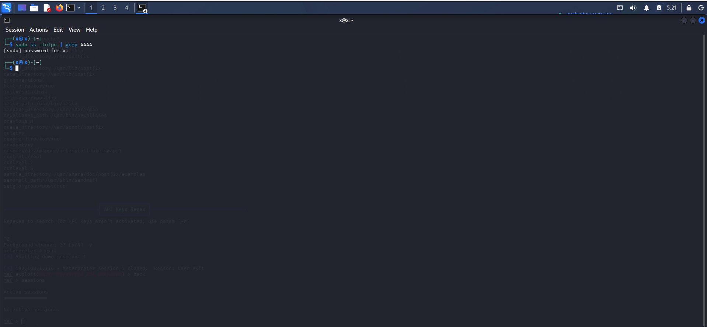

*Figure 8. A listener check on Kali.*

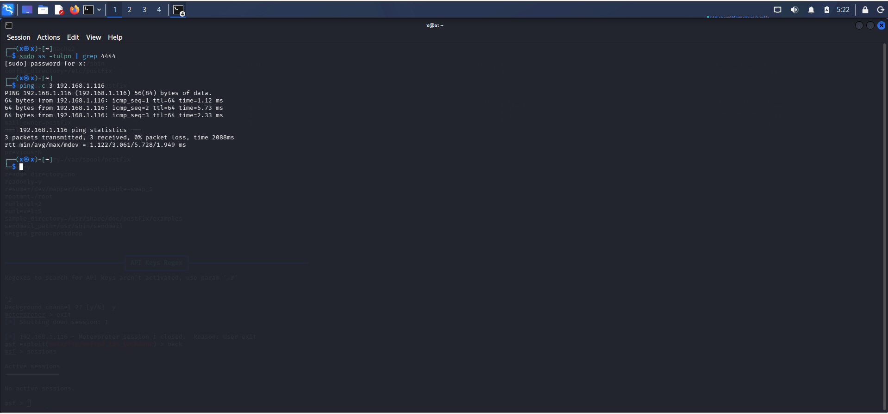

*Figure 9. The target responding to three ICMP echo requests.*

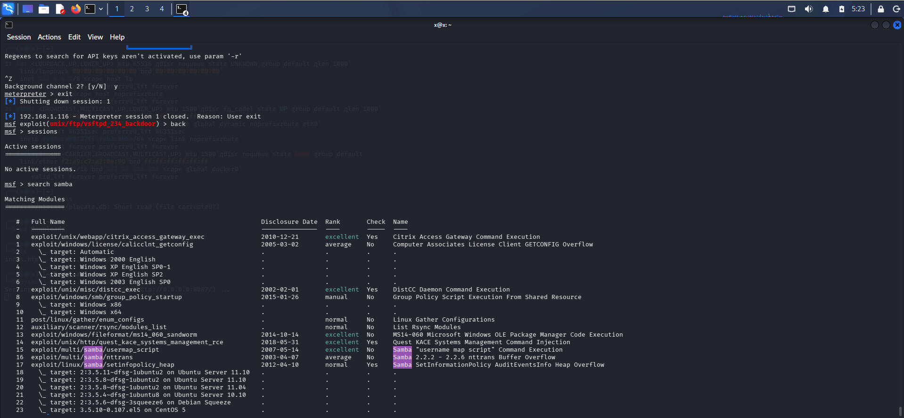

*Figure 10. The previous session was no longer active; I searched for Samba-related modules.*

---

## 8. Samba `usermap_script` Access

I selected the module:

```text
exploit/multi/samba/usermap_script
```

The options showed `RHOSTS` set to `192.168.1.116`, the Samba service on port `139`, and the reverse-shell listener on `192.168.1.115:4444`.

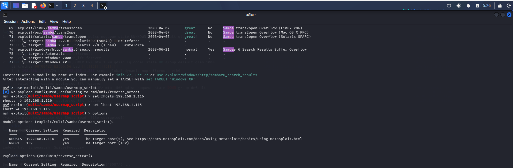

*Figure 11. Selection of the Samba username-map script module.*

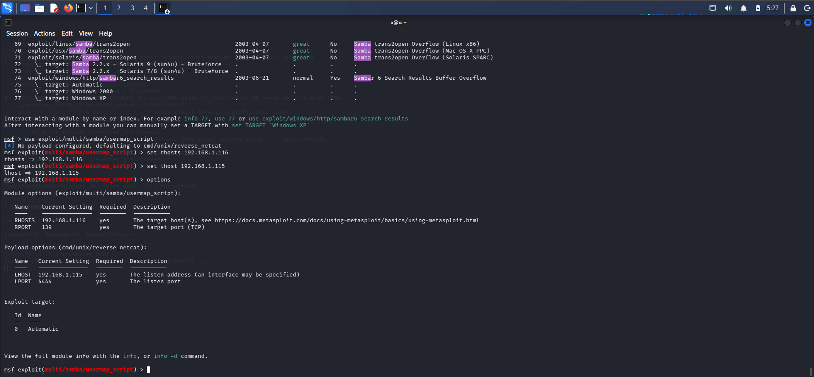

*Figure 12. Module options showing the target and reverse connection settings.*

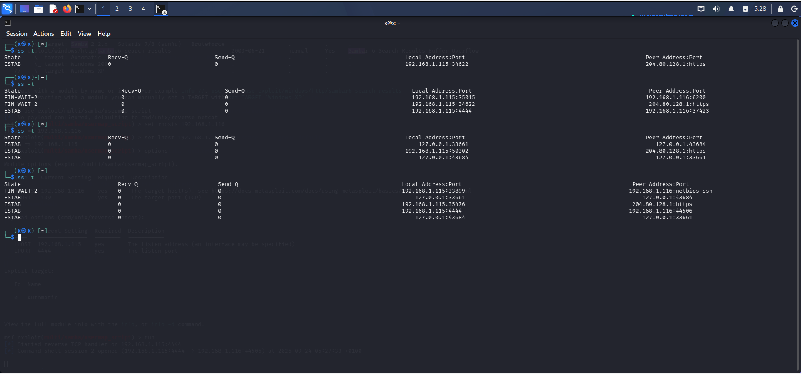

*Figure 13. A contemporaneous socket check while I was working through the Samba attempt.*

Running the module opened a **command shell session**. I then checked identity with `whoami`, which returned `root`. This matters: it is evidence of **root-level access through that service**, not evidence that LinPEAS itself elevated an already low-privilege session.

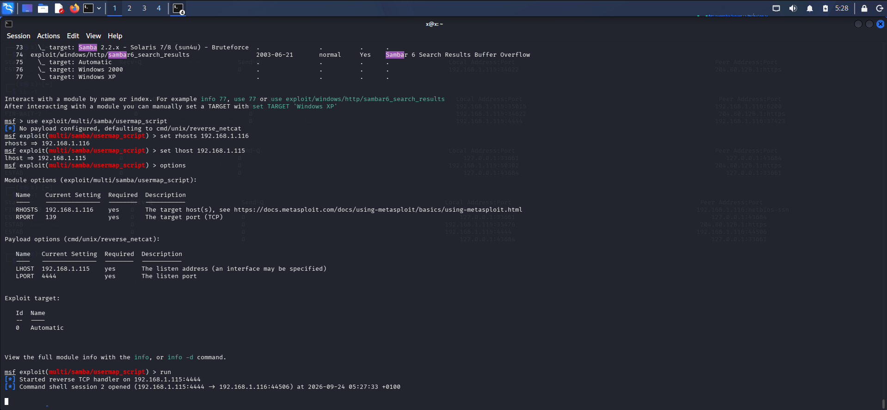

*Figure 14. Metasploit reporting the Samba command-shell session.*


*Figure 15. `whoami` returned `root`, and I started LinPEAS using the shell.*

LinPEAS started and displayed its banner and legend. I kept the output, including extensive file lists and system configuration results, as reconnaissance evidence rather than declaring every highlighted path a confirmed vulnerability.

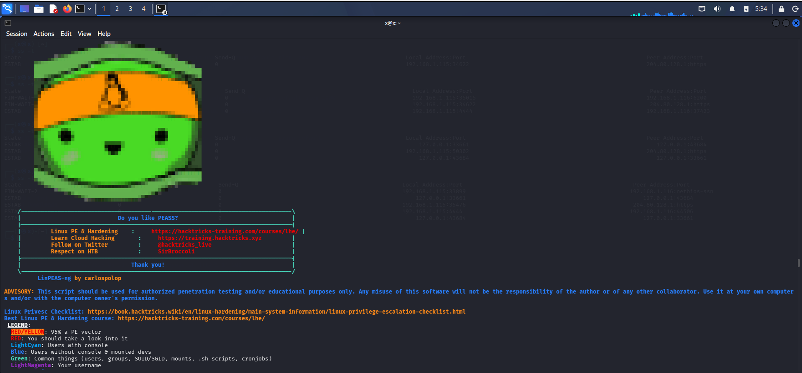

*Figure 16. LinPEAS starting in the Samba-derived session.*

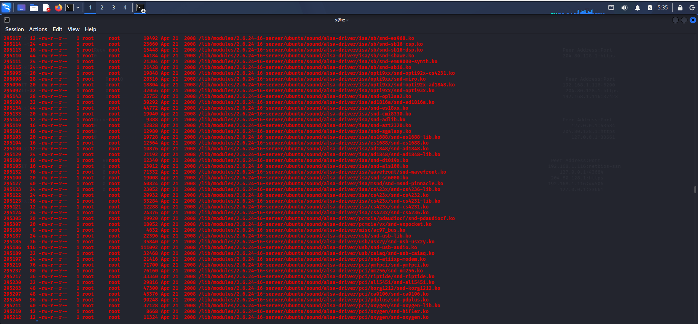

*Figure 17. A long listing of files and kernel module paths flagged by LinPEAS.*

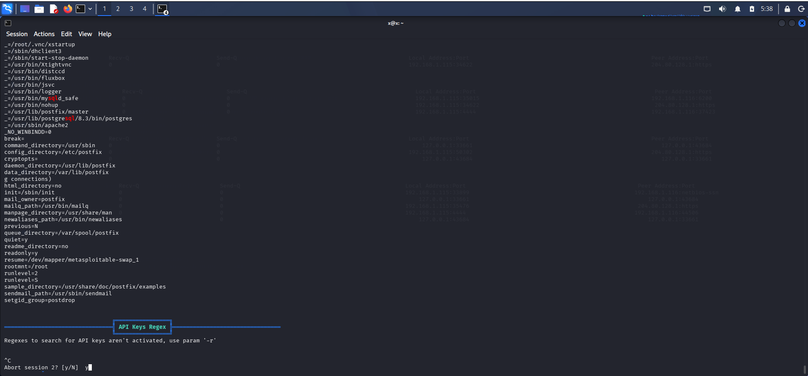

*Figure 18. Further configuration output and the attempted closure of the shell channel.*

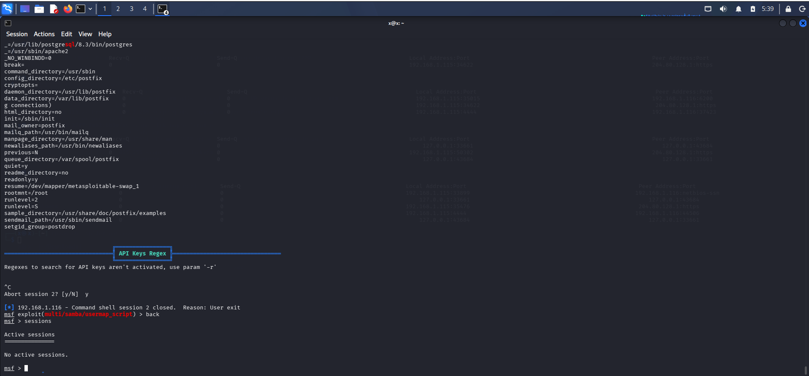

*Figure 19. The Samba command-shell session closed after user confirmation.*

### What I learned

The confirmation was the command output from `whoami`, not simply the fact that Metasploit said a shell had opened. The long red text in LinPEAS also required interpretation, rather than being copied into a report as an automatic list of exploitable weaknesses.

---

## 9. UnrealIRCd Investigation Without a Confirmed Result

I next searched for the UnrealIRCd 3.2.8.1 backdoor module and inspected its payload and connection options. I also made another socket check.

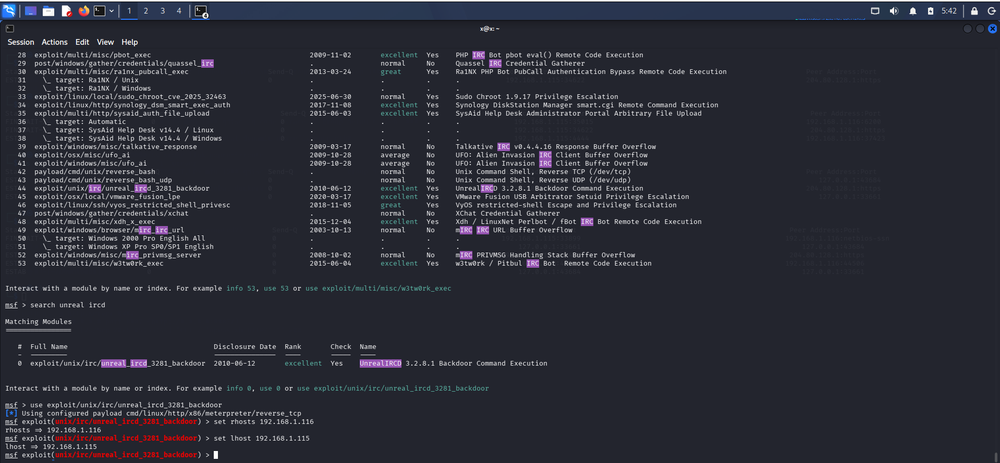

*Figure 20. The UnrealIRCd module search and initial configuration.*

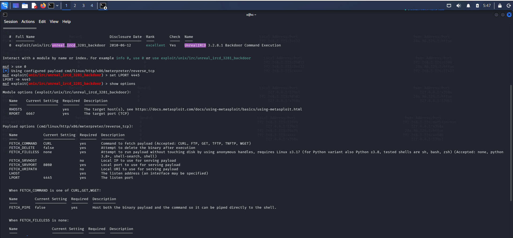

*Figure 21. The selected UnrealIRCd module and its payload options.*

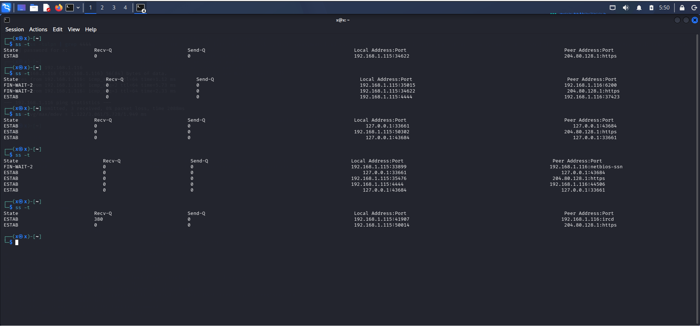

*Figure 22. Another Kali socket check during the IRC investigation.*

The screenshots do **not** show a successful UnrealIRCd session from this attempt, so I have not counted it as a success.

---

## 10. Tomcat Manager: A New Meterpreter Session

I searched Metasploit for Tomcat-related modules and selected the Manager deployment route (`exploit/multi/http/tomcat_mgr_deploy`).

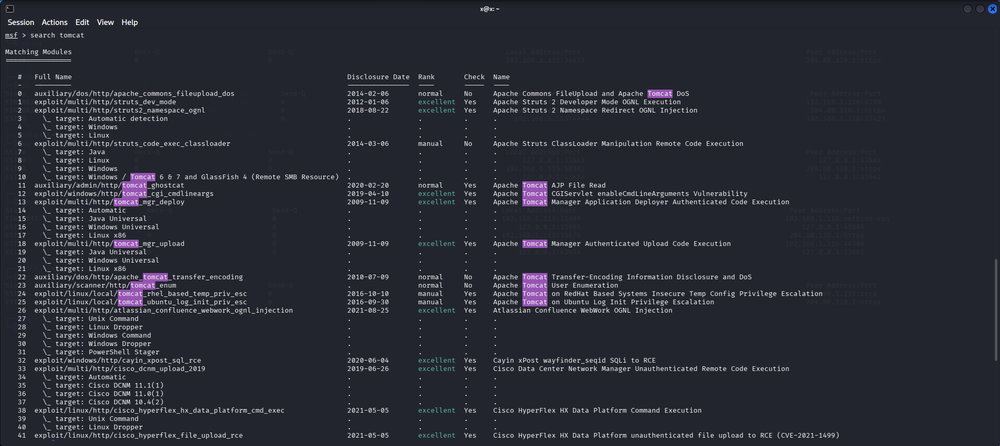

*Figure 23. Tomcat module search results.*

I configured the target's Tomcat HTTP port (`8180`) and a local listening port (`6666`). A mistyped `HttpUsertomcat` setting was rejected, after which I set the valid username and password option names to the known Metasploitable training credentials.

The exploit uploaded and executed a WAR/JSP payload and opened a Meterpreter session.

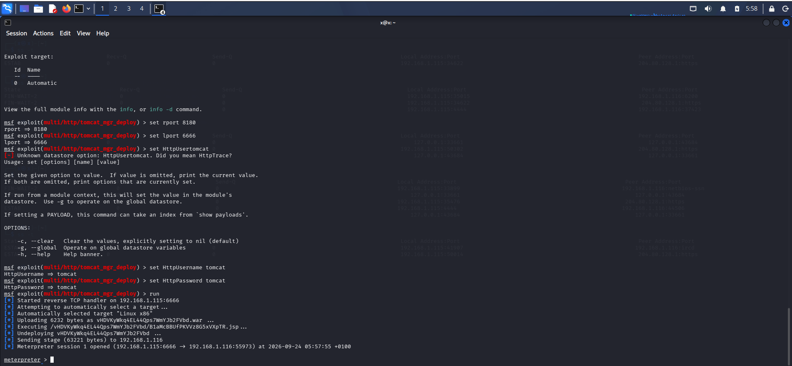

*Figure 24. The rejected datastore-option typo, corrected Tomcat settings, and successful Meterpreter session.*

I used `getuid`, which returned `tomcat5`. After opening a shell I tried a `curl` command with stray bracket characters in the address and received a globbing error. I then used `wget` to start LinPEAS.


*Figure 25. The `tomcat5` identity, malformed `curl` command, and the subsequent `wget` attempt.*

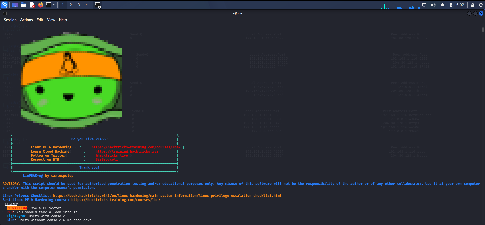

*Figure 26. LinPEAS banner showing that the Tomcat run started.*


*Figure 27. LinPEAS environment and log output, including the `tomcat5` user context.*

### What I understood

This was a successful initial foothold **as `tomcat5`**. I did not document a completed escalation from `tomcat5` to root.

---

## 11. PostgreSQL Payload and LinPEAS

I next configured the PostgreSQL payload module:

```text
exploit/linux/postgres/postgres_payload
```

The options showed the PostgreSQL service on port `5432`, the target `192.168.1.116`, the training database credentials, and a Linux x86 Meterpreter reverse TCP payload. I changed the local port to `7777` before running it.

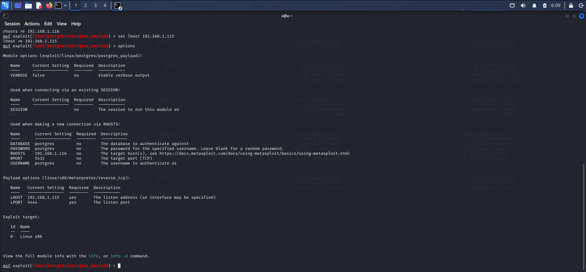

*Figure 28. PostgreSQL payload-module settings.*


*Figure 29. The listener port changed to `7777` and the options rechecked.*

Metasploit identified PostgreSQL **8.3.1**, uploaded a shared object to the target, and opened Meterpreter. `getuid` returned **`postgres`**. I opened a shell and launched LinPEAS.


*Figure 30. PostgreSQL Meterpreter success, `postgres` identity and the LinPEAS launch.*

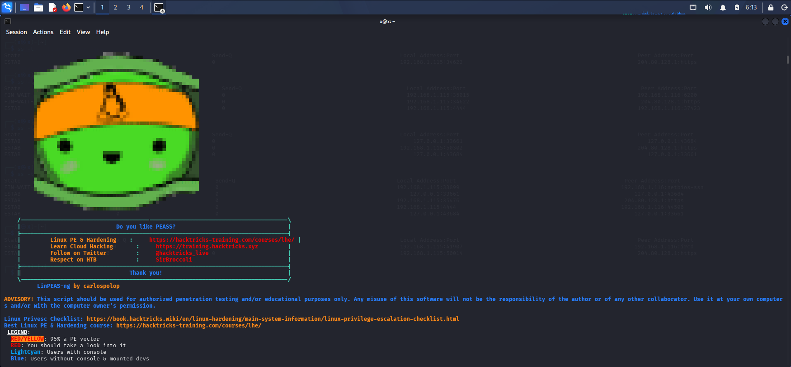

*Figure 31. LinPEAS banner from the PostgreSQL-derived shell.*

LinPEAS displayed a long list of kernel-related CVE candidates and a process/file inspection. I retained this as potential research material, not proof that the listed CVEs were exploitable in my exact environment.

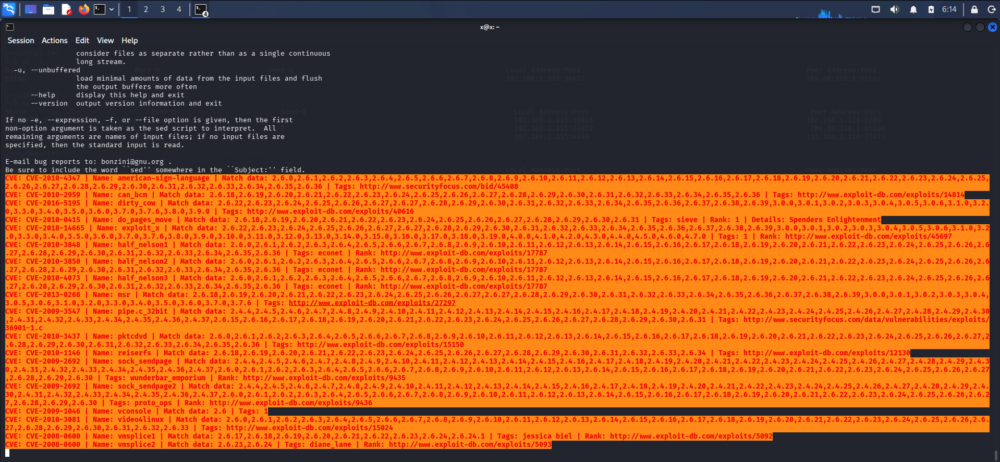

*Figure 32. Kernel-version-related exploit candidates listed by LinPEAS; these were not validated.*

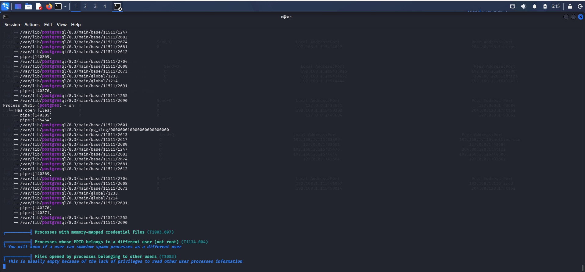

*Figure 33. Process-owned file listings, including PostgreSQL data paths.*

The environment information showed the PostgreSQL account context (`HOME=/var/lib/postgresql` and `USER=postgres`). I then interrupted and closed the shell channel.

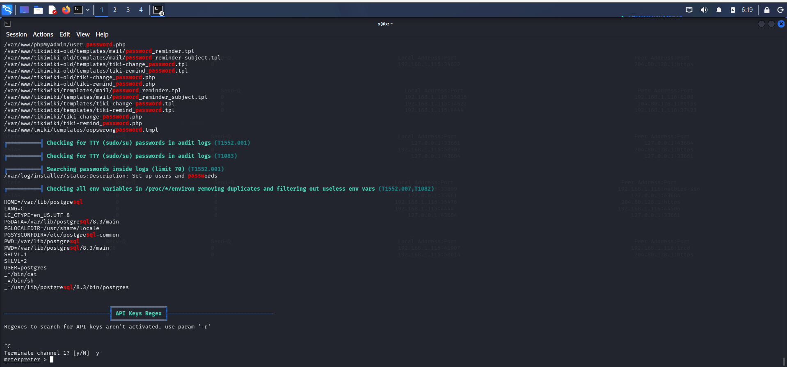

*Figure 34. PostgreSQL environment output followed by termination of the channel.*

### What I understood

I had a confirmed session as **`postgres`**, not proof of root-level privilege escalation. The kernel CVE list was a starting point for research, not a finding I had personally reproduced.

---

## 12. DistCC: Failed Payload, Then a Shell

I selected the DistCC command-execution module:

```text
exploit/unix/misc/distcc_exec
```

The module targeted port `3632` on `192.168.1.116`.

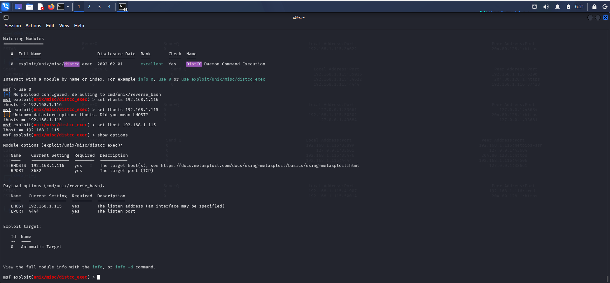

*Figure 35. DistCC module selected with target and reverse connection settings.*

The first run, using the default reverse Bash payload, returned errors including **`bash: 101: Bad file descriptor`** and `/dev/tcp/...: No such file or directory`. Metasploit said the exploit completed but no session was created.

I then changed to the Unix reverse payload and changed the listener port to `8889`. This time Metasploit accepted the connections and opened a command shell.

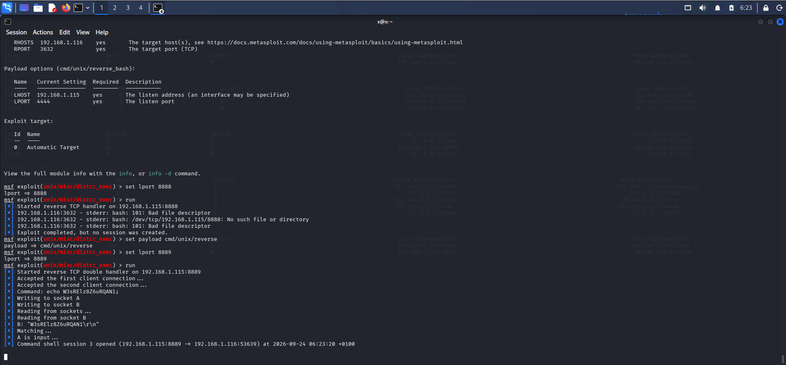

*Figure 36. The failed first DistCC payload and the subsequent successful command-shell session.*

`whoami` returned **`daemon`**. I invoked LinPEAS from that shell and its banner appeared.


*Figure 37. The command shell identified as `daemon` and the LinPEAS command entered.*

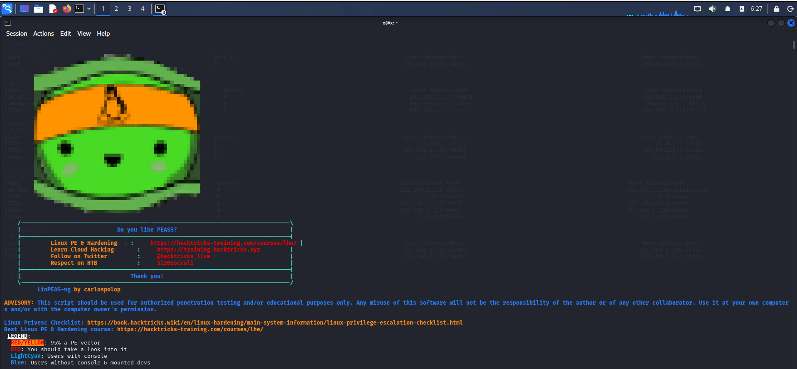

*Figure 38. LinPEAS starting under the DistCC-derived shell.*

### What I learned

An exploit module reaching its target is not the same thing as its payload establishing a session. This attempt showed both outcomes in the same troubleshooting sequence. The confirmed user context afterwards was `daemon`, not root.

---

## 13. Java RMI Session and Further Enumeration

I searched for Java-related Metasploit modules and selected the Java RMI server module:

```text
exploit/multi/misc/java_rmi_server
```

I configured the target on port `1099`, with Kali as the reverse connection host and a local listener on port `9991`.

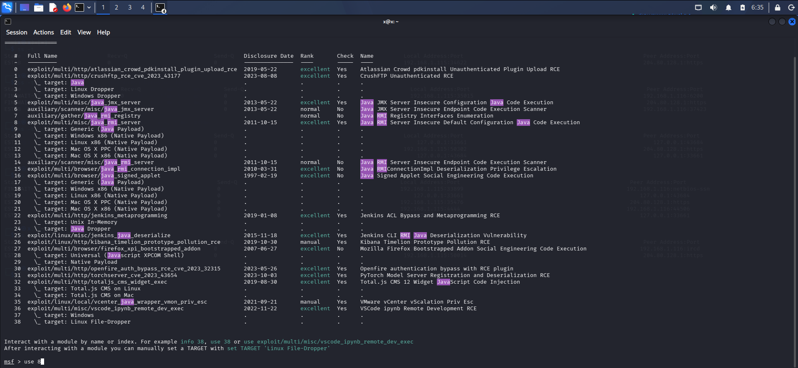

*Figure 39. Searching the Java/RMI module list.*

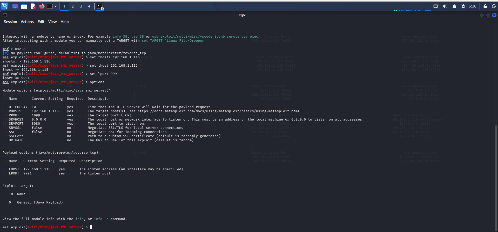

*Figure 40. Java RMI module and payload options.*

The module reported that it sent an RMI call and a payload JAR, and then opened a Meterpreter session. I opened a shell and started LinPEAS.

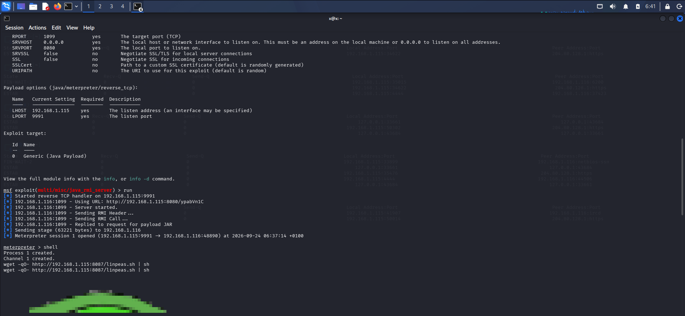

*Figure 41. Java RMI Meterpreter session and the shell-based LinPEAS command.*


*Figure 42. LinPEAS banner during the Java RMI run.*

The later process list displayed activity under several accounts, including `root`, `www-data`, `tomcat55` and `daemon`, as well as a Java/Metasploit payload process. The screenshot is useful for showing the services running on this deliberately vulnerable target. It is **not** a substitute for a `whoami`/`id` result in this particular session.

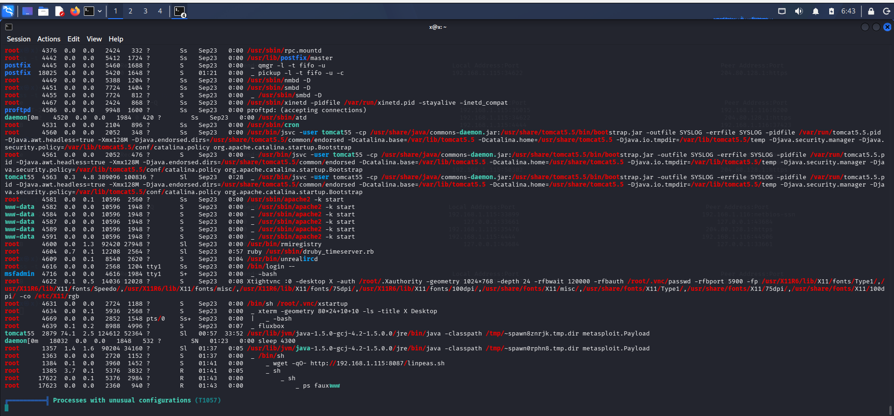

*Figure 43. Process enumeration under different system accounts during the Java RMI LinPEAS run.*

---

## 14. Findings and Evidence Status

| Area | What I observed | What the evidence supports |
|---|---|---|
| VSFTPD | A Meterpreter session was opened | Successful initial access; user identity not established in the visible image |
| LinPEAS transfer | `wget`/`nc` rejected inside Meterpreter, then `upload` completed | Successful transfer; separate shell launch confirmed |
| Scheduled tasks | LinPEAS highlighted cron directories and scripts | Leads for permission review, **not validated escalation** |
| Samba | `usermap_script` opened a shell; `whoami` returned `root` | **Confirmed root access via Samba** |
| UnrealIRCd | Module researched and options reviewed | No successful session demonstrated |
| Tomcat | Manager deployment opened Meterpreter; `getuid` returned `tomcat5` | **Confirmed session as `tomcat5`** |
| PostgreSQL | Payload module opened Meterpreter; `getuid` returned `postgres` | **Confirmed session as `postgres`** |
| LinPEAS CVE list | Many kernel candidates were displayed | Version-based leads, **not individually verified exploits** |
| DistCC | Initial payload failed; second attempt opened a command shell; `whoami` returned `daemon` | **Confirmed command shell as `daemon`** |
| Java RMI | Module opened Meterpreter and LinPEAS ran | **Confirmed session and enumeration; shell user not independently verified in the visible screenshots** |
| Privilege escalation | Several user contexts and possible leads were identified | **No separate low-privilege-to-root escalation demonstrated by this evidence** |

---

## 15. Troubleshooting and Pivots

The parts that did not work immediately were just as useful to document:

- the broken `locate` database;
- a GitHub homepage download that saved `index.html` rather than LinPEAS;
- trying normal Linux commands at the Meterpreter prompt;
- changing to the correct tool-specific `upload` command;
- interrupting long output and learning how shell channels and Metasploit sessions relate;
- checking whether the target remained reachable after a session disappeared;
- moving from VSFTPD to Samba, then investigating IRC and Tomcat;
- a Tomcat datastore-option typo and malformed `curl` command;
- distinguishing service access as `tomcat5` or `postgres` from root access;
- an unsuccessful DistCC payload followed by a successful alternative; and
- encountering a large volume of LinPEAS matches without mistaking them for confirmed vulnerabilities.

The workflow was iterative: **gain a session → establish the actual account → run enumeration → interpret leads → preserve errors → verify any result separately.**

---

## 16. Terms I Learned

**Meterpreter:** An interactive Metasploit payload with its own commands. It is not automatically an ordinary Linux shell.

**System shell:** The target's shell, where normal Linux commands such as `cd`, `chmod`, `wget` and `whoami` can run if available.

**RHOSTS / RPORT:** The target address and service port.

**LHOST / LPORT:** The local return address and listener port for a reverse payload.

**Foothold:** Initial access as a particular account or service user.

**Privilege escalation:** Moving from the access rights of one account to greater rights, for example from a service user to root. An initial root shell from a vulnerable service is not, by itself, proof of a separate escalation step.

**LinPEAS:** A Linux enumeration script that highlights potential misconfigurations and escalation leads. Its colour coding is a prioritisation aid, not a final verdict.

**Candidate CVE:** An entry whose applicability must be researched and validated. A version match alone is insufficient evidence.

---

## 17. What I Learned

This attempt helped me understand that **getting a shell, identifying its user, running LinPEAS, and actually escalating privileges are four different events**.

I became more comfortable switching between Meterpreter and a system shell, transferring a file into a session, and checking account identity after gaining access. I also learned that a successful exploit can still need additional context before I know what kind of access it gave me.

The Samba route returned root immediately. The Tomcat, PostgreSQL and DistCC routes gave me `tomcat5`, `postgres` and `daemon` respectively. These different results made it much easier to understand why the user context matters when interpreting LinPEAS findings.

I also saw how noisy enumeration output can be. The number of highlighted entries was not a vulnerability count, and the kernel CVE section was not a list of exploits I had validated. A report needs to say which parts were confirmed and which parts remain possible leads.

---

## 18. Remediation Considerations

In a normal environment, the service exposure seen on a deliberately vulnerable VM would call for controlled remediation, including retiring obsolete services, patching unsupported software, removing default credentials, limiting unnecessary listening services, avoiding service processes running as root where possible, restricting file and scheduled-task permissions, and reviewing suspicious processes and outbound connections.

Those are general defensive implications of the training environment, not a claim that I exhaustively audited or remediated this VM.

---

## 19. Limitations

- I did not independently verify every item flagged by LinPEAS.
- I did not reproduce a kernel exploit from the long CVE candidate list.
- I did not show a complete low-privilege-to-root escalation route.
- I did not establish the current user for every opened session.
- Some screenshots show successive screens of the same long-running output; these are included to preserve chronology, not counted as separate findings.
- I interrupted some long-running enumeration output and closed several sessions before moving to another service.
- A process owned by root is not evidence that the current shell was running as root.
- This exercise was a student familiarisation session, not a full professional penetration test.

---

## 20. Evidence and Privacy

All 43 images are copied from my original 24 September 2026 screenshots and kept in timestamp order. The screenshot bytes have not been recreated or edited for this package. The clean filenames are for easier GitHub navigation.

The terminal used a translucent background, so some screenshots show older output behind the active command. I have relied on the foreground prompt and the relevant visible result rather than treating every ghosted line as part of that moment's command.

**Before publishing:** the original desktop background contains a non-lab, publicly routable address in some socket-output screenshots. I should review whether that information needs to be displayed and redact irrelevant address details if necessary. The private `192.168.1.x` lab addresses are retained because they explain the configuration. I have not published any new identity documents or personal authentication information in this package.

---

## Conclusion

This second LinPEAS attempt was more useful than a single successful scan would have been. I established sessions through several services, learned to transfer and run the tool, saw how the output changed with the account I had, and worked through genuine errors and interrupted sessions.

The strongest lesson was to keep the evidence categories separate: **initial access**, **the account that access belongs to**, **enumeration leads**, and **validated escalation**. I obtained root through the Samba service and lower-privilege shells through other routes, but I did not produce screenshot evidence of a separate privilege-escalation chain from those lower-privilege users to root.

That distinction is what I will carry into the next lab, alongside the practical habit of recording both the unsuccessful attempts and the corrections that followed.

---

## Lab Note

This project documents **authorised security testing on my own deliberately vulnerable Metasploitable 2 home-lab VM**. It is a **student learning record**, not a professional penetration-test report.

## References

- [PEASS-ng / LinPEAS, official project](https://github.com/peass-ng/PEASS-ng)
- [Metasploit Framework documentation](https://docs.metasploit.com/)
- [Rapid7 Metasploitable 2 introduction](https://docs.rapid7.com/metasploit/metasploitable-2/)
